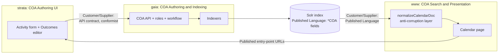

# Context Map — Calendar of Activities (production)

> How the three bounded contexts of the COA production system relate. Glossary:
> [CONTEXT.md](CONTEXT.md). Design detail per context: the spoke arch plans
> ([gaia](gaia-arch-plan.md), [strata](strata-arch-plan.md),
> [www.cbd.int-headless](www.cbd.int-headless-arch-plan.md)).

## Contexts

- **COA Authoring & Indexing** — owner: **gaia**. The authored calendar activity and its
  Outcomes, the reference data that enriches them, the schema linkages, the publication
  workflow and roles, and the indexers that publish the search documents. Code:
  `controllers/calendar-of-activities/` and `workers/indexers/scbd/` in `@scbd/gaia`.
- **COA Authoring UI** — owner: **strata** *(new this version)*. The create/edit form for
  calendar activities and their Outcomes. Owns form behavior, client validation, and the
  stable entry-point URLs; owns no records and no vocabulary of its own.
- **COA Search & Presentation** — owner: **www.cbd.int-headless**. The public search page:
  read path, normalization, presentation language (calendar document, facets, detail views),
  URL state, and the role-gated links into strata.

## Relationships

1. **strata → gaia: Customer/Supplier over the API, conformist.** Strata consumes gaia's
   calendar-of-activities endpoints, Joi-validated payload shapes, role names, and status
   vocabulary exactly as gaia defines them. Strata adds no model of its own — its form state
   is gaia's record shape plus UI concerns (dirty tracking, validation display). When gaia's
   schema changes, strata conforms.
2. **gaia → www: Customer/Supplier with a Published Language.** The Solr index document —
   specifically the `*COA` field set — is the contract. gaia names the fields; the front end
   adapts them behind its anti-corruption layer (`normalizeCalendarDoc`), so index names
   never leak into components. Renaming a published field is a coordinated two-repo change.
3. **www → strata: a published URL contract.** The front end links to strata's stable
   entry-point URLs (create, edit-by-id). This is a navigation contract only — no data
   crosses it except the record identifier and a return link. Strata publishes the routes;
   the front end conforms.
4. **No other coupling exists.** The front end never calls gaia's API or database; strata
   never reads Solr; gaia never renders. The write path and the read path meet only at the
   index, and the two front ends meet only at the URL.

## Translation seams (where words shift meaning)

- **"Calendar Activity"** upstream (gaia, strata) is the authored aggregate — the whole
  record with its Outcomes. Downstream (www) it is one of three **record types**; the
  umbrella for any searched record is **Calendar Document**. Both glossary entries flag this.
- **Status splits upstream, flattens downstream.** gaia (and the strata form) distinguish
  Publication Status (unpublished/published/rejected — gates visibility) from Activity Status
  (the event state). The front end only ever sees published records and folds
  `activityStatus` into a single displayed `status`; Publication Status has no presentation
  representation.
- **Outcome** is a structured sub-record upstream (kind, date, note, links) and a displayed
  detail section downstream. The boundary rule ("result record only, never an obligation")
  is owned by gaia's schema; strata's editor and www's display both inherit it.
- **Roles** have two names (`Administrator` and the new `COA-ADMIN`, both gaia-owned;
  either grants COA writes). Strata uses them to gate the page; www uses them to gate
  buttons; only gaia's check is security.

## Maintenance

When a context's model changes, update [CONTEXT.md](CONTEXT.md) and, if the change touches a
shared term, a published field, an entry-point URL, or a translation seam, update the
Relationships above. The canonical examples: renaming a `*COA` field (edit gaia's indexer,
www's service/ACL, and the field contract together) and changing a strata entry-point route
(edit strata's route and www's link builder together).
