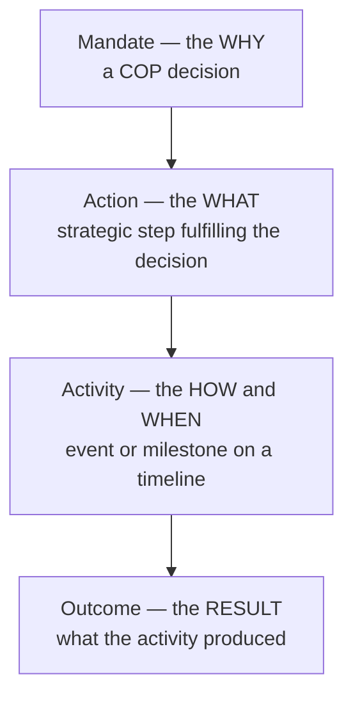

# Calendar of Activities — Domain Glossary (CONTEXT.md)

> The ubiquitous language for the COA production system, consolidated for the 2026-07-09
> design run. Three bounded contexts share these terms; how the contexts relate is in
> [CONTEXT-MAP.md](CONTEXT-MAP.md). Terms are grouped by owner. When a term is owned by one
> context and consumed by another, the owner's meaning wins. Use these words in code,
> comments, and commit messages.

## The ontology (from the mandate)

The COP decisions' own structure gives the domain its three-level shape:[^ontology]

**Mandate**:
The COP decision that authorizes work — the legal basis. Represented in records as decision
references.
_Avoid_: law, ruling, resolution

**Action** *(out of scope this version)*:
The strategic project, plan, or step required to fulfil a COP decision — the compliance work
or policy commitment. Kept in the glossary because the ontology needs it; **not** a record,
workflow, or feature in this version. The calendar's "action required by Parties" flag and
notification deadlines are activity/notification metadata, not Action records.
_Avoid_: task, todo, obligation record

**Activity** (canonical: **Calendar Activity**, gaia-owned):
The authored record of a single thing the Convention is doing or expects Parties to do — a
meeting, submission, peer review, nomination, report, workshop, or other scheduled action on
a timeline. The aggregate the domain is built around.
_Avoid_: event, task, item, COA record

**Outcome** (gaia-owned, extended this version):
What an activity produced, recorded on the activity after the fact. Kinds: a new activity, a
report, a meeting, a notification, or multiple items (for example a set of nominations). An
Outcome links to the artifact when it exists in the system and holds a plain note when it
does not. A *report* kind links the notification or URL carrying the report (reports are
never a record type); a *multiple* kind is one Outcome with several typed links sharing one
date and note. Boundary: a result record only — never an obligation, deadline, task, or
workflow.
_Avoid_: result, deliverable, follow-up task, action

## Record types and search (shared)

**Record Type**:
Which of the three kinds a searched record is: a meeting, a notification, or a calendar
activity. The type filter and tabs split on it.
_Avoid_: schema (that is the index field name), category

**Meeting**:
A CBD meeting or session, owned upstream in the events system; the calendar references it by
code or id.
_Avoid_: event, conference

**Notification**:
An official notification to Parties, owned upstream; referenced by its symbol
(`NTF-YYYY-NNN`). Carries sender, recipients, deadline, attachments.
_Avoid_: notice, alert, message

**Calendar Document** (www-owned):
Any record returned by the calendar search after normalization, regardless of kind — the
front end's unified shape.
_Avoid_: result, hit, row

**Calendar of Activities**:
The public page and feature that searches all three record types together. The umbrella,
never a single record.
_Avoid_: calendar (alone, in prose), COA (in prose)

## Status vocabulary (gaia-owned)

**Publication Status**:
Whether a record is **unpublished**, **published**, or **rejected** — the workflow gaia
enforces on `meta.status`. Governs visibility: only `published` records are public. The state
after create is **unpublished** — the word "draft" is never used as a state name.
_Avoid_: draft, visibility, workflow state

**Activity Status**:
Where the event behind an activity stands: confirmed, tentative, postponed, cancelled, or
completed. A thesaurus value for filtering and display; never gates visibility.
_Avoid_: state, publication status

**Action Required**:
The flag marking a record as something Parties must act on — activity/notification metadata
powering the action-required filter. Not an Action record.
_Avoid_: mandatory, obligation flag

## Authoring and enrichment (gaia-owned)

**Administrator** / **COA-ADMIN**:
The two gaia roles that may create, update, delete, or change the publication status of a
calendar activity. `Administrator` is the pre-existing full-rights role; `COA-ADMIN` is new
this version (ADR 0004) so calendar administration can be granted on its own. Strata and
the front end read them; gaia enforces them. No other role names exist in this domain.
_Avoid_: admin role variants, editor, curator, calendar admin (use the exact role names)

**Enrichment**:
The additive step on every save that fills in GBF targets, sections, responsible units, and
officers from the reference maps (by decision, or subjects as fallback). Adds only; never
overwrites author values.
_Avoid_: auto-fill, augmentation

**Theme Map** / **Responsibility Map**:
The reference collections enrichment reads: decision/subject → GBF alignment, and staff →
thematic/decision responsibility.
_Avoid_: lookup tables (unnamed)

**Schema Linkage**:
A cross-reference record (collection `scbd-schema-linkages`) joining one upstream record
(notification, meeting, or decision) to the activities that touch it, with reverse links
among them. What lets any record surface its related records.
_Avoid_: link, join record

**Linkage Discovery**:
Reading a notification's body text to find the decisions and meetings it names, then linking
the activities that reference them — connections recorded even when never stated explicitly.
_Avoid_: text mining, scraping

**Re-index Fan-out**:
On every activity save, the queued re-indexing of each linked meeting and notification so
their search documents pick up current cross-links. Outcome links join this same fan-out.
_Avoid_: cascade, sync

**Human-Legible Identifier**:
The readable sequential id minted per activity (`CAL-ACT-YYYY-NNN`) from an atomic counter,
unique per year.
_Avoid_: friendly id, slug (the slug is a different identifier)

**Published Language (`*COA` fields)**:
The calendar-aligned Solr field set gaia emits and the front end reads — the only coupling
between them. Renaming a field is a coordinated two-repo change.
_Avoid_: API (it is an index document shape, not an endpoint)

## Classification (gaia-owned, consumed everywhere)

**Activity Type**: what kind of action an activity is (thesaurus `CAL-ACTIVITY-TYPE-*`).
**Subject**: a thematic area of the Convention's work (thesaurus).
**Decision**: a COP/CP-MOP/NP-MOP decision reference an activity relates to — the mandate
link and the enrichment key.
**GBF Target / GBF Section**: the Global Biodiversity Framework targets (23) and lettered
sections an activity serves.
**Governing Body / Subsidiary Body**: COP, CP-MOP, NP-MOP govern; SBSTTA, SBI, SB8J advise
or implement.
**Agenda Item**: a numbered item of a body's session, referenced by meeting code + item and
resolved to localized titles.
**Responsible Unit / Responsible Officer**: the Secretariat unit and staff member
accountable for an activity.

## Presentation (www-owned)

**Facet**: the live count shown beside each filter option, computed with per-filter
exclusion so a filter's own counts survive its selection.
**Detail View**: the expanded in-place view of one record, shaped to its record type.
**Related Records**: the linked meetings/activities/notifications surfaced on a detail view
— the front-end face of schema linkages.
**Deep Link (`autoExpand`)**: the URL parameter that opens one record's detail and scrolls
it into view.
**URL State**: the rule that every filter, search, sort, view, and page lives in the URL, so
any view is shareable and restorable.
**Deadline Badge**: the notification-detail label showing a pending deadline, or "Deadline
passed {date}" once past (never "Completed" — completion is not knowable).
**Edit Button / Create Entry Point** *(new)*: the role-gated controls linking into the
strata form; rendered only for holders of the gaia `Administrator` or `COA-ADMIN` role.

## Authoring UI (strata-owned)

**Activity Form**:
Strata's single COA surface: create a new calendar activity or edit an existing one,
including its Outcomes. Reached only by links from the public calendar; no list page or menu
entry exists.
_Avoid_: editor app, admin panel

**Outcomes Editor**:
The form section for adding, editing, and removing an activity's Outcomes — constrained to
the approved Outcome shape.
_Avoid_: results tab, follow-up manager

**Entry-Point URL**:
The stable strata routes the front end links to (create, and edit-by-id) — a published
contract between the two front ends.
_Avoid_: deep link (reserved for `autoExpand`)

[^ontology]: From the COP decisions' structure as summarized in the run mandate
    ([mandate.md](mandate.md) §3): the Mandate is the why, the Action is the what, the
    Activity is the how-and-when. Decision CBD/COP/DEC/16/25 mandates the calendar itself.
