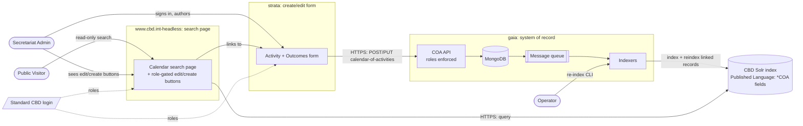
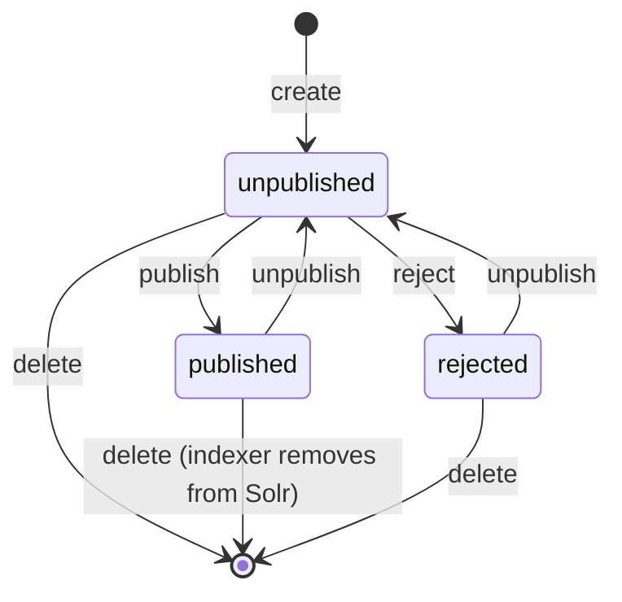

> **▶ This is a living architectural plan (hub)** — the cross-project design for the **Calendar of
> Activities (COA)**. It is NOT an implementation plan: it cuts no tasks, PRs, or branches.
> **To revise:** run `/docs-architectural-planner` (update mode) and edit the affected hub/spoke
> sections in place. Never fork or version-suffix this doc.
> **Hub:** `architectural-plan.md` · **Spokes:** [gaia](gaia-arch-plan.md),
> [strata](strata-arch-plan.md), [www.cbd.int-headless](www.cbd.int-headless-arch-plan.md) ·
> **PRD:** [prd.md](prd.md) · **Glossary:** [CONTEXT.md](CONTEXT.md) ·
> **Context map:** [CONTEXT-MAP.md](CONTEXT-MAP.md)
>
> **Consolidated location.** For this design run the whole COA document set lives together in
> `docs/coa-2026-07-09/`, so every cross-link here is relative. This deliberately overrides the
> usual "one hub repo, each spoke in its own repo" layout so the design reads as one set. When the
> spokes graduate to their own repos, switch the cross-repo links to full GitHub URLs.

# Calendar of Activities: Architectural Plan (Hub)

## Context

The Calendar of Activities lets anyone ask one plain question — *what is the Convention on
Biological Diversity doing on this subject, for this body, between these dates?* — and get one
answer back. Today the pieces are scattered. Meetings live in the events system. Official
notifications to Parties go out through another system. Secretariat activities, such as peer
reviews and calls for submissions, are tracked on their own. A delegate, a national focal point,
or a researcher has to search several places and stitch the results together. COP Decision 16/25
told the Secretariat to fix that with a yearly calendar of activities and actions.[^mandate]

A pilot already proved the idea works, and its features are approved. This plan turns the pilot
into a production system built across **three separately-deployable projects** that never call
each other directly:

- **gaia** (`@scbd/gaia`) — the back-end **system of record** and the only writer to the search
  index. It stores calendar activities and their Outcomes, checks who may write, and runs the
  indexers that publish search documents. Context: *COA Authoring & Indexing*. Spoke:
  [gaia-arch-plan.md](gaia-arch-plan.md).
- **strata** (`@scbd/strata`) — the **create/edit form**. A Secretariat administrator opens strata
  to author or fix a calendar activity, including its Outcomes. Strata has no list page and no menu
  entry for this — it is reached only by links. Context: *COA Authoring UI* (new this version).
  Spoke: [strata-arch-plan.md](strata-arch-plan.md).
- **www.cbd.int-headless** (`@scbd/www.cbd.int-headless`) — the **public search page** and the
  production home of the pilot's features, plus role-gated edit and create buttons that link to
  strata. Context: *COA Search & Presentation*. Spoke:
  [www.cbd.int-headless-arch-plan.md](www.cbd.int-headless-arch-plan.md).

This document is the **hub**: it holds only the material that crosses more than one project — the
actors, the shared workflow, the end-to-end flows, the ownership boundary, and the verification
checks. Each project's own depth lives in its spoke. The domain words used here are defined in
[CONTEXT.md](CONTEXT.md); how the three contexts relate is in [CONTEXT-MAP.md](CONTEXT-MAP.md); the
product intent is in [prd.md](prd.md). Cross-project decisions are recorded as ADRs in the repo's
`docs/adr/` tree.

## Project plans (index)

- **gaia** — [gaia-arch-plan.md](gaia-arch-plan.md) — owns the authored records, Outcomes, roles,
  enrichment, cross-link linkages, and the indexers that publish to Solr. Code lives in `@scbd/gaia`.
- **strata** — [strata-arch-plan.md](strata-arch-plan.md) — owns the create/edit form for calendar
  activities and their Outcomes, and the stable entry-point URLs the front end links to. Code lives
  in `@scbd/strata`.
- **www.cbd.int-headless** — [www.cbd.int-headless-arch-plan.md](www.cbd.int-headless-arch-plan.md)
  — owns the public search page, the read path, URL state, i18n, accessibility, the CBD login
  integration, and the role-gated links into strata. Code lives in `@scbd/www.cbd.int-headless`.

## System Overview (C4 level 1)

A level-1 view: the whole COA system as boxes, the people who use it, and what crosses each seam
(the arrows carry a protocol and a payload).[^c4]

The whole system sits on two paths that meet in one place. Writes flow left to right, one way:
strata → gaia → MongoDB → message queue → indexer → Solr. Reads flow from the visitor straight to
Solr and stop there. Nothing crosses from the front end back into gaia's database or API. A saved
change shows up in search *after* the indexer runs, not the instant it is saved — this is
**eventual consistency**, and it is accepted by design.[^eventual] The two front ends (strata and
www) meet only at a plain link: the front end's edit and create buttons point at strata's URLs, and
no data crosses that link except the record's identifier.

## Actors

| Actor | Role in the system | Primary entry point |
| ----- | ------------------ | ------------------- |
| **Secretariat Admin** | Signs in, authors and publishes calendar activities and their Outcomes; also browses the public page and clicks its edit/create buttons | strata form (reached from the www page); www page |
| **Public Visitor** | Searches and reads the calendar (delegates, focal points, researchers, journalists, the public) | www `/calendar-of-activities` page |
| **Operator / Data Engineer** | Runs bulk loads, re-index, and clean/delete jobs | gaia worker CLI |

Only the Secretariat Admin ever writes. Everyone else reads. The admin establishes their roles
through the standard CBD login, and both strata and the front end read the *same* roles that gaia
enforces — no project invents its own role names. gaia's write roles are `Administrator` and
`COA-ADMIN`: the dedicated `COA-ADMIN` role was added alongside `Administrator` (ADR 0004) so
calendar administration can be granted without full administrator rights; either role may create,
edit, delete, or change the status of a calendar activity.

## Workflow Statuses

Two different "status" ideas live on a record. Both are **owned by gaia**, and they cross the seam
very differently. Keeping them apart is the single most important vocabulary rule in this system.

**Publication Status** is the gate on visibility. gaia holds the one, server-enforced state machine
for it (field `meta.status`). The first state after create is **unpublished** — the word "draft" is
never used as a state name.[^drafting] Anonymous readers and non-administrators see only `published`
records, so the front end *never even sees* an unpublished or rejected one.

**Activity Status** describes where the real-world event stands — confirmed, tentative, postponed,
cancelled, or completed. It is a thesaurus value, not a state machine. Unlike Publication Status it
*does* cross the seam: gaia indexes it, and the front end shows it as a coloured badge. It never
gates visibility.

| Status | Kind | Owner | Crosses the seam? | Meaning |
| ------ | ---- | ----- | ----------------- | ------- |
| `unpublished` | Publication | gaia | No | Authored but not public; not indexed as public |
| `published` | Publication | gaia | Only published records are indexed | Visible; indexed `_state:public` |
| `rejected` | Publication | gaia | No | Withheld; not public |
| `confirmed` / `tentative` / `postponed` / `cancelled` / `completed` | Activity | gaia | Yes (as `statusCOA` / `activityStatus`) | Where the event stands; filterable; a badge on the front end |

The **canonical, server-enforced transition matrix** lives in one place only:
[gaia → Workflow transitions](gaia-arch-plan.md#workflow-transitions). Strata shows the buttons for
the transitions gaia allows and calls gaia's status endpoint; the front end mirrors none of the
machine because it only ever receives published records.

## Key End-to-End Flows

Each flow crosses at least one project boundary. The hand-off points are called out so a reader can
see exactly where control and data move from one project to the next.

### Flow 1 — Author and publish (strata → gaia → Solr → www)

1. The **admin** signs in with the standard CBD login and opens the strata form — either blank
   (create) or through an edit link that carries a record identifier.
2. Strata calls gaia's calendar-of-activities endpoints. **Seam crossed: strata → gaia (HTTPS).**
   gaia checks the `Administrator` or `COA-ADMIN` role, validates the payload, writes to MongoDB,
   snapshots a version, and updates the cross-link records.
3. gaia queues indexing messages: one for the activity itself, plus a re-index message for every
   linked meeting and notification so their search documents pick up the new cross-link.
4. The indexer builds the Solr document (localized text, vocabularies, decisions, GBF fields,
   Outcomes) and commits it. **Seam crossed: gaia → Solr.**
5. The front end's next search sees the record, if it is `published`. The boundary is eventually
   consistent — the record is in search once its worker runs, not before. Full detail:
   [gaia → Key Flows](gaia-arch-plan.md#key-flows-sequence-diagrams).

### Flow 2 — Edit from the public page (www → strata)

1. A signed-in **admin** loads the calendar page. The front end reads the user's roles from the CBD
   login **in the browser only** (see [www spoke → Auth integration](www.cbd.int-headless-arch-plan.md#auth-integration-new)).
2. Each calendar-activity result they may edit shows an edit button; the page header shows a create
   button. Both are plain links into strata; the edit link carries the record identifier. **Seam
   crossed: www → strata (a URL, no data but the identifier).**
3. Strata opens the form. It verifies the same role again server-side through gaia — the front-end
   button is a convenience, never the security boundary. An admin without the role sees no button;
   a mis-shared link that reaches strata still fails politely at the page guard, and any raw write
   is rejected by gaia with a 403.

### Flow 3 — Outcome recorded, cross-links stay current (strata → gaia → Solr)

1. The **admin** adds an Outcome in strata — say, linking the activity to a published report
   notification and to a follow-on activity — and saves. **Seam crossed: strata → gaia.**
2. gaia saves the Outcome inside the activity (one write), then recomputes the activity's full
   reference set (direct relations ∪ every current Outcome link) and diffs it against the pre-update
   document — the same document gaia already reads before the write, not the version-history
   collection, which stays audit-only. The diff drives the linkage update on both sides — additions upsert a reverse link,
   removals pull one out — and queues one `reindex-linked-records` job carrying both: re-index this
   activity, and re-index each newly-linked *and* each newly-unlinked record. This is
   **recompute-and-diff**, not additive-only — an Outcome link removed on a later edit un-links the
   record too, not just the add case (gaia → [How Outcomes reuse it](gaia-arch-plan.md#the-cross-link-reindex-implementation-as-built-logic-now-run-by-the-worker)).
   If the enqueue itself fails (broker unreachable), the Mongo write still succeeds and gaia records
   a durable failed-publish entry an operator replays — an **at-least-once + reconcile** guarantee,
   not exactly-once (gaia → [Decoupled reindex-linked-records worker](gaia-arch-plan.md#decoupled-reindex-linked-records-worker-new--resolves-hub-d4-was-deferred-d4)).
3. After the indexers run, the activity's Solr document carries the Outcome, and each linked
   record's document carries the reverse reference — or loses it, for a removed link. **Seam
   crossed: gaia → Solr.** The front end's detail view then shows the Outcome and its links.

### Flow 4 — Renaming a published field (the coordinated two-repo change)

The Solr document is the *only* thing coupling gaia and the front end, so renaming one of its fields
is a single change that must land in both repos together.

1. gaia's indexer emits the new field name (gaia spoke → Data Model + field contract).
2. The front end's calendar service and its anti-corruption layer read the new name (www spoke →
   Owned interface).
3. The field-contract table in
   [gaia § Published language](gaia-arch-plan.md#published-language-the-solr-field-contract) is
   updated to match, along with the committed `*COA` field manifest gaia owns (see
   [Deferred / Open Items](#deferred--open-items) below). A change made on only one side **fails
   silently at query time**: Solr simply returns nothing for a field that does not exist, rather
   than an error. That silent-failure risk is exactly why the field set is a named, machine-checked
   contract — gaia's CI fails if the indexer's emitted set drifts from the manifest, and www's CI
   fails if the front end reads a field the manifest does not declare (see the gaia and www spokes).
   Merging that manifest to gaia's `master` is the exact event [§ Implementation hand-off](#implementation-hand-off)
   calls "frozen" — the moment this coordinated two-repo change is safe for strata and www to build
   against.

## Ownership boundary

| | gaia | strata | www.cbd.int-headless |
|---|---|---|---|
| **Must** | Author, validate, enrich, cross-link, index; enforce roles; own the published field names | Present the create/edit form and Outcomes editor; publish stable entry-point URLs; mirror gaia's validation for a fast form | Read the index, normalize at its anti-corruption layer, render and translate; gate edit/create buttons on the role client-side |
| **Must not** | Render or present; assume how the front end reads a field | Own a record, a role, a vocabulary, or any listing/search | Write to gaia; read MongoDB; let raw Solr field names reach a component; leak role-gated markup into a cached anonymous page |
| **Source of truth for** | The records, the roles, the workflow, and the published field shape | Form behavior and the entry-point URL contract | The search experience and the URL state |

## Deferred / Open Items

The full register — every item consciously out of scope this version, each with an owner and a
one-line reason — lives in the hub PRD: [prd.md → Deferred register](prd.md#deferred-register)
(items D1–D3, D6–D8). Three former rows — D4 (the reverse-reindex SQL coupling), D5 (the `*COA`
field manifest), and D9 (reference-vocabulary upkeep) — were pulled **into scope** by Randy on
2026-07-09; they are requirements now, designed in the gaia and www spokes and tracked below, not
deferred items. It is the honest scope boundary the downstream implementation plans inherit as
their "not now" list. The cross-project highlights that shape this plan:

| Ref | Item | Owner | Note for the design |
|---|---|---|---|
| D2 | Outcomes creating activities | gaia/strata | This version *links* only; creation is future work. |
| D8 | CircleCI → GitHub Actions migration for www | www | The deployment standard mandates Actions; migration is deployment work, not COA design. www designs nothing new on CircleCI. |

No item is silently guessed: anything unresolved is a labeled row in the PRD register, not an
assumption buried in prose.

**Pulled into scope this version:**

- **Decoupled reverse-reindex (was D4).** The save no longer resolves linked-record codes through
  the CBD relational store synchronously; it publishes one queued `reindex-linked-records` job and a
  worker does the SQL resolution and per-record publishing asynchronously. See
  [gaia → Decoupled reindex-linked-records worker](gaia-arch-plan.md#decoupled-reindex-linked-records-worker-new--resolves-hub-d4-was-deferred-d4).
- **Committed `*COA` field manifest (was D5).** A machine-readable manifest, owned by gaia and
  consumed by www's CI, replaces the test-and-convention-only contract. See
  [gaia → the field manifest](gaia-arch-plan.md#a-committed-coa-field-manifest-new--resolves-hub-d5-was-deferred-d5)
  and [www → manifest CI check](www.cbd.int-headless-arch-plan.md#the-coa-parity-check-new).
- **Reference-vocabulary upkeep (was D9).** A mandatory manual workstream, no code — see the
  verification checklist below.

## Verification Checklist

End-to-end checks that span more than one project. Each one touches a seam, so passing it proves the
glue, not just one box.

- [ ] Admin creates and publishes an activity in strata → after the worker runs, it appears in the
  www `/calendar-of-activities` search results (Flow 1 end to end). *(crosses strata→gaia→Solr→www)*
- [ ] Admin sets an activity to `unpublished` or `rejected` → it is absent from front-end search
  after the worker runs (the Publication Status gate holds across the seam).
- [ ] An admin viewing the public page sees an edit button on a record they may edit; clicking it
  opens strata's edit form loaded with that record (Flow 2). *(crosses www→strata)*
- [ ] An anonymous visitor, and a signed-in user without `Administrator` or `COA-ADMIN`, sees no
  edit or create controls at all — and the SSR/cached anonymous page never carries that markup.
- [ ] A strata write attempted by a user without the role is rejected by gaia with a 403 (the
  server, not the button, is the boundary).
- [ ] An Outcome saved in strata renders on the www detail view, and each linked record's search
  document carries the reverse link after the fan-out runs (Flow 3). *(crosses strata→gaia→Solr→www)*
- [ ] Removing that same Outcome link on a later edit removes the reverse link from the
  formerly-linked record's search document after the fan-out runs — recompute-and-diff, not just
  the add case (Flow 3). *(crosses strata→gaia→Solr→www)*
- [ ] Every `*COA` field the front end reads is emitted by the gaia indexer under the same name
  (the four previously-gapped fields included) — the committed field manifest and both repos' CI
  make this mechanical.
- [ ] A deleted activity in gaia → removed from Solr after its worker message, and gone from
  front-end search.
- [ ] Reference vocabularies brought current by their named human owner (theme map, responsibility
  map, agenda items via existing operator scripts; thesaurus domains via vocabulary owners) —
  manual launch item, no code (was Deferred D9).

## Implementation hand-off

This plan cuts no tasks. Implementation planning happens per spoke, **gaia first** — it owns the
Outcome schema, the roles, and the published Solr contract that both other spokes consume; strata
(which conforms to gaia's API) and www (which conforms to gaia's field contract *and* to strata's
URL contract) inherit those as fixed inputs, and can otherwise proceed in parallel once gaia's
contract is frozen.

**What "frozen" means, exactly [new — pins forward finding 4]:** gaia's contract is frozen at the
moment `coa-field-manifest.json` merges to gaia's `master` branch. That merge is the single event
strata and www wait for — not a vaguer signal like "gaia's PR is open" or "the spoke reads done."
Before that merge, gaia's ADRs for the Solr field-naming convention and the decoupled-worker
decomposition (the two still-open items in [gaia § Architecture Decisions](gaia-arch-plan.md#architecture-decisions-candidate-adrs))
should also be recorded, since the manifest's field names depend on them. After the manifest merges,
any further change to it is not a free edit — it is the coordinated two-repo change described in
[Flow 4](#flow-4--renaming-a-published-field-the-coordinated-two-repo-change), now mechanically
enforced by both repos' CI (gaia's emit-side check, www's two-tier read-side check).

Each spoke's implementation plan derives from that spoke's section of this
document set plus the hub's flows and verification checklist: the checklist items become cross-spoke
acceptance criteria the per-spoke plans must jointly satisfy, and the deferred-register items stay
out of scope. Implementation plans are working documents; they are not stored in this docs tree.

[^mandate]: COP Decision CBD/COP/DEC/16/25 (COP 16, 2024) asked the Secretariat to give national
    focal points a yearly calendar of activities and actions. Mandate summary in
    [mandate.md](mandate.md); decisions portal:
    [COP 16 decisions](https://www.cbd.int/decisions/cop/?m=cop-16).
[^c4]: "C4" is a simple way to draw software at four zoom levels — **Context (level 1)**, Container
    (level 2), Component (level 3), and Code (level 4). A level-1 (L1) picture shows the whole
    system as one or a few boxes with the people and neighbouring systems around it, so a newcomer
    can see the shape before the detail. See the C4 model: <https://c4model.com>.
[^eventual]: **Eventual consistency** means a change is not visible everywhere at the same instant;
    the copy used for reading (here, the Solr search index) catches up a moment later, after the
    indexer runs. See <https://en.wikipedia.org/wiki/Eventual_consistency>.
[^drafting]: Fixed decision 10 for this run: the not-yet-public state is named **unpublished**,
    never "draft". This is a state-naming rule; the `calendar-of-activities-draft-1/2` reference
    folder names are unrelated.
