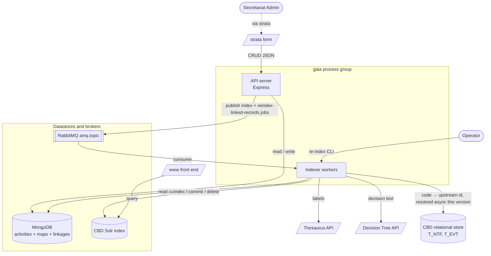
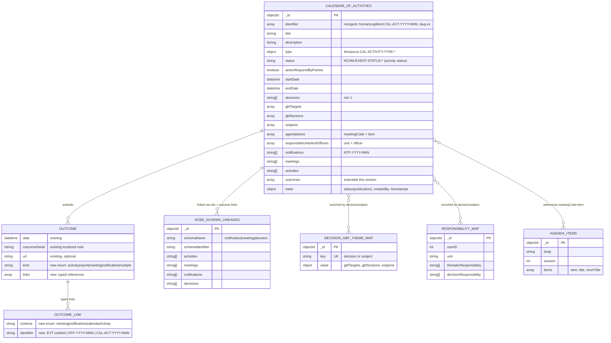
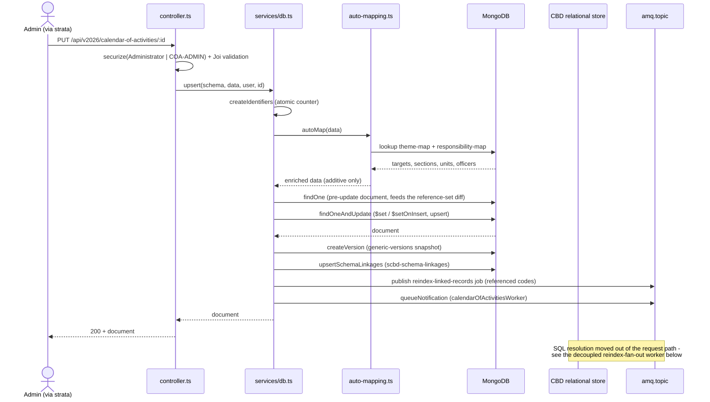
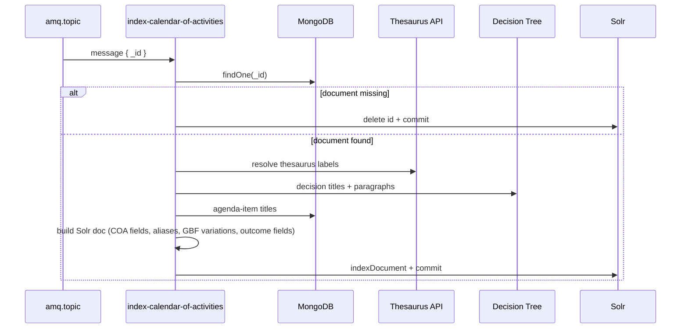

> Part of the [Calendar of Activities](architectural-plan.md) architectural plan. The cross-project
> hub (System Overview, Actors, Workflow Statuses, End-to-End Flows, Ownership, Verification) is the
> [hub](architectural-plan.md); glossary: [CONTEXT.md](CONTEXT.md); how this context relates to the
> others: [CONTEXT-MAP.md](CONTEXT-MAP.md). This doc owns the **gaia (API service)** work — the
> *COA Authoring & Indexing* context. Sibling spokes: [strata](strata-arch-plan.md),
> [www.cbd.int-headless](www.cbd.int-headless-arch-plan.md). Product intent: [gaia-prd.md](gaia-prd.md).
>
> **Plan vs. as-built.** This is the design-of-record for gaia's COA work. The `@scbd/gaia` source
> tree is the as-built truth; where the two disagree, the code is the truth about what runs and this
> plan is the truth about intent. The overlap is deliberate provenance. Source-code paths below are
> `@scbd/gaia` paths, written so a reader can open them; facts that already ship are labeled
> **[as-built]** and new design is labeled **[new]**.
>
> **Location note.** This spoke documents the `@scbd/gaia` repo but is parked in
> `www.cbd.int-headless/docs/coa-2026-07-09/` for this run so the set reads together. When it moves
> to `@scbd/gaia/docs/`, switch its hub and sibling links to full GitHub URLs.

# Calendar of Activities: gaia (API service) plan

gaia is the **system of record** and the **only writer to the search index**. It turns an authored
calendar activity into a published, multilingual, cross-linked Solr document. A Secretariat admin
writes an activity through a versioned API mounted at `/api/v2026/calendar-of-activities`; on save
gaia checks the role, validates, enriches the record from two reference maps, records
cross-reference linkages, and queues async work that indexes the activity and re-indexes the linked
records. This version grows gaia in exactly one place: **Outcomes become structured records** on the
activity, carried through the very same controller, queue, and fan-out that already exist. Domain
terms are in [CONTEXT.md](CONTEXT.md).

## Owned interface (the seam)

The single thing other projects depend on from gaia is split across **two contracts**, because gaia
has two customers:

1. **The HTTP API** — strata's contract. `POST` / `PUT` / `POST /:id/status/:status` under
   `/api/v2026/calendar-of-activities`, guarded by the `Administrator` or `COA-ADMIN` role
   (ADR 0004 — the second role was added alongside `Administrator` so calendar administration can
   be granted without full administrator rights), validated by Joi. This
   is a **Customer/Supplier** relationship in which strata is a **conformist**: it uses gaia's
   payload shapes, role names, and status words exactly as gaia defines them, and adds no model of
   its own.[^conformist]
2. **The Solr index document** — the front end's contract. Specifically the calendar-aligned `*COA`
   field set. This is a **Published Language**: a shared, agreed data shape that neither side changes
   alone.[^published] gaia is the supplier and names the fields; the front end adapts them at its own
   anti-corruption layer.[^acl]

Everything else in this spoke — the MongoDB collections, enrichment, linkage maintenance, the queue,
the worker pipeline — is implementation hidden behind those two contracts. That is the deep-module
property: a large enrichment-and-indexing pipeline collapses to *one HTTP surface and one set of
stably-named Solr fields*. The Solr seam has a real production adapter (the indexer writing to the
CBD Solr) and a test adapter (the indexer tests asserting the emitted field set), which is what
makes it a genuine seam and not a hypothetical one. Renaming any published field is a coordinated
two-repo change (hub [Flow 4](architectural-plan.md#flow-4--renaming-a-published-field-the-coordinated-two-repo-change)).

## Containers and components (C4 level 2/3)

gaia runs the same code base in two roles: an HTTP API server and a set of queue-consuming indexer
workers. They share the MongoDB connection, the message-queue connection, and the Solr indexing
library.



Key components and the one job each does — all under `controllers/calendar-of-activities/` and
`workers/indexers/scbd/` **[as-built]**:

- **`controllers/calendar-of-activities/controller.ts`** — a schema-driven router factory `routes(schema)`
  that builds the Express router: `GET /schema`, `GET /`, `GET /:id`, `POST /`, `PUT /:id`,
  `DELETE /:id`, `POST /:id/status/:status`. Each route chains `securize → joiValidation → asyncWrap(handler)`.
  A `read-only-controller.ts` variant serves the reference collections. Mounted at
  `/api/v2026/calendar-of-activities` in `controllers/calendar-of-activities/index.ts`.
- **`controllers/calendar-of-activities/services/db.ts`** — owns persistence: the `upsert` with its
  status-security filters, identifier generation from an atomic counter, version snapshots, and the
  schema-linkage upserts (`upsertSchemaLinkages`) and the owner-may-update rule (`securizeOwnerOrAuthorized`).
- **`controllers/calendar-of-activities/services/auto-mapping.ts`** — enriches a document additively
  from the theme map and responsibility map, falling back to subjects when there is no decision.
- **`controllers/calendar-of-activities/utils/index.ts`** — publishes the indexing message
  (`queueNotification`) and, this version, publishes the single `reindex-linked-records` job
  (`queueLinkedSchemaReindex`'s call site moves out of the request; the resolution code it calls
  stays here but now runs from the worker below) **[relocated this version]**.
- **`workers/indexers/scbd/index-calendar-of-activities.ts`** — consumes the message and writes the
  Solr document (the `*COA` field set, aliases, GBF variations, Outcome fields).
- **`workers/indexers/scbd/reindex-linked-records.ts`** (new, exact path a downstream decision) —
  consumes the `reindex-linked-records` job, resolves `T_NTF`/`T_EVT` codes, and publishes the
  per-record indexer messages **[new]**.

## Data Model

Five MongoDB collections back the feature. `calendar-of-activities` is the aggregate; the others are
reference data and the linkage join. Collections cross-reference each other by **domain identifier
strings** (decision references, notification codes `NTF-YYYY-NNN`, meeting codes, human-legible
activity ids `CAL-ACT-YYYY-NNN`), not by ObjectId foreign keys **[as-built]**.



### The extended Outcome sub-schema **[new]**

Today's `outcomes` array holds `{date, outcomeDetail, url}` **[as-built]**. This version extends
each Outcome, keeping the three existing fields so old records stay valid, and adds two:

| Field | Type | Rule |
|---|---|---|
| `date` | datetime | Existing. When the Outcome happened. Shared across all links of a *multiple* Outcome. |
| `outcomeDetail` | localized string | Existing. The note. Required when there is no in-system link (the artifact lives elsewhere). |
| `url` | string, optional | Existing. A plain link, e.g. to a report that is not a system record. |
| `kind` | enum `activity` \| `report` \| `meeting` \| `notification` \| `multiple` | New. What the Outcome produced. |
| `links` | array of `{schema, identifier}` | New. Typed references to in-system artifacts. |

The `links` sub-schema resolves **forward finding 1** (allowed schema-name enum + identifier
formats):

| `link.schema` | Allowed `link.identifier` format | Feeds which reindex |
|---|---|---|
| `meeting` | Meeting code (`EVT_CD`) or numeric `EVT_ID` | The existing meeting fan-out (`T_EVT` resolution) |
| `notification` | `NTF-YYYY-NNN` | The existing notification fan-out (`T_NTF` resolution) |
| `calendarActivity` | `CAL-ACT-YYYY-NNN` (human-legible id) | A `calendarOfActivitiesWorker` reindex of the linked activity |

Three shape rules the Joi schema enforces, closing gaps the kinds would otherwise leave open (from
[hub PRD § Outcomes](prd.md#outcomes-new)):

- **`report` is never a record type.** A *report* Outcome links the `notification` that carries the
  report, or sets `url`, or holds a note. No report record is created anywhere.
- **`multiple` is one Outcome with several typed links** sharing one `date` and one `outcomeDetail`.
  When an item needs its own date or note, the author records a separate Outcome.
- **`kind` and `link.schema` must agree for the single-kind cases [new].** For `kind: activity`,
  every link present must have `schema: calendarActivity`; for `kind: meeting`, every link present
  must have `schema: meeting`; for `kind: notification`, every link present must have
  `schema: notification`. Without this cross-field rule, a Joi-valid Outcome could claim
  `kind: meeting` while linking a `notification`, and only a human reading the record would catch
  the mismatch. `report` (no schema-typed link permitted) and `multiple` (any mix of schemas) are
  the two stated exceptions to this rule, not additional cases it must also cover.

The boundary is enforced in the schema, not just in prose: there is no `deadline`, `assignee`,
`taskState`, or nomination field. An Outcome is a result record only — never an obligation, a task,
or an "action required" back door.

**Invariants:** the human-legible id `CAL-ACT-YYYY-NNN` is allocated from an atomic
counter keyed by year, so concurrent inserts never collide **[as-built]**; enrichment (the
theme-map / responsibility-map auto-mapping) is additive only and de-duplicates by identifier,
never overwriting an author value **[as-built]**; linkage upserts are **idempotent** — re-saving an
unchanged reference set adds no duplicate.[^idempotent] "Additive-only" describes enrichment only —
the linkage merge itself is **recompute-and-diff** this version, not additive-only: see
[How Outcomes reuse it](#the-cross-link-reindex-implementation-as-built-logic-now-run-by-the-worker)
below **[new]**.

## API / Endpoints

The router is mounted at `/api/v2026/calendar-of-activities` **[as-built]**. Outcomes ride the
existing endpoints — **no new endpoints are added** **[new decision]**, because an Outcome is
embedded in the activity and one save carries both.

| Method + path | Guard | Purpose |
|---|---|---|
| `GET /schema` | `Everyone` | The JSON schema for the collection |
| `GET /` | `Everyone` (publication filter applied) | List activities (MongoLab-style `q,f,s,sk,l,c` params); non-admins see only `published` or their own |
| `GET /:id` | `Everyone` (publication filter applied) | One activity by ObjectId, per-locale slug, or `CAL-ACT-YYYY-NNN` |
| `POST /` | `Administrator` or `COA-ADMIN` | Create an activity (with its Outcomes); default `meta.status = unpublished` |
| `PUT /:id` | `Administrator` or `COA-ADMIN` (or owner for update) | Update an activity and its Outcomes |
| `POST /:id/status/:status` | `Administrator` or `COA-ADMIN` | Move publication status (`unpublished` / `published` / `rejected`) |
| `DELETE /:id` | `Administrator` or `COA-ADMIN` | Remove an activity; the worker deletes it from Solr |

Validation is **dual**: a Joi schema guards the request body at the route, and a MongoDB
`$jsonSchema` validator (generated from the Joi schema) guards the collection itself
(`utils/init-db.ts`, created idempotently on module load). Keeping the two in step is a deliberate
constraint; the extended Outcome shape is added to *both* in lockstep. Errors come back as
`{statusCode, code, message}` through `services/api-errors.js`.

## Published language: the Solr field contract

This is the interface between gaia and the front end. The indexer writes a general field set (shared
with other SCBD schemas) and a calendar-aligned set suffixed `COA`. Solr type suffixes follow the
index library convention: `_s` string, `_ss` string array, `_dt` datetime, `_dts` datetime array,
`_b` boolean, `_i`/`_is` integer(s), `_t` localized text, `_txt` text array, `_XX` a UN locale (EN,
FR, ES, AR, RU, ZH) **[as-built]**.

| Concept | gaia indexer field | Solr field the front end reads | Notes |
|---|---|---|---|
| Record kind | `schema` | `schema_s` | meeting / notification / calendarActivity |
| Realm | `schemaType` | `schemaType_s` | always `scbd` |
| Visibility | `_state` | `_state_s` | `public` |
| Title / description (localized) | `title` / `description` | `title_XX_t` / `description_XX_t` | one per locale |
| Start / end date | `startDateCOA` / `endDateCOA` | `startDateCOA_dt` / `endDateCOA_dt` | unified sort/filter fields |
| Status | `status` / `activityStatus` | `status_s`, `activityStatus_s` | both queried; promoted on the client |
| Status (COA facet) | `statusCOA` | `statusCOA_s` | facet field |
| Activity type | `type` | `type_s` | filter/facet |
| Governing / subsidiary bodies | `governingBodiesCOA` / `subsidiaryBodiesCOA` | `governingBodiesCOA_ss` / `subsidiaryBodiesCOA_ss` | filter/facet |
| Subjects | `thematicArea` | `thematicArea_ss` | filter/facet |
| GBF targets / sections | `gbfTargets` / `gbfSections` | `gbfTargets_ss` / `gbfSections_ss` | filter/facet |
| Decisions | `decisions` | `decisions_ss` | filter/facet |
| Action required | `actionRequiredByPartiesCOA` | `actionRequiredByPartiesCOA_b` | boolean filter |
| Linked notifications / meetings / activities | `notifications` / `meetings` / `activities` | `notifications_ss` / `meetings_ss` / `activities_ss` | related records |
| Responsible units / officers | `responsibleUnits` / `responsibleOfficers` | `responsibleUnits_ss` / `responsibleOfficers_is` | **contract gap #1 — front end now reads these two granular fields [new]** |
| Agenda items | `agendaItemMeetingCodes` / `Numbers` / `Codes` / `Titles_*` | `agendaItemMeetingCodes_ss`, `agendaItemNumbers_ds`, `agendaItemCodes_ss`, `agendaItemTitles_*_txt` | **contract gap #2 — front end now reads the granular fields [new]** |
| Outcomes | `outcomeDetails` / `outcomeUrls` / `outcomeDates` | `outcomeDetails_*_txt`, `outcomeUrls_ss`, `outcomeDates_dts` | **contract gaps #3/#4 — front end reads the structured fields; the scalar `outcome_s` / `url_ss` reads are dropped [new]** |
| Outcome links (per-link, index-aligned) | `outcomeLinkKinds` / `outcomeLinkSchemas` / `outcomeLinkIdentifiers` / `outcomeLinkTitles` | `outcomeLinkKinds_ss`, `outcomeLinkSchemas_ss`, `outcomeLinkIdentifiers_ss`, `outcomeLinkTitles_ss` | **new this version** — see [the Outcome-link Solr shape](#the-outcome-link-solr-shape-new) below |

### Closing the four contract gaps **[new]**

A cross-repo audit (2026-06-24) found four fields the front end reads that gaia never emits under
those names, so they are silently empty. The resolution direction (from
[hub PRD § Implementation Decisions](prd.md#implementation-decisions-cross-spoke)) is that **the
front end reads gaia's existing granular/structured fields; gaia adds no combined fields** — except
that Outcomes gain four *new* per-link members (the `outcomeLink*_ss` arrays below) so the front
end can render each link without a second lookup:

1. `responsibleUnitsAndOfficers_ss` → read `responsibleUnits_ss` + `responsibleOfficers_is`.
2. `agendaItems_ss` → read the four granular `agendaItem*` fields.
3. `outcome_s` → read `outcomeDetails_*_txt`, `outcomeUrls_ss`, `outcomeDates_dts`, plus the new
   `outcomeLinkKinds_ss` / `outcomeLinkSchemas_ss` / `outcomeLinkIdentifiers_ss` /
   `outcomeLinkTitles_ss`.
4. `url_ss` → read `outcomeUrls_ss`; the separate activity-level `url` concept is dropped.

### The Outcome-link Solr shape **[new]**

An Outcome's `links` field is a structured MongoDB array of `{schema, identifier}` objects, one per
Outcome, and an activity can hold several Outcomes each with several links. A single `_ss` (string
array) field cannot carry a structured pair per element without an encoding rule, so the indexer
flattens every link across every Outcome on the activity into **four parallel arrays**, all on the
activity's own Solr document:

| Field | Solr type | Holds |
|---|---|---|
| `outcomeLinkKinds_ss` | `_ss` string array | The parent Outcome's `kind` (`activity` / `report` / `meeting` / `notification` / `multiple`), repeated once per link |
| `outcomeLinkSchemas_ss` | `_ss` string array | The link's `schema` (`meeting` / `notification` / `calendarActivity`) |
| `outcomeLinkIdentifiers_ss` | `_ss` string array | The link's `identifier` |
| `outcomeLinkTitles_ss` | `_ss` string array | A best-effort display title for the linked record, resolved at index time |

**The encoding rule:** the four arrays are **index-aligned** — position *i* across all four arrays
describes one link. Link *i*'s kind is `outcomeLinkKinds_ss[i]`, its schema is
`outcomeLinkSchemas_ss[i]`, its identifier is `outcomeLinkIdentifiers_ss[i]`, its title is
`outcomeLinkTitles_ss[i]`. No delimited-string encoding (e.g. `"schema:id"`) is used — the front end
reads the four arrays by matching position, the same pattern already used for the agenda-item
fields (`agendaItemMeetingCodes_ss` / `Numbers_ds` / `Codes_ss` / `Titles_*_txt`).

**Title resolution** follows the same degrade-one-field-on-failure rule as the worker's other
external lookups (thesaurus labels, decision titles): the indexer resolves a display title for each
link's target (the linked meeting's title, notification's title, or calendar activity's title) at
index time, and on a failed lookup falls back to the bare `identifier` rather than failing the whole
document. This is why `outcomeLinkTitles_ss` is described as best-effort, not guaranteed.

An Outcome with no links (a `report` with only a note or URL, for example) contributes nothing to
these four arrays — it still appears in `outcomeDetails_*_txt` / `outcomeUrls_ss` / `outcomeDates_dts`
as before, just with no entries in the link arrays for that Outcome.

### A committed *COA field manifest **[new — resolves hub D5, was Deferred D5]**

The published-language contract stops being test-and-convention-only and becomes a committed,
machine-readable manifest gaia owns: `controllers/calendar-of-activities/coa-field-manifest.json`
**[new]**, one entry per calendar-aligned field — `name` (e.g. `startDateCOA_dt`), `solrType` (the
suffix convention above), and `emitter` (which indexer module writes it). A gaia CI test asserts the
indexer emits **exactly** the declared set — no field missing, no undeclared field added, comparing
each field's **full manifest entry, name and `solrType` together**, not name alone, so a same-name
type change (e.g. widening `_s` to `_ss`) fails the build the same way a rename does **[resolves
round-2 Medium #3]** — so a rename or retype that misses the manifest fails the build instead of
failing silently at query time (hub Flow 4). Adding, renaming, or retyping a field is now a
single-file, reviewable diff. The four
[Outcome-link fields](#the-outcome-link-solr-shape-new) (`outcomeLinkKinds_ss`,
`outcomeLinkSchemas_ss`, `outcomeLinkIdentifiers_ss`, `outcomeLinkTitles_ss`) are declared in the
manifest like any other field.

**This manifest is also the contract-freeze event.** The merge of `coa-field-manifest.json` to
gaia's `master` branch is the concrete moment the hub calls gaia's contract "frozen" — see
[hub → Implementation hand-off](architectural-plan.md#implementation-hand-off) for what "frozen"
means and why strata and www wait for that exact merge, not an earlier signal like "gaia's PR is
open" **[resolves round-2 Medium #4]**.

**How the front end keeps its copy of this manifest current:** the front end cannot call gaia at
build time and stay hermetic, so it keeps a checked-in snapshot instead, refreshed by a scheduled
CI job that catches drift automatically — see
[www § How the front end consumes gaia's manifest](www.cbd.int-headless-arch-plan.md#the-coa-parity-check-front-end-side-new--resolves-forward-finding-6-resolves-hub-d5)
for that companion workflow; the two sides are one mechanism split across two repos.

### The *COA read/emit parity CI check **[new — resolves forward finding 6]**

The front end consumes the same manifest in its own CI (design in the
[www spoke](www.cbd.int-headless-arch-plan.md#the-coa-parity-check-front-end-side-new--resolves-forward-finding-6-resolves-hub-d5)): a check asserts every field
the calendar service *reads* is present in gaia's committed manifest **with the same `solrType`**,
not just the same name. gaia's CI protects the emit side, www's CI protects the read side; together
they catch exactly the silent-rename failure of hub Flow 4 — and, since both sides compare the full
entry, a same-name type change too — and neither repo can drift from the other without a build
failing.

## Key Flows (sequence diagrams)

### Authoring an activity (upsert, with enrichment, linkage, and fan-out) **[as-built]**



### Indexing the activity (async worker) **[as-built]**



The worker re-fetches the current document by id at processing time, not the message payload, so the
index always reflects the latest save — this is how eventual consistency is kept correct.[^eventual]
The consumer is a durable queue `SCHEMA-INDEXER-calendarOfActivitiesWorker` bound to `amq.topic`,
with manual ack/nack, a 5-second retry, and a dead-letter queue for messages that keep
failing.[^deadletter]

### Outcome save with the cross-link reindex **[new design over as-built machinery]**

An Outcome save is an ordinary upsert (Outcomes are embedded), so it reuses the whole authoring
flow. The Outcome's `links` are merged into the reference sets the fan-out already tracks, then the
whole set rides in **one** queued job — no SQL resolution happens inside the save request itself
(see [Decoupled reindex-linked-records worker](#decoupled-reindex-linked-records-worker-new--resolves-hub-d4-was-deferred-d4)
below):

```mermaid
sequenceDiagram
  actor Admin as Admin (via strata)
  participant API as controller.ts
  participant DB as services/db.ts
  participant U as utils/index.ts
  participant AMQ as amq.topic
  Admin->>API: PUT /:id  (activity + a new Outcome with links)
  API->>DB: upsert(...)
  Note over DB: recompute the full reference set (direct refs ∪ outcome.links by schema),<br/>diff against the prior version → additions[] + removals[]
  DB->>DB: upsertSchemaLinkages (add this activity id to added linkages,<br/>pull it from removed linkages)
  DB->>U: queueLinkedSchemaReindex(document)
  alt publish succeeds
    U->>AMQ: publish reindex-linked-records { notifications[], meetings[], activities[] } (additions + removals)
    DB->>AMQ: queueNotification (this activity)
    API-->>Admin: 200 + document (no SQL wait)
  else publish fails (broker unreachable, channel error, timeout)
    DB->>DB: write a durable failed-publish record (dead-letter mechanism)
    API-->>Admin: 200 + document (Mongo write is durable; reindex queued for operator replay)
  end
```

### Decoupled reindex-linked-records worker **[new — resolves hub D4, was Deferred D4]**

The save no longer resolves linked-record codes through the CBD relational store during the
request. It publishes **one** queued job — routing key `reindex-linked-records` on the existing
`amq.topic` exchange, payload the referenced notification codes, meeting refs, and activity ids — and
a new worker does the rest, off the request path:

1. Consumes the `reindex-linked-records` job. Following the existing indexer's convention (`workers/indexers/scbd/index-calendar-of-activities.ts`, which binds `queue:
   'SCHEMA-INDEXER-' + QUEUE_CALENDAR_OF_ACTIVITIES_WORKER` to `route: QUEUE_CALENDAR_OF_ACTIVITIES_WORKER`
   on `amq.topic`), the new worker registers **routing key `reindexLinkedRecordsWorker`** and
   **durable queue `SCHEMA-INDEXER-reindexLinkedRecordsWorker`**, bound to the `amq.topic` exchange —
   a new `QUEUE_REINDEX_LINKED_RECORDS_WORKER = 'reindexLinkedRecordsWorker'` constant alongside
   `QUEUE_CALENDAR_OF_ACTIVITIES_WORKER` in `constants/queues.js`.
2. Resolves each notification code to `T_NTF.NTF_ID` and each meeting ref to `T_EVT.EVT_ID` against
   the CBD relational store — the same SQL lookups `queueLinkedSchemaReindex` used to run inline,
   moved here.
3. Publishes the per-record indexer messages exactly as before: `T_NTF_Events` for notifications,
   `IndexerQueue_meeting` for meetings, and `calendarOfActivitiesWorker` for `calendarActivity`
   links.
4. On a failed lookup or publish it nacks and retries like the other indexer workers, landing in the
   dead-letter queue after repeated failure — a bad reference degrades one record and never blocks
   or fails the admin's save.
5. **The enqueue itself can fail too, and this is a different, earlier failure mode [new].** The
   moment described above assumes the `reindex-linked-records` message and the activity's own
   indexing message already reached the broker. `db.ts` publishes both **after** the Mongo write and
   the linkage upsert have committed — if that publish call itself fails (broker unreachable,
   channel error, timeout), the message never reaches a queue, so it never reaches the dead-letter
   queue either; there is nothing to nack or retry. The save still **succeeds** — the record is
   durable in Mongo — but gaia writes a durable failed-publish record through the existing
   dead-letter mechanism, calling the same `saveDeadLetterQueue(document)` function
   `workers/libs/worker-amq.js` calls for in-worker failures, this time directly from the request
   handler. **Verified callable outside a worker's channel context**
   (`services/workers/dead-letter-queue.js`): `saveDeadLetterQueue` only opens a MongoDB collection
   and upserts, keyed on an md5 hash of the message body — it holds no reference to an AMQP channel
   or connection, so the request handler can import and call it exactly as the worker does, no
   adapter needed **[resolves round-2 Low #6]**. **The operator recovery path is the replay, not a
   separate manual re-index:** the failed-publish record's `message` field carries the same
   `reindex-linked-records` payload the enqueue was trying to publish, so replaying it means
   re-publishing that stored message to `amq.topic` — the primary recovery, not a log an operator
   merely reads before doing something else by hand. The CLI full/single-activity re-index stays the
   **independent fallback**, used when a replay is impossible or the dead-letter record itself is
   missing, not the first thing an operator reaches for. This is a deliberate
   **at-least-once + reconcile** design, not exactly-once — a save can commit with its reindex still
   pending replay, and that window is treated as normal operation, not an error state. It is also a
   coarser failure than the as-built per-lookup degrade: because the whole fan-out for a save now
   rides one message, one failed enqueue loses reindexing for every linked record that save touched,
   not just one — accepted because the failed-publish record makes the whole batch replayable
   together, rather than requiring the SQL resolution to fail record-by-record inline the way the
   old synchronous path did.

The admin's save now returns as soon as MongoDB and the linkage upsert complete; SQL availability no
longer gates authoring latency (gaia PRD story 13). This also absorbs the extra traffic Outcome
links add to the fan-out — a *multiple* Outcome can reference several notifications and meetings at
once — without widening the old synchronous coupling, because the coupling itself is gone.

## The cross-link reindex implementation (as-built logic, now run by the worker)

Fixed decision 5 requires mirroring gaia's cross-link reindex for Outcomes. Here is the existing
implementation the new design reuses; `upsertSchemaLinkages` is unchanged and still runs inside the
request, while `queueLinkedSchemaReindex`'s SQL-resolution half now runs inside the decoupled worker
above instead of inline **[as-built logic; relocated this version]**:

- **`upsertSchemaLinkages`** in `controllers/calendar-of-activities/services/db.ts` (around lines
  597–700), **[as-built logic, contract widened this version — see below]**. On each save it
  collects the document's `notifications`, `meetings`, and `decisions`, then `bulkWrite`-upserts one
  `scbd-schema-linkages` record per reference, keyed on the pair `"{schemaName}:{schemaIdentifier}"`.
  It writes the activity's `humanLegibleId` onto each linkage's `activities` array and the reverse
  cross-links (a notification linkage also gets the document's meetings and decisions; a meeting
  linkage gets its notifications and decisions; a decision linkage gets its notifications and
  meetings). It snapshots each touched linkage to `generic-versions`, so every prior linkage state
  stays recoverable from the version history even after a removal. **Stays in the request path.**
- **`queueLinkedSchemaReindex`** in `controllers/calendar-of-activities/utils/index.ts` (around
  lines 48–114). For each notification it strips the `NTF-` prefix and resolves the code to an id
  via SQL `SELECT NTF_ID FROM T_NTF WHERE NTF_CD=@code AND NTF_WEB_YN=1`; for each meeting it uses a
  numeric ref directly as `EVT_ID` or resolves an alphanumeric code via
  `SELECT EVT_ID FROM T_EVT WHERE EVT_CD=@code ...`. It then publishes to two AMQ routing keys on
  `amq.topic`: `sqs.us-east-1.amazonaws.com.<AWS_ACCOUNT_ID>.T_NTF_Events` (payload `{NTF_ID}`) and
  `sqs.us-east-1.amazonaws.com.<AWS_ACCOUNT_ID>.IndexerQueue_meeting` (payload `{EVT_ID}`). Each
  external lookup is wrapped, so one bad reference logs a warning and degrades one record rather than
  aborting the save. **This version moves the call site from the request into the decoupled worker**
  — the SQL and the two publishes are unchanged, only where they run changes.

**How Outcomes reuse it — recompute-and-diff, not additive-only [new]:** the earlier draft of this
plan described the Outcome-link merge as add-only (`$addToSet`, never removing a stale reference);
that left no way for an admin to undo a wrongly-linked notification or meeting, so a removed
Outcome link would leave a stale reverse link on the other record's search document forever. The
design now recomputes instead of accretes:

1. On every save, gaia derives the activity's **full** current reference set —
   `document.notifications`, `document.meetings`, `document.activities` — from the *union* of its
   direct relations (fields the admin fills in outside Outcomes, e.g. the activity's own decisions
   list) and every current Outcome `link`, grouped by `link.schema` exactly as before
   (`notification` → `notifications`, `meeting` → `meetings`, `calendarActivity` → `activities`).
2. gaia **diffs** that freshly-computed set against the reference set on the **pre-update document**
   — the same document `services/db.ts` already `findOne`s immediately before its
   `findOneAndUpdate`, read inside the same request as the write **[decided, round 2]**.
   `generic-versions` is **not** the read path for this diff: it stays the audit-only snapshot
   history it already is, written to but never read back for this computation. The pre-update
   document is the simpler, more defensible call — it needs no extra query (`generic-versions` would
   need a sort/limit fetch of the immediately-prior snapshot, with no stated guarantee a version
   exists for every prior save), and it keeps the reference-set diff in the same last-write-wins race
   class already accepted for a plain field clobber (see Risks below), rather than adding a second,
   differently-shaped race. Additions and removals both fall out of the diff — this is the one
   behavior change to `upsertSchemaLinkages`'s contract.
3. **Additions** behave as before: `upsertSchemaLinkages` upserts a `scbd-schema-linkages` record for
   each newly-referenced identifier and queues a `reindex-linked-records` job entry for it.
4. **Removals** are new: for each identifier that dropped out of the set, `upsertSchemaLinkages`
   pulls this activity's `humanLegibleId` out of that linkage record's `activities` array (a
   `$pull`, mirroring the `$addToSet` it already does for additions), and the same
   `reindex-linked-records` job carries the removed identifier too, so its search document is
   re-indexed and its reverse link disappears. A `calendarActivity` removal additionally publishes a
   `calendarOfActivitiesWorker` reindex for the formerly-linked activity (constant
   `QUEUE_CALENDAR_OF_ACTIVITIES_WORKER = 'calendarOfActivitiesWorker'` in `constants/queues.js`), so
   its own document loses the stale reverse reference too.
5. The operation stays **idempotent**: re-saving an unchanged set produces an empty diff, so no
   linkage record is touched and no reindex job entry is queued for it.
6. Every touched linkage is still snapshotted to `generic-versions` before the change, so a removal
   is recoverable from history even though the live `scbd-schema-linkages` record no longer carries
   it.

No new fan-out *transport* is introduced — the diffed set still rides the single
`reindex-linked-records` job and the existing per-schema resolution/publish code in the worker;
only the *computation* that decides what goes into that job changes, from "everything ever added"
to "everything true right now."

## Workflow transitions (canonical, server-enforced)

gaia owns the one authoritative Publication Status matrix the [hub](architectural-plan.md#workflow-statuses)
points at. The front end mirrors none of it. **[as-built]**

| From → To | Trigger | Effect |
|---|---|---|
| `unpublished → published` | publish | Record becomes visible; indexed `_state:public` |
| `published → unpublished` | unpublish | Record withdrawn from public reads |
| `unpublished → rejected` | reject | Record withheld |
| `rejected → unpublished` | unpublish | Record returns to the unpublished state |
| any → (removed) | delete | Document removed; worker deletes the id from Solr |

Anonymous and non-owner reads see only `published` documents (the `statusFilter` in `services/db.ts`).
Activity Status is a thesaurus value on the record, not a state machine.

## Quality Attributes (NFRs)

| Attribute | Target | How the design meets it |
|---|---|---|
| Correctness of enrichment | Never overwrite author data | Auto-mapping is additive and de-duplicates by identifier; unit-tested |
| Idempotency | Re-saving yields no duplicate linkages, and no stale ones | Linkage upserts keyed on `schemaName:identifier` with a unique index; the recompute-and-diff merge adds and removes on the same pass, so a re-save with no real change produces an empty diff |
| Resilience | One bad reference does not abort a save | Every external lookup (thesaurus, DTT, SQL, agenda) is wrapped; a failure degrades one field and is logged |
| Eventual consistency | Index reflects the latest save | Worker re-fetches the current document by id at processing time |
| Concurrency safety (ids) | Unique sequential ids under load | Human-legible ids from an atomic counter keyed by year |
| Multilingual search | Six UN locales searchable | Localized text + thesaurus labels resolved per locale at index time |
| Security | Only admins mutate; unpublished hidden | `securize(Administrator \| COA-ADMIN)` on write routes; publication-status filter on reads |
| Operability | Rebuildable index, retryable failures | CLI re-index of all activities or one id; manual ack/nack, retry, dead-letter |

## Deployment and CI (SCBD standard)

gaia is a Node.js service on Docker Swarm, so the SCBD deployment standard applies in full.[^standards]

- **Branching:** GitHub Flow on protected `master`; feature branches `feature/JIRA-123-short-desc`;
  squash-merge after review (two approvals, one senior; a security-team member for security-touching
  changes — the role/auth work here qualifies).
- **CI: as-built, this is CircleCI, not GitHub Actions.** gaia's working tree runs
  `.circleci/config.yml` today, on every push, every CalVer tag, and PRs to `master`/`dev`; no
  `.github/workflows/` directory exists. The manifest-parity CI test this version adds
  ([the *COA field manifest](#a-committed-coa-field-manifest-new--resolves-hub-d5-was-deferred-d5))
  wires into that existing CircleCI pipeline, not a GitHub Actions workflow — there is no such
  workflow to wire it into. Migrating gaia to GitHub Actions, the shape the SCBD deployment
  standard actually names, is a separate work item for gaia, parallel to the hub's Deferred D8 item
  for www.cbd.int-headless; this plan does not fold that migration into the Outcomes work.
- **Release:** CalVer tag `YYYY.weekOfYear.patch` on `master` (e.g. `2026.28.0`) → builds and pushes
  `scbd/gaia:<tag>` + `:latest`.[^calver] Releases go out Thursdays; prod is a manual
  `docker service update`. The `dev` branch pushes `scbd/gaia:dev` and auto-deploys the dev Swarm via
  a Portainer webhook (`continue-on-error`). Dev and prod Swarms are fully independent.
- **New infra:** none — this version adds no new service, only endpoints and schema fields on the
  existing gaia service. No `scbd/infra/services` change is required beyond any new env var.

## Risks and Open Questions

These feed the hub and the [PRD deferred register](prd.md#deferred-register).

- **Re-index fan-out load from Outcome links [resolves forward finding 5] — resolved by design.**
  Every activity's meetings and notifications resolve to upstream ids through the CBD relational
  store; Outcome `links` add more references to that path — a *multiple* Outcome can add several
  notifications and meetings at once. This version no longer treats that as a widening risk to
  accept: the SQL resolution moved out of the request into the decoupled
  [reindex-linked-records worker](#decoupled-reindex-linked-records-worker-new--resolves-hub-d4-was-deferred-d4)
  (was hub D4), so the extra lookups run async, retry, and dead-letter like any other worker load
  rather than adding to save latency. The merged reference set is still de-duplicated before the
  fan-out (`_.uniq`); batching or caching the `T_NTF`/`T_EVT` lookups remains an available follow-up
  if worker throughput ever becomes the bottleneck.
- **Concurrency: last-write-wins on the activity [resolves forward finding 4].** gaia's upsert is
  `findOneAndUpdate` with `$set`, which replaces the submitted fields wholesale. Two admins editing
  the same activity — for example one adding an Outcome while another fixes a date — are last-write-wins,
  and a routine Outcome save could clobber a simultaneous core-field edit. Accepted for this version
  (edits are infrequent and every overwrite is recoverable from the version snapshot). **Optional
  mitigation designed here, not yet built:** a conditional update — carry `meta.updatedOn` (or a
  version counter) from the loaded record in the `PUT`, and add it to the `findOneAndUpdate` filter,
  so a stale write matches no document and returns a `409 Conflict` the form can surface as "this
  record changed since you opened it". This is a small, contained change to `services/db.ts` and the
  Joi schema; it is offered as a follow-up, not a Phase-1 requirement.
- **The `*COA` contract is now enforced by a committed manifest, not just tests and convention** (was
  hub D5, resolved by design above) — a rename that misses the manifest fails the build.
- **Reference-vocabulary staleness (was hub D9) — now a mandatory manual workstream, no code risk.**
  The theme map, responsibility map, and agenda items collections stay read-only and system-only;
  keeping them current is a named human owner's job via the existing operator load/clean scripts,
  tracked as a launch item in the [hub verification checklist](architectural-plan.md#verification-checklist).
- **No surfaced indexing-lag metric (hub D6).** A slow or stuck worker is invisible to an author;
  not widened by this version, not fixed by it.

## Architecture Decisions (candidate ADRs)

This run's ADR practice already lives in the hub repo, at
[`docs/adr/`](../adr/) (baseline 0001, plus 0002 the write/read path, 0003 embedded Outcomes, and
0004 the `COA-ADMIN` role — all ratified). The items below that are **already decided** are linked
to their ADR, not re-listed as candidates:

- Outcomes stay **embedded** on the activity (extend the array) rather than a separate collection —
  recorded as [ADR 0003](../adr/0003-outcomes-remain-embedded-extended-with-kind-and-typed-links.md),
  accepted.
- Add the `COA-ADMIN` role alongside `Administrator` on gaia's write routes — recorded as
  [ADR 0004](../adr/0004-add-coa-admin-role-alongside-administrator.md), accepted 2026-07-09.

The following are genuinely still open and should be recorded — either when gaia's own repo
initializes its ADR practice, or in this hub repo's `docs/adr/` in the meantime:

- The dual-validation rule (Joi at the route, MongoDB `$jsonSchema` on the collection) and keeping
  the two in lockstep.
- Reference-by-domain-identifier across the five collections (identifier strings, not ObjectId
  foreign keys).
- Additive-only **enrichment** (the theme-map / responsibility-map auto-mapping) — narrowed from
  earlier drafts, which also called linkage merges "additive-only"; the linkage merge itself is now
  recompute-and-diff (see [How Outcomes reuse it](#the-cross-link-reindex-implementation-as-built-logic-now-run-by-the-worker) above), not additive-only.
- The Outcome `links` schema-name enum (`meeting` / `notification` / `calendarActivity`) and its
  identifier formats.
- The decoupled `reindex-linked-records` worker (was hub D4) — one queued job replaces the inline
  SQL calls, and its queue/routing-key naming.
- The committed `*COA` field manifest (was hub D5) as the format and location of the published-field
  contract, including the four parallel `outcomeLink*_ss` arrays.

## Verification Checklist (gaia-owned; * marks cross-seam)

- [ ] A `POST`/`PUT` without `Administrator` or `COA-ADMIN` is rejected 403; an owner may update but
  not delete.
- [ ] A malformed payload is rejected at the Joi route *and* the Mongo JSON Schema.
- [ ] An Outcome with `kind: report` and no in-system artifact is accepted with a note; an Outcome
  with a `deadline`/`assignee` field is rejected (boundary enforced).
- [ ] A `multiple` Outcome with several links shares one date and note; per-item dates are rejected
  (must be separate Outcomes).
- [ ] An Outcome with `kind: meeting`/`notification`/`activity` whose link `schema` does not match
  is rejected; `report` and `multiple` are exempt from this rule.
- [ ] * Saving an activity whose Outcome links a notification, meeting, or calendar activity
  publishes exactly one `reindex-linked-records` job; the worker resolves it and publishes the
  matching `T_NTF_Events` / `IndexerQueue_meeting` / `calendarOfActivitiesWorker` message, with no
  SQL call made during the save itself.
- [ ] * Removing an Outcome link (or a direct reference) removes the reverse link from the
  formerly-linked record's `scbd-schema-linkages` entry and re-indexes that record — the
  recompute-and-diff, not just the add case.
- [ ] Re-saving an unchanged Outcome set produces an empty diff: no linkage record is touched and no
  reindex job entry is queued for it (idempotent).
- [ ] * The indexer emits exactly the field set declared in the committed `*COA` manifest —
  including the four previously-gapped fields and the four new `outcomeLinkKinds_ss` /
  `outcomeLinkSchemas_ss` / `outcomeLinkIdentifiers_ss` / `outcomeLinkTitles_ss` arrays — and gaia's
  CI fails if the two drift.
- [ ] A deleted activity is removed from Solr after its worker message.

[^conformist]: **Conformist** and **Customer/Supplier** are patterns for how two teams' models
    relate. Customer/Supplier means one system (supplier) provides a contract another (customer)
    depends on; conformist means the customer simply adopts the supplier's model rather than
    negotiating its own. See the DDD context-mapping patterns:
    <https://github.com/ddd-crew/context-mapping>.
[^published]: A **Published Language** is a shared, well-documented data shape that two systems agree
    to communicate through, so neither can change it unilaterally. See
    <https://martinfowler.com/bliki/PublishedLanguage.html>.
[^acl]: An **anti-corruption layer** is a translation layer that keeps one system's names and shapes
    from leaking into another. See
    <https://learn.microsoft.com/en-us/azure/architecture/patterns/anti-corruption-layer>.
[^eventual]: **Eventual consistency:** the search copy of a record catches up a moment after the
    save, once the indexer runs — not instantly. <https://en.wikipedia.org/wiki/Eventual_consistency>.
[^idempotent]: **Idempotent** means doing the same operation twice has the same effect as doing it
    once — here, re-saving the same reference creates no duplicate.
    <https://en.wikipedia.org/wiki/Idempotence>.
[^deadletter]: A **dead-letter queue** holds messages that keep failing so they can be inspected
    instead of silently lost. <https://en.wikipedia.org/wiki/Dead_letter_queue>.
[^calver]: **CalVer** (calendar versioning) numbers releases by date parts instead of a running
    count — here `year.weekOfYear.patch`. See <https://calver.org>.
[^standards]: SCBD Deployment Standards v0.1 and Software Development Standards v0.3
    (`scbd/documentation`, `devops/`), which scope to Node.js apps on Docker Swarm.
