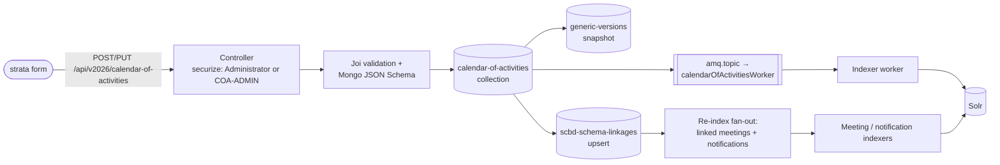

# Product Requirements: gaia (COA API service)

> Spoke PRD for the **gaia** project in the COA production design run. The shared domain,
> workflow, cross-spoke flows, and Deferred register are in the [hub PRD](prd.md); context
> restated here is labeled "from hub PRD §x". Vocabulary: [CONTEXT.md](CONTEXT.md).

## Problem Statement

gaia already authors, enriches, and indexes calendar activities — but only through a raw API.
Two things are missing for production. First, the API must serve a real authoring client
(strata) rather than hand-crafted requests. Second, nothing records what an activity produced:
today's embedded `outcomes` field holds only a date, a note, and a URL, with no way to link an
Outcome to the meeting, report, notification, or follow-on activity it actually names.

## Solution

Keep gaia exactly what it is — the system of record and the only writer to the search index —
and grow it in one place: **Outcomes become structured records** on the calendar activity,
with typed links to in-system artifacts, served through the same controller pattern, indexed
through the same message-queue pipeline, and kept consistent through the same cross-link
re-index fan-out the module already runs for meetings and notifications.

Everything else already works and is kept as-is (from hub PRD §Implementation Decisions:
"nothing is dropped"): validation, enrichment, versioning, linkage upserts, human-legible
ids, publication workflow, and the full indexer field set.

## What gaia owns (responsibilities)

- The calendar-activity record and its Outcomes: storage, validation, identifiers, version
  history.
- Role enforcement: writes require the `Administrator` **or `COA-ADMIN`** role — the second
  is new this version (from hub PRD §Roles, ruled 2026-07-09; ADR 0004): gaia's security
  lists gain `COA-ADMIN` so calendar administration can be granted without full
  administrator rights. Reads are public for `published` records only. The concrete
  enforcement today:
  `securize(adminRoles)` on POST/PUT/DELETE/status routes
  (`controllers/calendar-of-activities/controller.ts`), the role list in
  `controllers/calendar-of-activities/schemas/calendar-of-activities.ts` (security block),
  and the owner-may-update rule in `controllers/calendar-of-activities/services/db.ts`.
- The publication workflow: `meta.status` ∈ unpublished / published / rejected, transitions
  via `POST /:id/status/:status`, default **unpublished** on create.
- Enrichment: additive auto-mapping from the theme map and responsibility map
  (`services/auto-mapping.ts`) — never overwrites author values.
- Cross-links: the `scbd-schema-linkages` collection and the re-index fan-out that keeps
  linked meetings' and notifications' search documents current
  (`services/db.ts` → `upsertSchemaLinkages`; `utils/index.ts` → `queueLinkedSchemaReindex`).
- The published Solr contract: the `*COA` field set plus the general fields the indexer emits
  (`workers/indexers/scbd/index-calendar-of-activities.ts`).

## User Stories

1. As a Secretariat administrator, I want to create a calendar activity through the API with
   a title, type, and the decisions it relates to, so that the work behind a mandate is
   captured as a record. *(existing — kept)*
2. As an administrator, I want malformed input rejected with clear validation errors at the
   route (Joi) and the collection (Mongo JSON Schema), so that bad data never lands.
   *(existing — kept)*
3. As an administrator, I want each activity to get a stable human-legible id
   (`CAL-ACT-YYYY-NNN`) minted from an atomic counter, so that concurrent creates never
   collide. *(existing — kept)*
4. As an administrator, I want every create, update, status change, and delete to write a
   version snapshot, so that history is recoverable. *(existing — kept)*
5. As an administrator, I want to move an activity between unpublished, published, and
   rejected, so that I control when it becomes public. *(existing — kept)*
6. As an administrator, I want to save an activity's **Outcomes** — each with a date, a kind,
   an optional localized note, and links to the meetings, notifications, reports, or
   activities it names — so that results are recorded with the record. *(new)*
7. As an administrator, I want an Outcome that names an artifact not in the system to carry a
   plain note describing it, so that results are never lost just because the artifact lives
   elsewhere. *(new)*
8. As a delegate reading a linked meeting or notification, I want its search document to show
   the activities connected to it — including connections created by an Outcome — so that
   cross-references stay current in both directions. *(new — reuses the existing fan-out)*
9. As the front end, I want each activity's Solr document to carry its Outcomes as structured
   fields (details, kinds, links, dates), so that display needs no second lookup. *(new —
   extends the existing `outcomeDetails`/`outcomeUrls`/`outcomeDates` fields)*
10. As the front end, I want every field I read from the index emitted under the name I read
    it by, so that nothing is silently empty. The four known contract gaps are resolved this
    version: gaia's side of each fix is decided in the [gaia arch plan](gaia-arch-plan.md).
11. As an operator, I want to re-index all activities or one id from the CLI, so that the
    corpus is rebuildable after a schema change. *(existing — kept)*
12. As an operator, I want indexing failures to nack, retry, and dead-letter as they do
    today, so that Outcome indexing inherits the pipeline's resilience. *(existing — kept)*
13. As an administrator, I want a save to return without waiting on the CBD relational
    store — the linked-record re-index resolution runs in a queued worker, and a failed
    resolution lands in the dead-letter queue instead of failing my save — so that
    authoring is fast and SQL outages never block writing. *(new — pulled into scope from
    Deferred D4, ruled 2026-07-09)*
14. As a data steward, I must manually bring the reference vocabularies current — gaia's
    theme map, responsibility map, and agenda items via the existing operator load/clean
    scripts, and the external thesaurus domains through their vocabulary owners — before
    launch and on an agreed cadence after it, so that enrichment and filters run on
    current data. *(pulled into scope from Deferred D9, ruled 2026-07-09; a mandatory
    manual workstream — no coding, no new endpoints, no UI)*
15. As a release engineer, I want a committed machine-readable manifest of the published
    `*COA` field contract, checked by CI on both repos, so that a silent field rename fails
    a build instead of silently emptying a front-end field. *(new — pulled into scope from
    Deferred D5, ruled 2026-07-09)*

## Implementation Decisions

- **Outcomes stay embedded on the activity.** The production Outcome extends the existing
  `outcomes` array (today `{date, outcomeDetail, url}`) rather than becoming a separate
  collection. Reasons: strata edits Outcomes inside the activity form, so one save carries
  both; one write path keeps one version snapshot, one linkage upsert, and one indexing
  message; and the existing indexer already emits outcome fields. The extension adds a
  **kind** (activity / report / meeting / notification / multiple) and a **links** array of
  typed references (schema name + identifier), keeping the existing note (`outcomeDetail`),
  `url`, and `date` fields compatible. Recorded as ADR 0003 in the hub repo's `docs/adr/`
  (accepted 2026-07-09).
- **Kind rules close the two shape gaps** (from hub PRD §Outcomes): a *report* Outcome links
  the notification or URL carrying the report (reports are never a record type); a *multiple*
  Outcome is one Outcome with several typed links sharing one date and note — items needing
  their own dates or notes are separate Outcomes. Validation enforces both.
- **Outcome links feed the existing cross-link machinery.** Identifiers referenced by an
  Outcome's links join the same `scbd-schema-linkages` upserts and the same
  `queueLinkedSchemaReindex` fan-out as the activity's own `meetings` / `notifications` /
  `activities` references, so linked records' search documents are re-indexed on every save
  (from hub PRD §Flow 3).
- **No new endpoints unless the shape forces one.** Outcomes ride the existing
  create/update/status endpoints under `/api/v2026/calendar-of-activities`. The controller
  pattern (schema-driven router factory, `securize` → Joi → handler) is unchanged.
- **The Outcome boundary is enforced in the schema.** No deadline, no assignee, no task
  state, no nomination workflow fields — an Outcome is a result record only (from hub PRD
  §Outcomes). Validation rejects fields outside the approved shape.
- **Parity is preserved.** Every field and behavior the prototype's feature list depends on —
  statuses and their two vocabularies, `actionRequiredByParties` (+ `COA` alias), decisions
  with aliases and paragraphs, GBF targets/sections and variations, agenda items, responsible
  units/officers, localized text, related-record arrays — is already emitted by the indexer
  and is kept.
- **One role is added, nothing else is redesigned.** The security block in
  `controllers/calendar-of-activities/schemas/calendar-of-activities.ts` changes from
  `['Administrator']` to `['Administrator', 'COA-ADMIN']` on create/update/delete/admins
  (ADR 0004, ruled by Randy 2026-07-09). The `securize` middleware, the owner rule, and the
  read openness are untouched. Any finer scheme remains a future decision.
- **The reverse-reindex fan-out is decoupled from the save path** (story 13). The upsert
  publishes one queued "reindex linked records" job carrying the referenced codes; a worker
  performs the relational-store lookups (`T_NTF` / `T_EVT`) and publishes the per-record
  indexer messages. The save's success no longer depends on SQL; the fan-out inherits the
  worker pipeline's retry and dead-letter behavior. This also absorbs the added Outcome-link
  traffic that would otherwise widen the old synchronous path.
- **Reference-vocabulary upkeep is a required manual workstream** (story 14): no code
  changes. The read-only routers stay read-only; `scbd-schema-linkages` stays
  system-maintained; the external thesaurus service is untouched. What this version adds is
  the obligation: a named human owner updates gaia's reference collections through the
  existing operator scripts and coordinates thesaurus-domain updates with the vocabulary
  owners, before launch and on a cadence. The hub arch plan's verification checklist
  carries the launch item.
- **The `*COA` contract gets a committed manifest** (story 15): gaia owns a
  machine-readable field manifest (name, Solr type, emitting indexer); a gaia CI test
  asserts the indexer emits exactly the declared calendar-aligned set, and the front end's
  CI asserts its reads are a subset. Format and location are fixed in the
  [gaia arch plan](gaia-arch-plan.md).

## Testing Decisions

Test seams follow the module's existing layout (prior art in gaia's current tests and the
draft-2 spoke's seam list):

1. **API routes** — role gating (403 without `Administrator` or `COA-ADMIN`; 200 with
   either), validation errors, workflow
   transitions, and Outcome payload acceptance/rejection at the route seam.
2. **db service** — upsert with Outcomes: version snapshot written, linkage upserts
   idempotent (re-saving an unchanged Outcome adds no duplicates), publication filter honored.
3. **Indexer** — given a stored activity with Outcomes, the emitted Solr document carries the
   structured outcome fields and the `*COA` set; a deleted record deletes from Solr.
4. **Fan-out** — a save whose Outcome links a notification/meeting publishes the queued
   reindex-linked job; the fan-out worker, given that job, resolves the codes and publishes
   the per-record indexer messages; a failed resolution dead-letters without failing the
   save (story 13).
5. **Manifest** — the CI assertion that the indexer's emitted calendar-aligned field set
   equals the committed manifest (story 15). (Story 14 — reference-vocabulary upkeep — is
   a manual launch-checklist item, not a code test.)

A good test asserts the emitted document or response body, not internal calls.

## Success Metrics

- 100% of Outcome saves produce: one version snapshot, idempotent linkage upserts, one
  activity indexing message, and one re-index message per linked record.
- 0 writes accepted without the `Administrator` or `COA-ADMIN` role (or record ownership
  for updates).
- Every field named in the front-end PRD's read contract is emitted by the indexer under that
  name — including the four previously-gapped fields — verified by an indexer test.
- Re-running the CLI re-index over the corpus produces documents identical to
  message-driven indexing for the same records.

## Out of Scope

- Outcomes creating activities (hub Deferred D2 — link-only this version).
- Any Action record, workflow, deadline, or obligation semantics (hub Deferred D3).
- Authoring meetings, notifications, or decisions — referenced, never owned.
- Any code for editing reference vocabularies — story 14 is a manual human workstream; the
  read-only routers stay read-only, and no editing UI exists anywhere (strata keeps only
  the activity form).

## Further Notes

- File citations in this PRD were verified against the gaia working tree on 2026-07-09:
  `controllers/calendar-of-activities/{index.ts,controller.ts,schemas/calendar-of-activities.ts,services/db.ts,services/auto-mapping.ts,utils/index.ts}` and
  `workers/indexers/scbd/index-calendar-of-activities.ts`.
- The queue names and broker details (RabbitMQ `amq.topic`, routing key
  `calendarOfActivitiesWorker`, durable queue `SCHEMA-INDEXER-calendarOfActivitiesWorker`)
  are documented in the [gaia arch plan](gaia-arch-plan.md).
