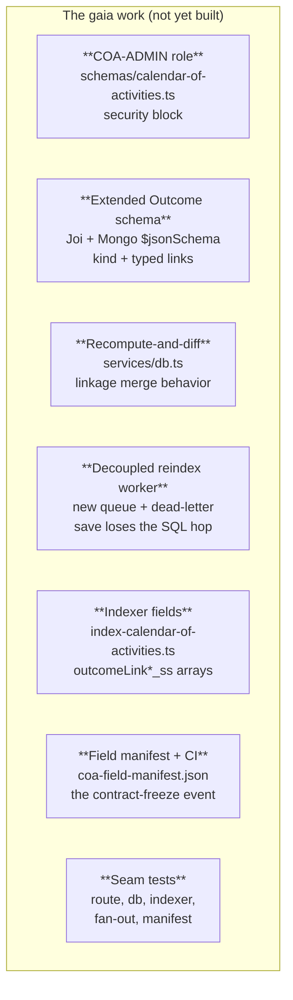
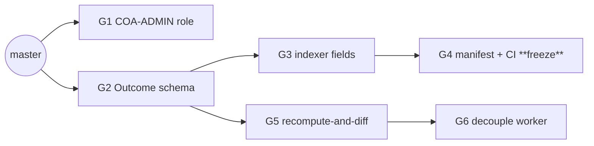
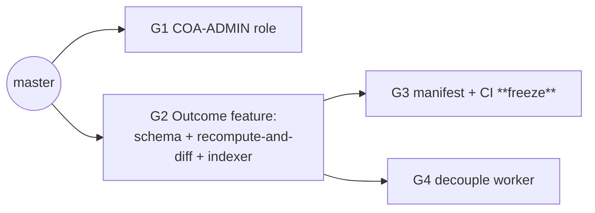
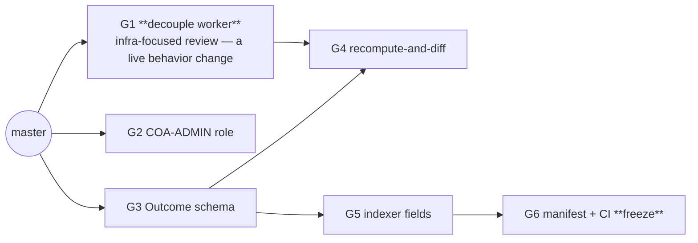

# gaia — PR Seam Options

> **Doc:** "PR Seam Options" — rival ways to cut the gaia (`@scbd/gaia`) work for the Calendar of
> Activities into pull requests, for a human to choose between. It is **not** a pull request and
> not a code review — it is the plan for *how to make* the PRs.

> **What this is.** [gaia-arch-plan.md](gaia-arch-plan.md) is the design of record: Outcomes
> become structured records with typed links, a new role guards writes, the linkage merge changes
> from additive-only to recompute-and-diff, the reverse-reindex SQL work moves off the save path
> into a new worker, the indexer gains four new fields, and a committed manifest freezes the Solr
> field contract. None of that code exists yet on gaia's `master` branch — this is forward design,
> not a pile of uncommitted diffs. So instead of counting changed lines, each piece below is
> described by what it does and how big a change it roughly is in the existing gaia codebase.

---

## The work, in one picture

| Piece | What it is | Modification site (real, as-built) | Nature | Relative size |
|---|---|---|---|---|
| COA-ADMIN role | Widen the write-role allow-list from `['Administrator']` to `['Administrator', 'COA-ADMIN']` | `controllers/calendar-of-activities/schemas/calendar-of-activities.ts` (security block) | adds-something-new | Tiny — a one-array edit, no logic change |
| Extended Outcome schema | Add `kind` (enum) and `links` (typed array) to the Outcome sub-schema, plus the `kind`/`link.schema` cross-field rule, in both Joi and the generated Mongo `$jsonSchema` | `controllers/calendar-of-activities/schemas/calendar-of-activities.ts`, `controllers/calendar-of-activities/utils/init-db.ts` | adds-something-new | Small-to-medium — new fields plus one cross-field validation rule, kept backward-compatible |
| Recompute-and-diff linkage semantics | Change the linkage merge from add-only to full recompute: read the pre-update document, diff the fresh reference set against it, and pull stale linkages on removal | `controllers/calendar-of-activities/services/db.ts` (`upsertSchemaLinkages`, around lines 597-700) | switches-it-on (a behavior change on every save, not just Outcome saves) | Medium — new diff logic plus a widened contract on an existing function |
| Decoupled reindex-linked-records worker | Move the `T_NTF`/`T_EVT` SQL lookups and their two AMQ publishes out of the request into a new worker consuming a new durable queue | `controllers/calendar-of-activities/utils/index.ts` (today's `queueLinkedSchemaReindex`), a new `workers/indexers/scbd/reindex-linked-records.ts`, `constants/queues.js` | switches-it-on (save-path latency and failure mode both change) | Medium — mostly a relocation of existing SQL/publish logic, plus the new queue wiring and the enqueue-failure dead-letter path |
| Indexer fields | Emit four new index-aligned arrays (`outcomeLinkKinds_ss`, `outcomeLinkSchemas_ss`, `outcomeLinkIdentifiers_ss`, `outcomeLinkTitles_ss`) plus best-effort title resolution | `workers/indexers/scbd/index-calendar-of-activities.ts` | adds-something-new | Small — four new parallel arrays following the existing agenda-item pattern |
| Field manifest + CI parity check | Add `controllers/calendar-of-activities/coa-field-manifest.json` (name + solrType + emitter per field) and a CI test asserting the indexer's emitted set matches it exactly | New file + a new CI test step | adds-something-new (a CI gate) — **this merge is the contract-freeze event** | Small — one JSON file plus one comparison test |
| Seam tests | API-route role gating, db-service linkage idempotency, indexer field assertions, fan-out job resolution, manifest parity | Rides inside each PR above, per the PRD's testing decisions | adds-something-new | Distributed — no separate "test PR" |

A fact worth flagging before the options: [gaia-arch-plan.md](gaia-arch-plan.md) describes gaia's
CI as `.github/workflows/ci.yml`, the SCBD deployment standard. Verified against the working tree:
gaia's as-built CI is **CircleCI** (`.circleci/config.yml`, present) — there is no
`.github/workflows/` directory at all. This is the same kind of standards gap already flagged for
www.cbd.int-headless (item D8 in [architectural-plan.md](architectural-plan.md#deferred--open-items)).
It does not block any option below — the manifest-parity CI test in every option wires into
**CircleCI, today**, not a GitHub Actions workflow that does not exist — but it means the "gaia's
CI fails if the two drift" claim in the arch plan currently points at a pipeline gaia doesn't run.
The GitHub Actions migration the SCBD deployment standard mandates is its own, separate work item
for gaia, parallel to the hub's D8 item for www — not something any option below should assume is
already done or should attempt to do incidentally while adding the manifest check.

---

## What a good split means here

A pull request is cut at the right place when **a reviewer could approve only that PR, merge it to
`master`, and gaia would still build, ship, and behave correctly.** Small is not the goal —
*independently mergeable* is.

Where this test comes from (sources)

> This is not a matter of taste. It restates a long-standing rule of continuous integration and
> trunk-based development: the shared branch must remain shippable after every merge, so a change
> is correctly scoped only when it can land on its own without breaking that branch.

> - **The seam test itself** is the `pr-decomposition` doctrine: a cut is real only when *"a
>   reviewer approved only this PR and nothing else, [and] the codebase would still be correct and
>   shippable,"* because *"good PRs are independently mergeable, not merely small."*
> - **Continuous integration** sets the same constraint. In *Continuous Integration*, Martin Fowler
>   writes that *"Continuous Integration can only work if the mainline is kept in a healthy
>   state,"* with the aim that *"the product should always be in a state where we can release the
>   latest build"* ([martinfowler.com](https://martinfowler.com/articles/continuousIntegration.html)).
> - **Trunk-based development** states the outcome plainly: collaborating on one branch and not
>   breaking the build *"ensures the codebase is always releasable on demand and helps to make
>   Continuous Delivery a reality"* ([trunkbaseddevelopment.com](https://trunkbaseddevelopment.com/)).
> - **Size is a by-product, not the target.** Google's code-review guidance defines the right unit
>   as *"a minimal change that addresses just one thing"* and *"one self-contained change,"* such
>   that *"the system will continue to work well... after the CL is checked in"* (a *CL*, or
>   changelist, is Google's term for a PR —
>   [google.github.io/eng-practices](https://google.github.io/eng-practices/review/developer/small-cls.html)).
>   Independence is the requirement; the small size tends to follow.
>
> In short: cut by whether each slice leaves the main branch green and releasable. A low change
> count is a symptom of a good cut, never its definition.

**Five facts shape every option. They hold in all three, and the first three are hard
constraints, not preferences:**

1. **The manifest freeze is a real cross-repo gate, not a courtesy.** [architectural-plan.md](architectural-plan.md#implementation-hand-off)
   names the merge of `coa-field-manifest.json` to gaia's `master` as the exact moment strata and
   www may build against gaia's contract. Every option below must say plainly when that merge
   happens relative to the rest of the work, because that date is a promise to two other repos.
2. **The manifest can only freeze what the indexer already emits.** The CI check compares the
   manifest to the indexer's actual output, so the manifest PR must always come after the indexer
   PR that adds the four new `outcomeLink*_ss` fields — never before it. A manifest declaring
   fields the indexer does not yet emit would fail its own check the moment it merged.
3. **The Outcome schema must land before anything that reads Outcome links.** The recompute-and-diff
   linkage merge unions an activity's direct references with every current Outcome `link`; the
   indexer's four new fields read the same `links` array. Both need `kind`/`links` to already exist
   on the schema, so the schema PR is an upstream dependency of both, in every option.
4. **Recompute-and-diff and worker decoupling are two different changes wearing one description.**
   [gaia-arch-plan.md](gaia-arch-plan.md#the-cross-link-reindex-implementation-as-built-logic-now-run-by-the-worker)
   describes them together because they touch the same two call sites
   (`upsertSchemaLinkages`, `queueLinkedSchemaReindex`), but they answer different questions:
   recompute-and-diff decides **what** identifiers get queued for reindexing (adding removals to
   the set); worker decoupling decides **where** the SQL resolution for those identifiers runs
   (inline in the request, or in a new async worker). A version of recompute-and-diff that still
   resolves SQL inline — extending today's `queueLinkedSchemaReindex` to also loop over the new
   removals array, exactly as it already loops over additions — is a buildable, shippable
   intermediate state. So is a version of the worker decoupling that moves only today's
   additive-only SQL resolution into the new worker, with no Outcome links involved at all. **The
   two do not have to ship in the same PR, and do not have to ship in a fixed order relative to
   each other.** This is the fact that makes three genuinely different orderings possible — see
   Option 3 below, which decouples the worker first, before any Outcome code exists.
5. **The role PR touches security-gated code.** SCBD's development standard requires a
   security-team reviewer on any security-touching change, and a write-role allow-list is exactly
   that. It is still the smallest, safest PR in the set — keep it separate so that reviewer's
   attention is not diluted by unrelated diffs.

---

## Option 1 — Contract-first *(recommended)*

**The idea:** Land the role, the schema, the indexer fields, and the manifest as early as
possible, so the contract-freeze event happens while the riskier plumbing changes — recompute-and-
diff, worker decoupling — are still in flight. strata and www start building against a frozen
manifest well before gaia's own linkage internals finish changing.

**The PRs:**

| # | What it does (no "and") | Kind | Builds on |
|---|---|---|---|
| G1 | Add the `COA-ADMIN` role to the write-route allow-list (ADR 0004) | adds-something-new | master |
| G2 | Add `kind` and `links` to the Outcome sub-schema in the Joi schema and the generated Mongo `$jsonSchema`, with the `kind`/`link.schema` cross-field rule and schema-level tests | adds-something-new | master |
| G3 | Add the four `outcomeLink*_ss` arrays and their index-time title resolution to the indexer, with indexer tests | adds-something-new | G2 |
| G4 | Add `coa-field-manifest.json` and the CI test asserting the indexer's emitted set matches it exactly — **the contract-freeze event** | adds-something-new | G3 |
| G5 | Change the linkage merge to recompute-and-diff (read the pre-update document, diff, propagate removals), still resolving SQL inline as today, with db-service tests | switches-it-on | G2 |
| G6 | Move the SQL resolution and publish step into the new decoupled worker and queue, with the enqueue-failure dead-letter path, and fan-out tests | switches-it-on | G5 |

**Good:**
- The freeze (G4) needs only G2 and G3 — it lands well before G5 and G6, the two PRs that change
  save-path behavior. strata and www can start their own implementation work the moment G4 merges,
  without waiting for gaia's linkage plumbing to finish.
- G1, G2, and G3 are all additive — nothing consumes the new fields yet, so each is safe to review
  in isolation.
- G5 and G6 stay separated by fact 4 above: one behavior change per PR, each independently
  reviewable.

**Watch out:**
- G4 freezes the field *names and types*, not gaia's internal linkage behavior — a reviewer who
  reads "contract frozen" as "feature done" will be surprised that G5 and G6 still change how saves
  behave. Say this out loud when G4 merges.
- G5 is the PR most likely to need rework (it changes behavior for every save, not just Outcome
  saves) — schedule review time for it, since G6 is blocked behind it.
- G3's title-resolution code calls the same external lookups (thesaurus, decision titles) already
  used elsewhere in the indexer — keep the failure-degrades-one-field pattern instead of a new one.

---

## Option 2 — Vertical feature, then decouple

**The idea:** Build the whole Outcome feature end to end as one coherent capability PR — schema,
linkage semantics, and indexer together, using today's synchronous SQL resolution the whole way —
so a reviewer reads the entire feature in one sitting instead of jumping between smaller PRs.
Decoupling the worker is a separate infrastructure change, layered on top once the feature exists.

**The PRs:**

| # | What it does (no "and") | Kind | Builds on |
|---|---|---|---|
| G1 | Add the `COA-ADMIN` role to the write-route allow-list (ADR 0004) | adds-something-new | master |
| G2 | Build the whole Outcome feature as one vertical capability PR: add `kind` and `links` to the Outcome sub-schema (Joi + Mongo, with the cross-field rule), change the linkage merge to recompute-and-diff (still resolving SQL inline as today), and add the four `outcomeLink*_ss` indexer arrays with title resolution — schema, linkage-merge behavior, and indexer land together, with schema, db-service, and indexer tests all riding in the same PR | adds-something-new *and* switches-it-on (a bundled capability change) | master |
| G3 | Add `coa-field-manifest.json` and the CI parity test — **the contract-freeze event** | adds-something-new | G2 |
| G4 | Move the SQL resolution and publish step into the decoupled worker and queue, with the enqueue-failure dead-letter path and fan-out tests | switches-it-on | G2 |

**Good:**
- The story reads in order: a reviewer can follow "what an Outcome looks like" to "how it re-links"
  to "what search sees" without jumping between smaller PRs — the whole feature is one read.
- Genuinely distinct from Option 1 by both count (four PRs, not six) and shape: this is a coarser
  cut along the same axis Option 1 splits fine-grained, not a relabeling of the same graph — G2's
  bundle covers exactly what Option 1's G2+G5+G3 cover separately.
- G3 and G4 both build on G2 but touch disjoint files (a manifest JSON file plus a CI test, versus
  `db.ts`'s call site, `utils/index.ts`, and `constants/queues.js`), so they are safe to review and
  merge in either order, or in parallel, once G2 lands.

**Watch out:**
- G2 is the heaviest single review across all three options — the schema, the linkage-merge
  behavior change, and the indexer fields, plus three kinds of tests, all in one PR. A reviewer who
  wants a narrower diff should pick Option 1 instead; this option trades review size for narrative
  completeness on purpose.
- The freeze (G3) now waits behind the whole vertical PR, including the recompute-and-diff
  behavior change — strictly later than Option 1's freeze point. That delay is a real, honest
  structural consequence of the coarser cut this time, not a same-graph relabeling with a
  false-later claim.
- The save path runs with synchronous SQL resolution for the entire time between G2 and G4 merging
  — the latency and outage-coupling risk the decoupling is meant to remove stays live for that
  whole window.

---

## Option 3 — Decouple first, build the feature on top

**The idea:** Treat the worker decoupling as a stand-alone reliability fix to gaia's *existing*
linkage fan-out — the one that already runs for meetings, notifications, and decisions today, with
no Outcome code involved. Ship it first, alone, reviewed by whoever owns queue/worker
infrastructure. Every later PR then builds the Outcome feature on top of a fan-out that is already
async.

**The PRs:**

| # | What it does (no "and") | Kind | Builds on |
|---|---|---|---|
| G1 | Move the *existing* `queueLinkedSchemaReindex` SQL resolution and publish step into a new decoupled worker and queue, with the enqueue-failure dead-letter path and fan-out tests — no Outcome code touched | switches-it-on (a behavior change on today's meeting/notification save path, not a refactor) | master |
| G2 | Add the `COA-ADMIN` role to the write-route allow-list (ADR 0004) | adds-something-new | master |
| G3 | Add `kind` and `links` to the Outcome sub-schema (Joi + Mongo), with the cross-field rule and schema tests | adds-something-new | master |
| G4 | Change the linkage merge to recompute-and-diff, publishing to the already-decoupled worker from G1, with db-service tests | switches-it-on | G3, G1 |
| G5 | Add the four `outcomeLink*_ss` indexer arrays and title resolution, with indexer tests | adds-something-new | G3 |
| G6 | Add `coa-field-manifest.json` and the CI parity test — **the contract-freeze event** | adds-something-new | G5 |

**Good:**
- G1 is the cleanest possible review of the riskiest change: no new schema, no new role, no new
  validation, and every line it touches is `queueLinkedSchemaReindex`'s existing SQL/publish logic
  relocated — but it is a live behavior change (sync inline resolution becomes async, queue-backed
  resolution) for today's meeting and notification saves, not a refactor a reviewer can wave
  through as move-only. A queue/infrastructure reviewer can still approve it on its own merits, and
  gaia's existing (non-Outcome) saves get the latency win immediately once it does.
- By the time G4 needs a decoupled worker to publish to, G1 has already been in production and
  proven, lowering the risk of the Outcome feature's own PR.

**Watch out:**
- This is the option most likely to surprise a reviewer expecting "the Outcome PR" to also be "the
  worker PR" — G1 ships with zero mention of Outcomes, and someone skimming the PR list could miss
  that it is a prerequisite for G4.
- The freeze (G6) still lands last of the three options in real-repo terms, tied with Option 2 —
  isolating G1 does not by itself move the freeze earlier; only Option 1's ordering does that.
- G1 changes the reindex latency and failure mode for gaia's current production traffic (meetings
  and notifications), before any Outcome work exists — it needs its own careful rollout attention,
  not just a green CI run, since it is live behavior change on day one with nothing else to blame
  it on if something regresses.

---

## Side by side

|                              | Option 1 — contract-first | Option 2 — vertical feature, then decouple | Option 3 — decouple first |
|---|---|---|---|
| Number of PRs | 6 | 4 | 6 |
| Longest chain | 3 (G2→G3→G4, and separately G2→G5→G6) | 2 (G2→G3, and separately G2→G4) | 3 (G3→G4/G5→G6, decoupling off the critical path) |
| When the manifest freezes | **Earliest** — right after schema + indexer, before either behavior change | Later — the whole vertical PR (schema + recompute-and-diff + indexer) must merge first | Latest in wall-clock terms, though the riskiest change (decoupling) is already done and proven by then |
| Where the riskiest PR sits | Split into two smaller, sequential behavior changes (G5, G6) | Bundled inside the one vertical PR (G2); decoupling (G4) ships as a separate, parallel infra PR once G2 lands | First, alone, before any Outcome code exists |
| Best reviewer fit | Security reviewer for G1; general reviewers for the rest | A reviewer who wants the whole Outcome feature read as one, heavier capability PR; a separate infra reviewer for G4 | An infra/queue reviewer for G1; feature reviewers for the rest |
| Cross-repo unblock speed | Fastest — strata and www can start the moment G4 merges | Slower — freeze (G3) waits behind the single, heavy vertical PR (G2) | Slowest wall-clock freeze, but production reliability improves first |
| Best when… | strata and www are ready to start and waiting on the contract | one reviewer wants to review the whole Outcome feature as a single, coherent PR and can accept a bigger diff for it | the decoupling is itself urgent (an incident, a latency complaint) independent of the Outcome feature |

---

## Recommendation

**Option 1 is the strongest choice.** [architectural-plan.md](architectural-plan.md#implementation-hand-off)
is explicit that gaia's contract freeze is what strata and www wait for, not "gaia's PR is open" or
"the spoke reads done" — so the option that reaches that freeze first, without cutting any corner to
get there, is the right default. Option 1 reaches it after only two upstream PRs (schema, indexer),
and fact 4 above proves that splitting recompute-and-diff from worker decoupling is safe, so nothing
about the freeze date depends on hurrying either behavior change.

Option 3's instinct — that the worker decoupling deserves its own focused, infra-reviewed PR,
separate from anything Outcome-shaped — is correct and worth keeping. But there is no free hybrid
that gets it for nothing: recompute-and-diff and worker decoupling both edit the same save-path
code (the `db.ts` call site, `queueLinkedSchemaReindex`, `constants/queues.js`), so whichever ships
second must be authored against the first's result — the two cannot run in parallel, only their
*order* is free (fact 4). Running them side by side off G2 (recompute inline, decouple built
against *today's* additive-only logic) would let a decoupled worker with no notion of removals
merge in parallel with a recompute PR that just started emitting them — a silent bug, not a savings.
Two honest ways to get the isolated infra review without deleting that edge:

- **Keep Option 1 as drawn.** `G5 → G6` is the genuine chain, and G6 already *is* the isolated
  worker PR — it just lands after recompute, not before it. The freeze at G4 is already early and
  independent of both G5 and G6, so nothing about the freeze date depends on hurrying either one.
- **Or adopt Option 3's ordering.** Decouple first (its G1, before any Outcome code exists,
  reviewable purely as infrastructure), then author recompute-and-diff against the already-async
  worker. This is the shape that actually delivers "worker-decoupling reviewed in isolation, before
  the feature" — at the cost of a later freeze (Option 3's G6, the latest of the three).

Either way the recompute↔decouple edge has to exist; only its direction is a real choice.

Option 2 is the right call only when a single reviewer needs to read the whole Outcome feature as
one, heavier PR and the later contract-freeze date is acceptable to strata and www.

Whichever option is chosen, land **G1 (the role)** and **G2 (the schema)** first — both are small,
additive, and unlock everything else.
