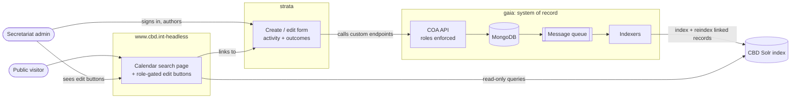
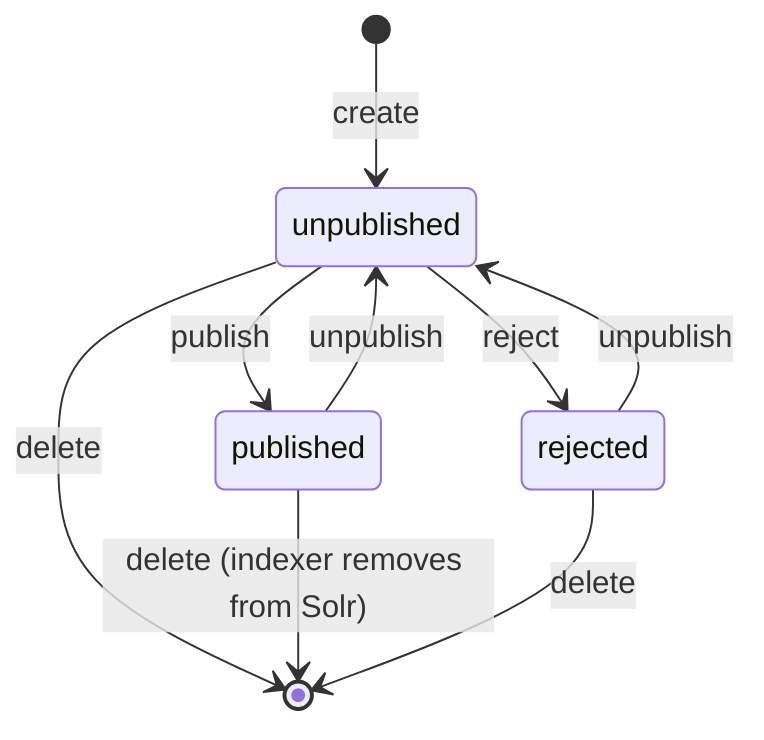

# Product Requirements: Calendar of Activities (hub)

> This is the **hub PRD** for the COA production design run. It carries the shared domain, the
> workflow, the flows that cross more than one project, and the Deferred register. Each spoke
> PRD ([gaia](gaia-prd.md), [strata](strata-prd.md),
> [www.cbd.int-headless](www.cbd.int-headless-prd.md)) carries that project's own
> responsibilities and restates the hub context it needs, labeled "from hub PRD §x".
> Domain words used here are defined in [CONTEXT.md](CONTEXT.md).

## Problem Statement

People who follow the Convention on Biological Diversity have no single place to see what is
happening and what is expected of them. Meetings live in one system. Official notifications to
Parties go out through another. Secretariat activities — peer reviews, workshops, calls for
submissions — are tracked internally. A delegate, a national focal point, or a researcher has
to search several sites and cross-reference the results by hand. Deadlines get missed.

COP Decision 16/25 told the Secretariat to fix this: give national focal points a "calendar of
activities and actions" for the year ahead, so intersessional work is easier to plan and
follow.[^mandate]

A pilot already proved the answer works. The prototype calendar merges meetings, notifications,
and calendar activities from the CBD search index into one searchable page, and its features
are approved. But the pilot is read-only and stands alone. Three gaps remain:

1. **No authoring path.** Secretariat staff have an API (gaia) but no form to create or edit
   calendar activities.
2. **No production home.** The prototype runs as a standalone pilot app, not inside the real
   www.cbd.int front end.
3. **No record of what happened.** When an activity finishes, nothing records what it produced
   — the report, the meeting, the notifications, or the follow-on activities it led to.

## Solution

Rebuild the pilot as a production system across three projects, each doing one job:

- **gaia** keeps its role as the system of record and the API. It stores calendar activities
  and their **Outcomes**, enforces who may write, and publishes every record to the CBD Solr
  search index through its message-queue indexers.
- **strata** gets the create/edit form. A Secretariat administrator opens strata to create a
  new calendar activity or edit an existing one, including its Outcomes. Strata has no list
  page and no menu entry for this — it is reached by links from the front end.
- **www.cbd.int-headless** carries the production search page: the prototype's approved
  feature set, re-implemented in the front end's own conventions. Signed-in users who hold the
  required role also see **edit buttons** on each calendar activity and a **create activity**
  entry point; both link to the strata form.

The front end stays a pure read-through of the search index. Writes travel only one path:
strata → gaia → MongoDB → message queue → indexer → Solr. A saved change appears in search
after the indexer runs, not instantly — eventual consistency is accepted.[^write-path]

## The shared domain (canonical)

### Record types

The calendar searches three record types from one index: **meetings**, **notifications**, and
**calendar activities**. Meetings and notifications are owned by their existing upstream
systems; gaia references them and triggers their re-indexing but does not author them. The
calendar activity is the record gaia authors directly.

### Action vs Activity (ontology)

From the COP decisions' own structure:[^mandate]

- The **Mandate** (the "why") is the COP decision — the legal basis.
- An **Action** (the "what") is the strategic step required to fulfil a decision — the
  compliance work or policy commitment.
- An **Activity** (the "how and when") is the event or milestone on a timeline that executes
  an Action.

**Actions are out of scope for this version** as a first-class record and as a workflow. The
calendar keeps its approved Action-flavored metadata — the "action required by Parties" flag
and filter, and notification deadlines — as fields on activities and notifications, exactly as
the prototype shipped them. The glossary keeps the Action entity, marked out of scope.

### Outcomes (new)

An **Outcome** records what happened after an activity. Its kinds: a new activity, a report, a
meeting, a notification, or a set of items (for example a group of nominations). An Outcome:

- links to the artifact (meeting, report, notification, activity) when the artifact exists in
  the system;
- holds a plain note describing the result when the artifact does not exist in the system;
- may link to activities, and in a future version may create them.

Two shape rules close gaps the kinds would otherwise leave open:

- **Reports are not an index record type.** The system's record types are meeting,
  notification, and calendar activity. An Outcome of kind *report* links to the notification
  or URL that carries the report when one exists; otherwise it holds a note. No report
  record is created anywhere.
- **A "multiple" Outcome is one Outcome with several typed links** sharing one date and one
  note (for example, a set of nominations recorded as one result). When individual items
  need their own dates or notes, the author records separate Outcomes instead.

**Boundary:** Outcomes are post-activity result records only. They do not represent
obligations, tasks, deadlines, nomination workflows, or any "action required" behavior. They
are not a back door for Action features.

Ownership: gaia stores and serves Outcomes. Strata creates and edits them alongside the
activity form. The front end displays them. gaia's existing embedded `outcomes` field (a date,
a localized note, a URL) is the seed this grows from; the production shape is designed in the
[gaia PRD](gaia-prd.md) and the gaia arch plan.

### Publication workflow

gaia owns and enforces one publication state machine for calendar activities (field
`meta.status`). The state is named **unpublished** — never "draft".

Anonymous readers and non-administrators see only `published` records. **Activity Status**
(confirmed, tentative, postponed, cancelled, completed) is a separate vocabulary describing
the event itself; it filters and displays but never gates visibility.

### Roles

Roles come from gaia only. As built, gaia enforces the **`Administrator`** role on every
calendar activity write (create, update, delete, status change); reads are open to
`Everyone`. **New this version (ruled by Randy, 2026-07-09): a dedicated `COA-ADMIN` role
is added alongside `Administrator`** — either role may create or edit calendar activities,
so calendar administration can be granted without full administrator rights. gaia's
security lists gain the new role name; no other role scheme is invented. One extra
server-side rule: the person who created a record may also update it (not delete it)
without either role.[^roles] Users establish their roles through the standard CBD login;
strata and the front end read the same roles gaia enforces.

**UI decision (this version):** both UIs gate on holding `Administrator` or `COA-ADMIN`.
The owner-may-update allowance is a server-side legacy behavior that neither the front
end's edit buttons nor strata's page guard surfaces — an owner without either role sees no
edit button and cannot open the form, even though a direct API call from them would
succeed. This asymmetry is accepted and recorded here so nobody "fixes" one side to match
the other by accident; designing an ownership signal is deliberately out of scope.

## User Stories (cross-spoke)

Spoke-local stories (search behavior, form fields, indexer details) live in the spoke PRDs.
These are the stories that cross a seam.

1. As a Secretariat administrator, I want to create a calendar activity in strata and see it
   appear on the public calendar after publishing, so that authoring and publishing is one
   flow.
2. As a Secretariat administrator browsing the public calendar, I want an edit button on each
   calendar activity I am allowed to edit, linking me straight into the strata edit form for
   that record, so that fixing a record takes one click.
3. As a Secretariat administrator, I want a "create activity" entry point on the public
   calendar, so that I can reach the create form even though strata has no menu entry.
4. As a visitor without the role, I want to see no edit or create controls at all, so that the
   public page stays clean and no dead-end links exist.
5. As a Secretariat administrator, I want to record an activity's Outcomes in strata — linking
   the report, meeting, notification, or follow-on activity it produced, or a plain note when
   the artifact is not in the system — so that the record shows results, not just plans.
6. As a visitor, I want an activity's Outcomes displayed with its details, with links that
   take me to the linked records, so that I can follow what an activity led to.
7. As a Secretariat administrator, I want an activity I unpublish or reject to disappear from
   public search after the indexer runs, so that visibility always matches the workflow state.
8. As a delegate viewing a notification or meeting, I want to see the activities linked to it,
   kept current even when the link was created from the activity side, so that cross-references
   never go stale.
9. As an operator, I want every write to reach the search index through the existing message
   queue and indexers, so that one pipeline (with its retry and dead-letter handling) carries
   all indexing.

## Cross-spoke flows

### Flow 1 — Author and publish (strata → gaia → Solr → www)

1. The administrator signs in (standard CBD login) and opens the strata form — either fresh
   (create) or via an edit link carrying a record id.
2. Strata calls gaia's calendar-of-activities endpoints. gaia checks the role, validates,
   writes to MongoDB, snapshots a version, and updates the cross-link records.
3. gaia queues indexing messages: one for the activity, plus re-index messages for every
   linked meeting and notification so their search documents pick up the new cross-link.
4. The indexer builds the Solr document (localized text, vocabularies, decisions, GBF fields,
   Outcomes) and commits it.
5. The front end's next search sees the record (if `published`).

### Flow 2 — Edit from the public page (www → strata)

1. A signed-in administrator loads the calendar page. The front end knows the user's roles
   from the CBD login.
2. Each calendar-activity result they may edit shows an edit button; the page header shows a
   create button. Both are plain links into strata (edit links carry the record id).
3. Strata verifies the same role server-side through gaia — the front-end button is a
   convenience, never the security boundary.

### Flow 3 — Outcome recorded, cross-links stay current

1. The administrator adds an Outcome in strata (say, linking the activity to a published
   report notification and to a follow-on activity).
2. gaia saves the Outcome, updates the linkage records, and queues: re-index this activity,
   and re-index each linked record — mirroring the existing linked-schema re-index fan-out.
3. After the indexers run, the activity's Solr document carries the Outcome, and each linked
   record's document carries the reverse reference.

## Implementation Decisions (cross-spoke)

- **One write path.** Strata is the only UI that writes; it calls gaia's custom endpoints
  following gaia's existing controller pattern. gaia writes MongoDB, then signals the message
  queue; indexers update Solr and re-index related documents. The front end never writes and
  never reads MongoDB.[^write-path]
- **The Solr document is the only coupling between gaia and the front end.** The
  calendar-aligned `*COA` field set is the published contract; renaming a field is a
  coordinated two-repo change.
- **Roles are gaia's.** No new role scheme is invented anywhere. The UI role checks in strata
  and the front end exist for usability; gaia's `securize` middleware is the enforcement.
- **Every feature already implemented in the API and indexers is kept.** The parity baseline
  is the prototype PRD's feature list; nothing is dropped.
- **Prototype defects are resolved, not inherited.** Each known defect gets an explicit call
  in the owning spoke PRD (the front-end PRD carries most of them).
- **The four known contract gaps close this version, resolved on the front-end side.** A
  2026-06-24 cross-repo audit found four fields the front end reads that gaia's indexer never
  emits under those names. The resolution direction: the front end reads the granular or
  structured fields gaia already emits; gaia adds no combined fields.

  | Front end read (old) | gaia emits (kept) | Resolution |
  |---|---|---|
  | `responsibleUnitsAndOfficers_ss` | `responsibleUnits_ss` + `responsibleOfficers_is` | Read the two granular fields |
  | `agendaItems_ss` | `agendaItemMeetingCodes_ss`, `agendaItemNumbers_ds`, `agendaItemCodes_ss`, `agendaItemTitles_*_txt` | Read the granular fields |
  | `outcome_s` | `outcomeDetails_*_txt`, `outcomeUrls_ss`, `outcomeDates_dts` (extended this version with kinds and links) | Read the structured fields |
  | `url_ss` | `outcomeUrls_ss` | Read `outcomeUrls_ss`; the separate activity `url` concept is dropped |
- **SCBD standards apply**: GitHub Flow on `master` with squash merges, GitHub Actions CI,
  CalVer releases (`YYYY.weekOfYear.patch`), Docker Swarm deployment with independent dev and
  prod environments.[^standards]

### Pulled into scope (ruled by Randy, 2026-07-09 — formerly Deferred D4, D5, D9)

- **Decoupled reverse-reindex (was D4).** The fan-out that re-indexes linked meetings and
  notifications no longer resolves codes through the CBD relational store during the save
  request. The save publishes one queued job; a worker does the SQL resolution and the
  per-record publishing asynchronously, with failures landing in the dead-letter queue.
  Authoring latency stops depending on SQL availability. Design in the
  [gaia arch plan](gaia-arch-plan.md).
- **Generated `*COA` field manifest (was D5).** The published-language contract becomes a
  committed, machine-readable manifest owned by gaia (field name, type, emitter). gaia's CI
  verifies the indexer emits what the manifest declares; the front end's CI verifies every
  field its calendar service reads exists in the manifest. A silent rename now fails a
  build instead of failing at query time. Design split across the
  [gaia](gaia-arch-plan.md) and [www](www.cbd.int-headless-arch-plan.md) arch plans.
- **Reference-vocabulary upkeep (was D9) — a mandatory manual workstream, no coding.**
  The vocabularies that drive filters and enrichment must be brought current and kept
  current by people as part of delivering this version: the external thesaurus domains
  (activity types, event statuses, bodies, GBF terms) through their vocabulary owners, and
  gaia's own reference collections (the theme map, the responsibility map, and agenda
  items) through the existing operator load/clean scripts. No new endpoints and no UI are
  built — the read-only routers stay read-only. This is a required launch item with a named
  human owner, tracked in the hub arch plan's verification checklist.

## Testing Decisions (cross-spoke)

Each spoke tests behind its own seam (spoke PRDs name them). The cross-spoke acceptance checks
are integration-shaped:

- An activity created and published through strata appears in front-end search after the
  indexer runs; unpublishing removes it (Flow 1 and story 7).
- An Outcome saved in strata renders on the front-end detail view, and its linked records'
  search documents carry the reverse link (Flow 3).
- Edit/create controls render only for users holding the gaia role, and a strata write by a
  user without the role is rejected by gaia with a 403 (Flow 2).
- Every `*COA` field the front end reads is emitted by the gaia indexer under the same name.

## Success Metrics

Launch acceptance checks (verified once, at build time):

- 100% of the prototype PRD's feature list is traceable to a front-end PRD story or an
  explicit, recorded divergence (the parity register in the front-end PRD).
- 0 write paths outside strata → gaia; 0 role checks invented outside gaia's role names.
- Each of the four contract-gap fields above is read from gaia's emitted field names,
  verified by a service test on the front end and an indexer test in gaia.
- The `*COA` manifest checks pass in both repos' CI: gaia emits exactly what the manifest
  declares; the front end reads only fields the manifest contains.
- A calendar-activity save completes without any synchronous call to the CBD relational
  store (the fan-out job carries that work), verified by a route-seam test.

Operational metrics (re-measurable after launch):

- A valid activity round-trips — created in strata, published in gaia, visible in front-end
  search after the worker runs — in 100% of cases when the queue and indexers are up (a
  failed run must appear in the dead-letter queue, never vanish).
- Edit buttons appear for 100% of role-holding users and 0% of anonymous sessions (e2e
  check, re-run per release).

## Deferred register

Items intentionally not designed in this version. Each has an owner and a one-line reason.

| # | Item | Owner | Reason |
|---|---|---|---|
| D1 | Strata editing of notifications and meetings | strata | Ruled future scope (Fixed decision 3); one Out-of-Scope line in the strata PRD, no design work. |
| D2 | Outcomes creating activities | gaia/strata | Decision 5 marks creation "future version"; this version links only. |
| D3 | Action as a first-class record and Action workflows | all | Fixed decision 7; ontology kept in the glossary, marked out of scope. |
| D6 | Indexing-lag observability (queue depth, processing time) | gaia | Existing gap; not widened by this version, not fixed by it either. |
| D7 | Calendar export/subscription (iCal/ICS, reminders), month-grid view, saved searches | www | Out of scope in the prototype and unchanged here. |
| D8 | CircleCI → GitHub Actions migration for www.cbd.int-headless | www | Deployment standard mandates Actions; migration is deployment work, not COA design. |

> Former rows D4 (reverse-reindex decoupling), D5 (generated `*COA` field manifest), and D9
> (editing the reference vocabularies) were pulled **into scope** by Randy on 2026-07-09.
> They are now requirements — see "Pulled into scope" under Implementation Decisions. Row
> numbers D6–D8 are kept stable because other documents cite them.

## Out of Scope

- Everything in the Deferred register above.
- Authoring meetings, notifications, or decisions — owned by their upstream systems.
- Any synchronous "indexed before the API returns" promise — the pipeline is eventually
  consistent by design.
- Per-user personalization on the public calendar beyond role-gated edit controls.

## Further Notes

- The reference drafts (draft-2, then draft-1, under `docs/calendar-of-activities-draft-*/`)
  are secondary sources; where they conflict with the mandate or the prototype PRD, the
  precedence in `prompt.md` §Fixed decision 15 was applied.
- The gaia code citations behind the roles, write path, and re-index claims are in the
  [gaia PRD](gaia-prd.md) and [gaia arch plan](gaia-arch-plan.md).

[^mandate]: COP Decision CBD/COP/DEC/16/25 (2024, COP 16) asked the Secretariat to provide
    national focal points with a yearly calendar of activities and actions. See the mandate
    summary in [mandate.md](mandate.md) and the
    [COP 16 decisions portal](https://www.cbd.int/decisions/cop/?m=cop-16).
[^write-path]: Write/read path ruled by Randy, 2026-07-09 (prompt.md, Fixed decision 5):
    strata calls gaia's custom endpoints; gaia writes MongoDB then sends a message-queue
    message; the indexer updates Solr and re-indexes related documents; the front end stays a
    pure Solr read-through.
[^roles]: Enforced in gaia at `controllers/calendar-of-activities/schemas/calendar-of-activities.ts`
    (security block, as built: `create/update/delete/admins: ['Administrator']`, reads
    `['Everyone']`) via the `securize` middleware in `middleware/authentication.js`; the
    owner-may-update rule is in `controllers/calendar-of-activities/services/db.ts`
    (`securizeOwnerOrAuthorized`). This version adds `COA-ADMIN` to those security lists
    (see ADR 0004 in `docs/adr/`).
[^standards]: SCBD Software Development Standards v0.3 and Deployment Standards v0.1
    (`scbd/documentation`, `devops/`). The deployment standard scopes to Node.js apps on
    Docker Swarm, which covers all three spokes.
