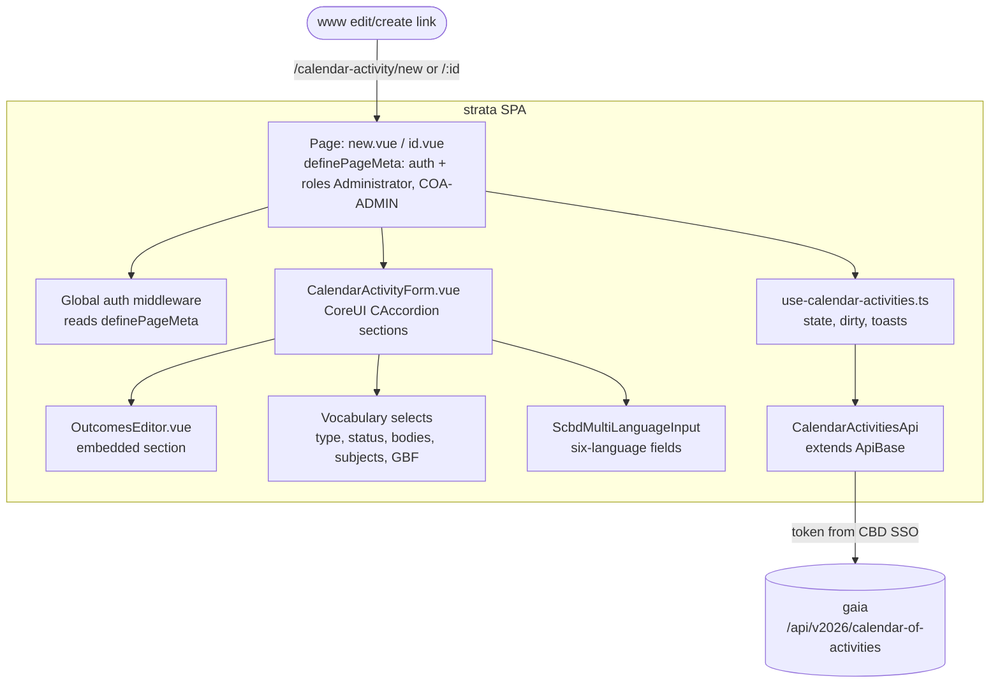
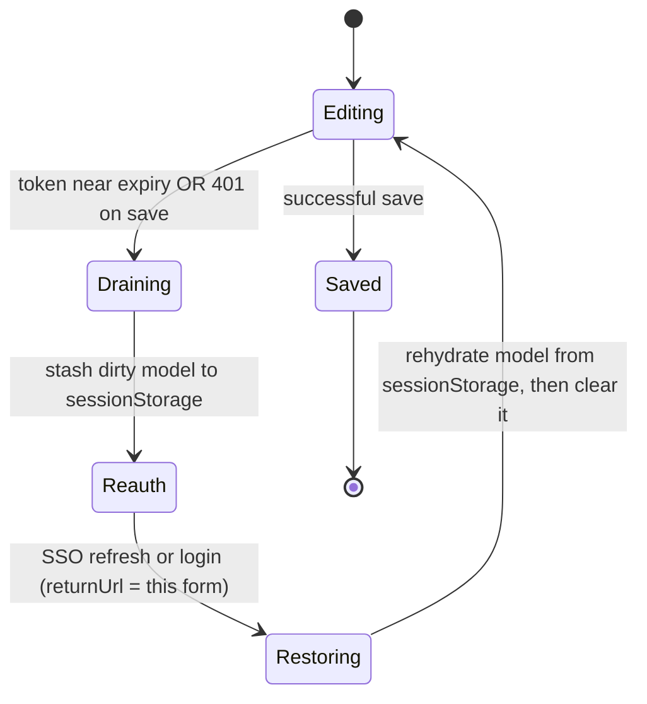

> Part of the [Calendar of Activities](architectural-plan.md) architectural plan. The cross-project
> hub (System Overview, Actors, Workflow Statuses, End-to-End Flows, Ownership, Verification) is the
> [hub](architectural-plan.md); glossary: [CONTEXT.md](CONTEXT.md); how this context relates to the
> others: [CONTEXT-MAP.md](CONTEXT-MAP.md). This doc owns the **strata (create/edit form)** work —
> the *COA Authoring UI* context (new this version). Sibling spokes: [gaia](gaia-arch-plan.md),
> [www.cbd.int-headless](www.cbd.int-headless-arch-plan.md). Product intent: [strata-prd.md](strata-prd.md).
>
> **Plan vs. as-built.** This is the design-of-record for strata's COA form. No calendar-activity
> code exists in strata yet, so this spoke is a **forward design** — every source path below is
> **[new]** unless it names an existing exemplar to copy (labeled **[exemplar]**). The `@scbd/strata`
> repo's conventions (`AGENTS.md`, `CONTEXT.md`, the `strata-api-shape` skill) are the as-built
> constraints this design conforms to.
>
> **Location note.** This spoke documents the `@scbd/strata` repo but is parked in
> `www.cbd.int-headless/docs/coa-2026-07-09/` for this run. When it moves to `@scbd/strata/docs/`,
> switch its hub and sibling links to full GitHub URLs.

# Calendar of Activities: strata (create/edit form) plan

Strata gets **one form**: create a new calendar activity, or edit an existing one, including its
Outcomes. That is the whole surface — no list page, no menu entry, no dashboard. A Secretariat admin
arrives only by a link from the public calendar page. The form speaks gaia's language: it calls
gaia's calendar-of-activities endpoints, honours gaia's write roles (`Administrator` or the new
`COA-ADMIN` — ADR 0004) through the standard CBD
login, and shows the record's publication state with the transitions gaia allows. Domain terms are
in [CONTEXT.md](CONTEXT.md).

## Owned interface (the seam)

Strata owns **two contracts**, one on each side of it:

1. **Upward, to gaia — a conformist Customer/Supplier link.**[^conformist] Strata calls gaia's HTTP
   API and adopts gaia's payload shapes, role names (`Administrator`, `COA-ADMIN`), and status words exactly. It
   adds no model of its own; the form state is gaia's record shape plus UI concerns (dirty tracking,
   validation display). When gaia's schema changes, strata conforms. This side is *consumed*, not
   published — strata is the customer.
2. **Downward, to the front end — a published URL contract.** The stable entry-point routes the
   front end links to are the one thing strata *publishes*. Only a record identifier and an optional
   return link cross this seam; no data does. Strata names the routes; the front end conforms.

Everything else — the CoreUI form tree, the Outcomes editor, client-side validation, dirty tracking,
the session-expiry handling — is implementation hidden behind those two contracts.

### The entry-point URL contract (published) **[new — resolves forward finding 2]**

These are the routes the front end hardcodes. They are a contract: changing one is a coordinated
two-repo change (edit strata's route and www's link builder together, per
[CONTEXT-MAP § Maintenance](CONTEXT-MAP.md#maintenance)). Strata is a Nuxt 4 SPA with file-based
routing, so each route is a page file under `app/pages/`.

| Purpose | Route | Page file **[new]** | Params |
|---|---|---|---|
| Create a new activity | `/calendar-activity/new` | `app/pages/calendar-activity/new.vue` | `?returnUrl=<encoded www page URL>` (optional) |
| Edit an activity by id | `/calendar-activity/:id` | `app/pages/calendar-activity/[id].vue` | `:id` = the record identifier gaia accepts (ObjectId, per-locale slug, or `CAL-ACT-YYYY-NNN`); `?returnUrl=` optional |

Contract rules:

- **`:id` accepts any identifier gaia's `GET /:id` accepts.** The front end passes whatever
  identifier it has for the record (in practice the human-legible `CAL-ACT-YYYY-NNN`); strata passes
  it straight through to gaia. Strata does not care which of the three forms it is.
- **`returnUrl` is an optional, encoded link back to the public calendar page** the admin came from.
  After a save or cancel, strata offers the way back to it, keeping the no-menu model coherent.
  **The validation mechanism [new — pins forward finding 2's open item]:** strata reads a
  runtime-config allowlist, `runtimeConfig.public.returnUrlAllowedOrigins` (a comma-separated list
  of origins, one per deployment environment — dev and prod Swarms serve from different hostnames,
  the same reason `apiBaseUrl`/`drupalBaseUrl`/`ortUrl` are already environment-scoped runtime
  config, not hardcoded). Validation is **strict origin equality**: parse `returnUrl` with the `URL`
  constructor and compare its `protocol` + `host` (which includes the port) against each allowed
  origin for an exact match — no substring or suffix matching, so a suffix trick like
  `https://www.cbd.int.evil.example` or a subdomain trick cannot pass. On a failed match the
  `returnUrl` is silently dropped — the form still works, it just offers no back link — never used
  as a redirect target. This is never an open redirect by construction, because the allowlist is
  fixed at deploy time and the check never trusts an attacker-controlled component of the URL.
- **No other routes are published.** There is no list route, no menu, no `/calendar-activity`
  index. Anyone reaching the bare path with no id and no `new` gets a not-found.

## UI Surfaces (page + component tree)

The design follows strata's **Editorial Request** precedent piece for piece **[exemplar:
`app/components/editorial/request/{form,modal}.vue`]**, so the new code looks like the code already
in the repo.



- **Pages** `new.vue` / `[id].vue` **[new]** — thin. Each sets
  `definePageMeta({ auth: true, roles: ['Administrator', 'COA-ADMIN'] })`, loads the record (edit) or an empty
  model (create) through the composable, and renders the form. The `id.vue` page fetches by `:id`
  before rendering.
- **`CalendarActivityForm.vue`** **[new, exemplar `editorial/request/form.vue`]** — a CoreUI
  `CAccordion` of sections (core fields, classification, related records, Outcomes), built from
  `CForm*` controls and the shared selector components. It uses `defineModel` with a `cloneDeep` dirty
  clone and the repo's `isModelDirty` / `modelDiff` utilities **[exemplar `app/utils/models.ts`]** so
  the save button enables only on a real, valid change.
- **`OutcomesEditor.vue`** **[new]** — the embedded section for add / edit / remove of Outcomes (its
  own subsection below).
- **Localized fields** use `ScbdMultiLanguageInput` + `lstring()` from `@scbd/vue-components`
  **[exemplar]** for the six-language title, description, and status narrative.
- **Save UX** mirrors `editorial/request/modal.vue` **[exemplar]**: an explicit save button disabled
  unless the form is dirty *and* valid, a `CSpinner` while saving, success/error toasts through
  `app/composables/use-toast.ts`, and edits kept on screen on failure.

### The Outcomes editor **[new]**

The editor is a repeatable list inside the form. Each row edits one Outcome constrained to the
approved shape — nothing more:

- **Kind** — a select of `activity` / `report` / `meeting` / `notification` / `multiple`.
- **Date** — one date for the Outcome (shared across all links of a `multiple` Outcome).
- **Note** — the localized `outcomeDetail`, using the same multi-language input; required when there
  is no in-system link.
- **URL** — an optional plain link (e.g. a report that is not a system record).
- **Links** — zero or more typed references `{schema, identifier}`. The `schema` select offers
  `meeting` / `notification` / `calendarActivity`; the identifier field is a lookup appropriate to
  the schema (a meeting picker, a notification-code field validating `NTF-YYYY-NNN`, an activity
  picker resolving `CAL-ACT-YYYY-NNN`). A `report` kind offers only the notification link or the URL
  or the note — never a "report record", because reports are not a record type. **[new — resolves
  round-2 Low #5]** The `schema` select is constrained client-side by the chosen Kind, mirroring
  gaia's [kind/schema cross-field rule](gaia-arch-plan.md#the-extended-outcome-sub-schema-new):
  `kind: meeting` offers only `schema: meeting`, `kind: notification` only `schema: notification`,
  `kind: activity` only `schema: calendarActivity`, and `report` / `multiple` keep all schemas
  offered per their stated exceptions — so a mismatched combination cannot be entered, not just
  rejected at save.

The editor enforces the boundary in the UI as gaia enforces it in the schema: there is no deadline,
assignee, or task field to enter. A `multiple` Outcome is one row with several links, one date, one
note; when an item needs its own date, the admin adds a separate Outcome row.

### Vocabulary-driven selects

Activity type, status, governing and subsidiary bodies, subjects, GBF targets and sections all come
from the **same thesaurus vocabularies gaia validates against**, loaded through strata's API clients,
so the form can never offer a value gaia would reject. This keeps strata a conformist to gaia's
classification and removes a whole class of validation round-trips.

## API client

One client class, following the repo's one-client-per-domain rule **[exemplar
`app/api/editorial-requests.ts`]**:

```
app/api/calendar-activities.ts   [new]
  class CalendarActivitiesApi extends ApiBase   // @scbd/api-client
    constructor({ token, baseURL })             // baseURL = runtimeConfig.public.apiUrl
      // injects Authorization: <token> on every request
    query(opts)                    → GET  /api/v2026/calendar-of-activities
    get(id)                        → GET  /api/v2026/calendar-of-activities/:id
    create(data)                   → POST /api/v2026/calendar-of-activities
    update(id, data)               → PUT  /api/v2026/calendar-of-activities/:id
    setStatus(id, status)          → POST /api/v2026/calendar-of-activities/:id/status/:status
```

Two deliberate differences from the Editorial Request exemplar, because strata conforms to *gaia's*
COA contract, not Editorial Request's: the API version is **v2026** (gaia's COA mount), and update is
**`PUT`** with a status **sub-route** (`POST /:id/status/:status`), matching gaia's controller —
whereas Editorial Request uses `PATCH` and a `/transition` endpoint. The client is a thin wrapper;
all shaping stays in the composable and form.

## Auth and role gating

Strata already extends `github:scbd/scbd-auth-layer` **[as-built]**, which provides single sign-on
through the standard CBD login.[^sso] The COA form reuses it as-is:

- **Page gating** — `definePageMeta({ auth: true, roles: ['Administrator', 'COA-ADMIN'] })`. The layer's global
  middleware reads that meta and enforces it: an anonymous visitor is sent to login; a signed-in user
  without the role gets a clear "no access" outcome instead of a broken form.
- **Role constants** — add `Administrator = 'Administrator'` and `CoaAdmin = 'COA-ADMIN'`
  (ADR 0004) to `app/utils/roles.ts` **[new]**, alongside its two existing exports (verified
  as-built): `Staff = 'ScbdStaff'` and `EditorialService = 'EditorialService'` — the exported
  identifier is `Staff`, its value is `'ScbdStaff'`, matching the existing identifier-vs-value
  pattern the two new constants follow. The names are gaia's, used verbatim — strata invents no role.
- **Token** — `useScbdAuthSso()` **[as-built]** exposes the token, the user, `isAuthenticated`,
  `login` / `logout`, and `hasRole`. The token is injected into every `CalendarActivitiesApi` request.
- **The page check is usability only.** gaia's server-side `securize` is the real boundary — a raw
  write by a user without the role is rejected 403 regardless of the page guard (hub
  [Flow 2](architectural-plan.md#flow-2--edit-from-the-public-page-www--strata)).

## Key Flows

### Save round-trip (create / edit / status), including gaia's transitions

```mermaid
sequenceDiagram
  actor Admin
  participant Page as page (new.vue / id.vue)
  participant Comp as use-calendar-activities
  participant Api as CalendarActivitiesApi
  participant Gaia as gaia API
  Admin->>Page: opens /calendar-activity/new (or /:id)
  Page->>Comp: load empty model (or get(id))
  Comp->>Api: (edit) get(id)
  Api->>Gaia: GET /:id  (token)
  Gaia-->>Api: activity (+ outcomes)
  Api-->>Comp: model
  Admin->>Page: edits fields + Outcomes
  Note over Page: save enabled only when dirty AND valid
  Admin->>Page: Save
  Page->>Comp: submit(modelDiff)
  Comp->>Api: create(data) or update(id, data)
  Api->>Gaia: POST / or PUT /:id  (token)
  alt success
    Gaia-->>Api: saved document (+ CAL-ACT-YYYY-NNN)
    Api-->>Comp: document
    Comp-->>Admin: success toast; show human-legible id
    opt publish / unpublish / reject
      Admin->>Page: choose a transition gaia allows
      Page->>Comp: setStatus(id, status)
      Comp->>Api: setStatus(id, status)
      Api->>Gaia: POST /:id/status/:status
      Gaia-->>Api: updated document
    end
  else 403 (no role) / 400 (validation) / network
    Gaia-->>Api: error
    Api-->>Comp: error
    Comp-->>Admin: error toast; edits kept on screen
  end
```

Strata shows only the transition buttons gaia allows from the record's current publication state
(`unpublished` ⇄ `published`, `unpublished` ⇄ `rejected`), and the state is always named
**unpublished** — never "draft". The canonical matrix is gaia's
([gaia → Workflow transitions](gaia-arch-plan.md#workflow-transitions-canonical-server-enforced)); the
form is a client of it.

### Session expiry mid-edit — preserve the form through re-login **[new — resolves forward finding 3]**

The form is long (six languages, no autosave), so a login session can expire while the admin is
still typing. Losing their work is unacceptable. The design keeps the data through a re-login:



**Build-time verification (new — this design's hard guarantee depends on it):** the NFR table below
states "an expired session never costs a typed record" as a hard guarantee, not a best-effort one,
so the mechanism it depends on must be confirmed, not assumed. `sessionStorage` survives a same-tab
redirect through login and back, but not a flow that opens a popup or a new tab — some SSO
integrations use a new browsing context for a silent-refresh iframe or a specific identity-provider
configuration. Before this design ships: **[ ] confirm, by reading `scbd-auth-layer`'s actual
`login()` call site and its silent-refresh implementation (if one exists), that every path returns
control to the same tab strata is running in.**

Mechanics:

1. **Detect early.** A watcher reads the token's expiry from `useScbdAuthSso()` and, as expiry nears,
   attempts a silent refresh if the auth layer supports one. If a save nonetheless returns `401`, that
   is the fallback trigger.
2. **Stash the work.** Before any navigation, the composable serializes the current dirty model —
   including in-progress Outcomes — to `sessionStorage` under a key scoped to the route and record id
   (`coa-form:<id|new>`). `sessionStorage` is per-tab and cleared on tab close, so nothing leaks
   between users or sessions.
   - **If the build-time check above finds any path leaves the tab**, the stash falls back to a
     **scoped `localStorage` entry** instead: same key shape (`coa-form:<id|new>`), plus a short TTL
     (e.g. 30 minutes) and the record id, so a stale entry from an abandoned edit cannot resurrect
     itself into a later, unrelated session. The entry is deleted on restore exactly as the
     `sessionStorage` entry is (mechanic 4), and any entry past its TTL is treated as absent and
     cleared opportunistically on the next form mount.
3. **Re-login in place.** Trigger the auth layer's login with a `returnUrl` pointing back at this
   exact form route (the same route the admin is on). A silent refresh returns without a visible
   redirect; a full re-login returns the admin to the form afterward.
4. **Restore and clear.** On the form's mount/hydration, if a matching stash entry exists (whichever
   storage mechanic 2 used), rehydrate the model from it and delete the entry, so the admin resumes
   exactly where they were.

This composes with the plain unsaved-changes guard (story 11): a `beforeunload` / route-leave warning
still fires when the admin tries to leave with unsaved edits by any other path.

## Quality Attributes (NFRs)

| Attribute | Target | How the design meets it |
|---|---|---|
| No lost work | An expired session never costs a typed record | Dirty model stashed to per-tab `sessionStorage`, restored after re-login (above) |
| Validation parity | Most errors caught before the request | Client validation mirrors gaia's Joi schema (required type + decisions, localized title, field shapes) |
| Security | No write without the role | Page guard for usability; gaia's `securize` is the boundary; `returnUrl` validated against www origin (no open redirect) |
| Conformance | The form never offers a value gaia rejects | Vocabulary selects load the same thesaurus gaia validates against |
| Feedback | The admin always knows if a save landed | Explicit dirty+valid save button, spinner, success/error toasts, edits kept on failure |
| Consistency with the repo | New code looks like existing code | Follows the Editorial Request form/modal/composable/API-client precedent and `AGENTS.md` conventions |
| Accessibility | Keyboard operable, labeled fields | CoreUI form controls with labels; the same patterns strata already ships |

## Deployment and CI (SCBD standard)

Strata is already a Node.js SPA on Docker Swarm with a **GitHub Actions** pipeline, so it is already
conformant with the SCBD deployment standard **[as-built, verified 2026-07-09:
`.github/workflows/ci.yml`]** — no migration is needed here.[^standards]

- **CI:** `.github/workflows/ci.yml` builds CalVer tags `YYYY.N.N` → `scbd/strata:<tag>` + `:latest`;
  `master`/`main`/`dev` build a branch tag; a `dev` push fires the Portainer webhook
  (`newarifrh/portainer-service-webhook@v1`, `WEBHOOK_URL_DEV`).[^calver]
- **Runtime:** the existing `node:24-alpine` multi-stage Dockerfile, port 3000, running `.output`.
- **Branching / review:** GitHub Flow on protected `master`, feature branches
  `feature/JIRA-123-short-desc`, squash-merge after review. The role/auth surface means a
  security-team reviewer is included per the software-development standard.
- No new service or `scbd/infra/services` entry — the COA form is new pages inside the existing
  strata app. *(Note: the repo `AGENTS.md` "Deploy" section still mentions CircleCI; the live
  `.github/workflows/ci.yml` is the current truth and is GitHub Actions.)*

## Risks and Open Questions

- **Last-write-wins across two editors.** Because gaia's upsert replaces the submitted fields
  wholesale, two admins editing one activity are last-write-wins (hub / gaia risk). Accepted this
  version (infrequent edits, recoverable snapshots). If gaia adds the optional conditional-update
  guard ([gaia → Risks](gaia-arch-plan.md#risks-and-open-questions)), strata should carry the loaded
  `meta.updatedOn` on the `PUT` and surface a `409 Conflict` as "this record changed since you opened
  it" — a small addition on the form side, coordinated with gaia.
- **Silent SSO refresh availability.** The clean session-expiry path depends on the auth layer
  supporting a silent token refresh. If it does not, the design falls back to a full re-login with
  `returnUrl` plus the stash (`sessionStorage`, or `localStorage` with a TTL if the build-time check
  finds any path leaves the tab) — the work is still preserved, only the admin sees a login screen.
  Confirm the layer's refresh capability at build time, alongside the same-tab check above.

## Out of scope (this spoke)

- **Editing notifications and meetings in strata** — future work (hub Deferred D1); one line here by
  design, no design work.
- Any list page, search page, dashboard, or menu entry for calendar activities.
- Creating activities from an Outcome (hub Deferred D2).
- Role administration UI — gaia's roles are used as-is; the `COA-ADMIN` addition (ADR 0004)
  is granted through the existing CBD user administration, not in strata.

## Architecture Decisions (candidate ADRs)

- The published entry-point URL contract (`/calendar-activity/new`, `/calendar-activity/:id`,
  optional validated `returnUrl`) as a two-repo contract with the front end.
- Session-expiry handling: stash-to-`sessionStorage` (or scoped, TTL'd `localStorage` if the
  same-tab check fails) + re-login `returnUrl` + rehydrate.
- Conform to gaia's COA API version and verbs (`v2026`, `PUT`, status sub-route) rather than the
  Editorial Request shape.

## Verification Checklist (strata-owned; * marks cross-seam)

- [ ] * `/calendar-activity/new` opens a blank form; `/calendar-activity/:id` opens the form loaded
  with that record (deep link works).
- [ ] Anonymous → login redirect; signed-in without `Administrator`/`COA-ADMIN` → access refused;
  with either role → form loads (fixture-auth e2e).
- [ ] The save button is disabled unless the form is dirty and valid; a successful create shows the
  `CAL-ACT-YYYY-NNN` id.
- [ ] Adding, editing, and removing Outcomes works; a `multiple` Outcome carries several links, one
  date, one note; no deadline/assignee field exists to enter.
- [ ] * A save rejected by gaia (403 / 400 / network) keeps the admin's input on screen with the
  error shown.
- [ ] A session that expires mid-edit preserves the entered data through re-login (stash + rehydrate).
- [ ] The word "draft" never renders as a state name anywhere in the UI or its translations.
- [ ] After save or cancel, a valid `returnUrl` offers the way back to the calendar page.

[^conformist]: **Conformist / Customer-Supplier** are patterns for how two teams' models relate: the
    customer adopts the supplier's contract rather than negotiating its own. See
    <https://github.com/ddd-crew/context-mapping>.
[^sso]: **Single sign-on (SSO)** lets a user sign in once and be recognized across CBD apps without
    a separate login per app. <https://en.wikipedia.org/wiki/Single_sign-on>.
[^calver]: **CalVer** numbers releases by date parts (`year.weekOfYear.patch`) instead of a running
    count. <https://calver.org>.
[^standards]: SCBD Deployment Standards v0.1 and Software Development Standards v0.3
    (`scbd/documentation`, `devops/`).
