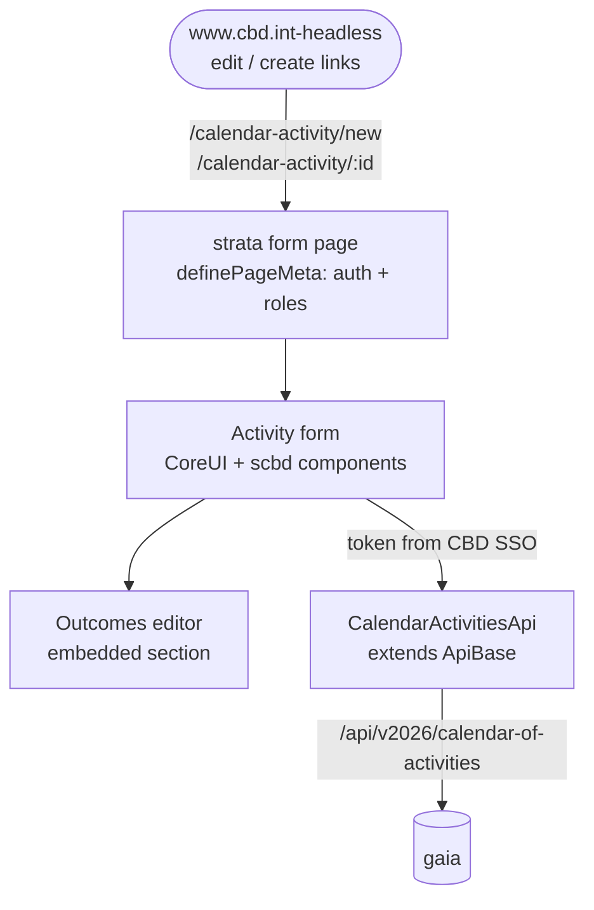

# Product Requirements: strata (COA create/edit form)

> Spoke PRD for the **strata** project in the COA production design run. The shared domain,
> workflow, cross-spoke flows, and Deferred register are in the [hub PRD](prd.md); context
> restated here is labeled "from hub PRD §x". Vocabulary: [CONTEXT.md](CONTEXT.md).

## Problem Statement

Calendar activities can only be written through gaia's raw API. There is no form. A
Secretariat administrator who needs to create an activity, fix a date, publish a record, or
record what an activity produced has no user interface at all — and the new public calendar
will show edit buttons that need somewhere to link to.

## Solution

One form in strata: **create or edit a calendar activity, including its Outcomes**. That is
the whole surface. No list page, no menu entry, no dashboard (from hub PRD §Solution) — users
arrive only by link:

- the front end's **create activity** button opens the blank form;
- the front end's **edit** button on a record opens the form loaded with that record.

The form speaks gaia's language: it calls gaia's calendar-of-activities endpoints, respects
gaia's write roles (`Administrator` or the new `COA-ADMIN`) through the standard CBD login,
and shows the record's publication
state (unpublished / published / rejected) with the transitions gaia allows.

## What strata owns (responsibilities)

- The create/edit page and form for calendar activities, following strata's existing
  conventions: a Nuxt 4 SPA page gated with `definePageMeta({ auth: true, roles })`, a CoreUI
  form component, and a per-domain API client class extending `ApiBase` (the pattern of
  `app/api/editorial-requests.ts` and the Editorial Request form/modal pair in
  `app/components/editorial/request/`).
- The Outcomes editor inside that form: add, edit, and remove Outcomes on the activity —
  each with its kind, date, note, URL, and links to in-system artifacts.
- Client-side validation mirroring gaia's Joi schema (required type and decisions, localized
  title, field shapes) so most errors are caught before the request.
- Honest workflow display: the record's current publication state and the transition actions
  the user may take (publish / unpublish / reject), calling gaia's status endpoint.

Strata does **not** own: the role model (gaia's), the record (gaia's), search or any listing
of activities (the front end's), or indexing (gaia's).

## User Stories

1. As a Secretariat administrator, I want to open a blank create form from the public
   calendar's create button, so that creation is reachable even though strata has no menu.
2. As an administrator, I want to open the edit form for one record from the public
   calendar's edit button, with the record loaded, so that fixing a record takes one click
   (from hub PRD §Flow 2).
3. As an administrator, I want to sign in with the standard CBD login when I arrive without a
   session, and land back on the form I asked for, so that the entry links always work.
4. As a user without the required role, I want a clear "you do not have access" outcome
   rather than a broken form, so that mis-shared links fail politely.
5. As an administrator, I want to edit the activity's core fields — localized title and
   description, activity type and sub-type, status, dates, decisions, subjects, governing and
   subsidiary bodies, GBF targets and sections, agenda items, responsible units and officers,
   notifications, meetings, related activities, and the action-required flag — so that the
   form covers the whole record gaia stores.
6. As an administrator, I want to edit the six-language localized fields with the same
   multi-language input strata already uses, so that translations are entered where the
   record is authored.
7. As an administrator, I want to add an Outcome to an activity — pick its kind (a new
   activity, a report, a meeting, a notification, or multiple items), set its date, link the
   artifact when it exists in the system, or write a plain note when it does not — so that
   results are recorded (from hub PRD §Outcomes).
8. As an administrator, I want to see and change the record's publication state (publish,
   unpublish, reject) with the state clearly named **unpublished** — never "draft" — so that
   visibility is controlled where the record is edited.
9. As an administrator, I want saving to be explicit (a save button enabled only when the
   form is dirty and valid), with a spinner while saving and a clear success or error toast,
   so that I always know whether my change landed.
10. As an administrator, I want a failed save to keep my edits on screen with the error
    shown, so that I never retype a record.
11. As an administrator, I want to be warned before leaving the form with unsaved changes,
    so that edits are not silently lost.
11a. As an administrator whose login session expires mid-edit (this is a long form with six
    languages and no autosave), I want my entered data preserved through a re-login, so that
    an expired token never costs me the record I typed. The token-refresh mechanics are
    designed in the [strata arch plan](strata-arch-plan.md).
12. As an administrator, I want validation errors pointed at the fields that caused them, so
    that fixing a rejected save is quick.
13. As an administrator creating a record, I want the saved record's human-legible id
    (`CAL-ACT-YYYY-NNN`) shown after save, so that I can reference it immediately.

## Implementation Decisions

- **Follow the Editorial Request precedent.** New pieces mirror the existing stack: a page
  under `app/pages/`, a form component tree under `app/components/`, a
  `CalendarActivitiesApi` class in `app/api/` extending `ApiBase` with the SSO token injected,
  and a `use-calendar-activities` composable owning state, error toasts, and dirty tracking
  (the `modelDiff` / `isModelDirty` utilities are reused).
- **Role gating uses the auth layer as-is.** `definePageMeta({ auth: true, roles: [...] })`
  with the gaia role names (`['Administrator', 'COA-ADMIN']`); the scbd-auth-layer
  middleware and
  `useScbdAuthSso()` already implement login, token, and `hasRole`. The page check is
  usability only — gaia's 403 is the boundary (from hub PRD §Roles).
- **Entry-point URLs are stable and documented** — they are links the front end hardcodes.
  The exact routes are fixed in the [strata arch plan](strata-arch-plan.md) and treated as a
  published contract between the two front ends.
- **Vocabulary-driven selects.** Activity types, statuses, bodies, subjects, GBF targets and
  sections come from the same thesaurus vocabularies gaia validates against, so the form
  cannot offer a value gaia rejects.
- **Return-to-calendar navigation.** After a save or cancel, the user is offered the way back
  to the public calendar page they came from (link preserved from the entry URL), keeping the
  no-menu model coherent.
- **The Outcomes editor enforces the boundary.** Its fields are exactly the approved Outcome
  shape; there is no deadline, assignee, or task field to enter (from hub PRD §Outcomes).

## Testing Decisions

Prior art: strata's existing component and e2e setup, with the auth layer's fixture mode
(`NUXT_PUBLIC_AUTH_MODE=fixture`) for role scenarios.

1. **Form component** — mounted with a mocked API client: field rendering from a loaded
   record, dirty/valid gating of the save button, validation messages, Outcome add/edit/
   remove, never rendering "draft" as a state name.
2. **API client** — request shapes against gaia's endpoints (create POST, update PUT, status
   POST), token header injection, error propagation.
3. **Page gating (e2e, fixture auth)** — anonymous → login redirect; authenticated without
   the role → access refused; with the role → form loads; deep-link with record id loads that
   record.
4. **Save round-trip (e2e against a stubbed gaia)** — create, edit, transition, and failure
   paths (403, validation 400, network error) each end in the promised UI state.

## Success Metrics

- An administrator can go from clicking "edit" on the public calendar to a saved change in
  gaia without touching anything but the strata form (e2e, 100% of runs).
- 0 fields in gaia's activity schema that the form cannot populate (parity check against the
  Joi schema).
- 0 occurrences of the word "draft" as a state name anywhere in the UI or its translations.
- A save rejected by gaia always leaves the user's input intact with the error visible (e2e
  failure-path check).

## Out of Scope

- **Editing notifications and meetings in strata** — future work, one line here by design
  (hub Deferred D1).
- Any list page, search page, dashboard, or strata menu entry for calendar activities.
- Creating activities from an Outcome (hub Deferred D2).
- Role administration UI (gaia's roles are used as-is; the one addition — `COA-ADMIN`,
  ADR 0004 — is granted through the existing CBD user administration, not here).
- Offline editing, autosave, or concurrent-edit merging. **Accepted risk, recorded
  deliberately:** gaia's upsert replaces the submitted fields wholesale
  (`findOneAndUpdate` with `$set` in
  `controllers/calendar-of-activities/services/db.ts`), so two concurrent editors are
  last-write-wins — a routine Outcome addition could clobber a simultaneous core-field
  edit. Accepted for this version because edits are infrequent and version snapshots make
  every overwrite recoverable; a conditional-update guard is a forward item for the arch
  plan.

## Further Notes

- Strata's binding conventions (AGENTS.md: naming, API-client shape, `strata-api-shape`
  skill) apply to all new code; its `CONTEXT.md` glossary gains the COA terms when the form
  is built.
- File citations verified 2026-07-09: `app/plugins/scbd-auth.ts`,
  `app/api/editorial-requests.ts`, `app/components/editorial/request/{form,modal}.vue`,
  `app/utils/{roles,models}.ts`, `.github/workflows/ci.yml`.
