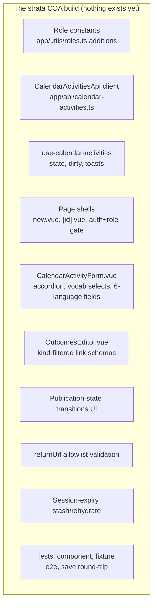
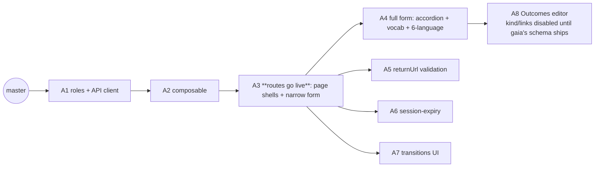
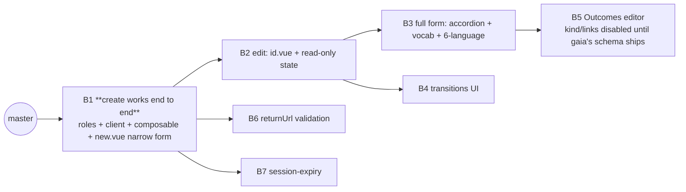
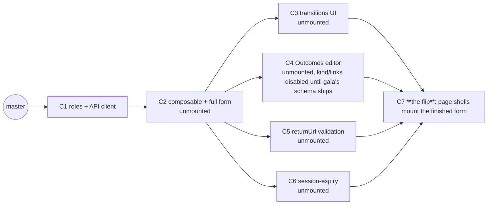

# PR Seam Options — strata (COA create/edit form)

> **Doc:** "PR Seam Options" — rival ways to cut the strata COA form build into pull requests, for
> a human to choose between. It is **not** a pull request and not a code review — it is the plan
> for *how to make* the PRs.

> **What this is.** The [strata arch plan](strata-arch-plan.md) is the design of record for one new
> surface in the `@scbd/strata` repo: a create/edit form for calendar activities. No calendar-
> activity code exists in strata today — every file path below is **new**, built from scratch
> against the arch plan, not measured from a diff. This doc lays out rival ways to sequence that
> build as pull requests against `master`, so a reviewer can choose one before work starts.

---

## The work, in one picture

The arch plan names nine pieces. None of them exist yet.

| Piece | What it is | File(s) | Nature |
|---|---|---|---|
| Role constants | Two new exported role values matching gaia's role names | `app/utils/roles.ts` (append to existing) | adds-something-new |
| API client | One class extending `ApiBase`, five calls incl. status sub-route | `app/api/calendar-activities.ts` | adds-something-new |
| Composable | State, dirty tracking, toast dispatch | `app/composables/use-calendar-activities.ts` | adds-something-new |
| Page shells | The published entry-point routes, auth+role gated | `app/pages/calendar-activity/new.vue`, `app/pages/calendar-activity/[id].vue` | switches-it-on |
| Form | The accordion of core fields, six-language inputs, vocabulary selects | `app/components/calendar-activity/CalendarActivityForm.vue` | adds-something-new |
| Outcomes editor | Repeatable Outcome rows, kind-filtered link schema | `app/components/calendar-activity/OutcomesEditor.vue` | adds-something-new |
| Transitions UI | Publish / unpublish / reject buttons gated by current state | inside the form or a small sibling component | adds-something-new |
| returnUrl validation | Strict-origin allowlist check against runtime config | in the page shells or a small utility | adds-something-new |
| Session-expiry handling | Stash to `sessionStorage`/`localStorage`, rehydrate on return | in the composable | adds-something-new |
| Tests | Component (mocked client), fixture-auth e2e, save round-trip (stubbed gaia) | `*.test.ts`, `*.spec.ts` | adds-something-new |

No piece here is a **move-only** change — this is a forward build, not a refactor, so nothing is
being relocated or rewritten.

---

## What a good split means here

A pull request is cut at the right place when **a reviewer could approve only that PR, merge it to
`master`, and strata would still build, deploy, and pass its tests.** Small is not the goal —
*independently mergeable* is.

Where this test comes from (sources)

> This is not a matter of taste. It restates a long-standing rule of continuous integration and
> trunk-based development: the shared branch must stay shippable after every merge, so a change is
> correctly scoped only when it can land on its own without breaking that branch.

> - **The seam test itself** is the `pr-decomposition` doctrine: a cut is real only when *"a
>   reviewer approved only this PR and nothing else, [and] the codebase would still be correct and
>   shippable,"* because *"good PRs are independently mergeable, not merely small."*
> - **Continuous integration** sets the same constraint. In *Continuous Integration*, Martin Fowler
>   writes that *"Continuous Integration can only work if the mainline is kept in a healthy state,"*
>   with the aim that *"the product should always be in a state where we can release the latest
>   build"* ([martinfowler.com](https://martinfowler.com/articles/continuousIntegration.html)).
> - **Trunk-based development** states the outcome plainly: collaborating on one branch and not
>   breaking the build *"ensures the codebase is always releasable on demand and helps to make
>   Continuous Delivery a reality"* ([trunkbaseddevelopment.com](https://trunkbaseddevelopment.com/)).
> - **Size is a by-product, not the target.** Google's code-review guidance defines the right unit
>   as *"a minimal change that addresses just one thing"* and *"one self-contained change,"* such
>   that *"the system will continue to work well... after the CL is checked in"* (a *CL*, or
>   changelist, is Google's term for a PR —
>   [google.github.io/eng-practices](https://google.github.io/eng-practices/review/developer/small-cls.html)).
>   Independence is the requirement; the small size tends to follow.

In short: cut by whether each slice leaves the main branch green and shippable. A low file count is
a symptom of a good cut, never its definition.

**A property specific to this build, worth stating up front: strata has no menu and no list page.**
A visitor only ever reaches a calendar-activity page by a direct link. That changes what
"independent" means here in one useful way:

- A merged, role-gated page is **fully live and testable the moment its PR merges** — by direct
  URL, in a fixture-auth end-to-end test — regardless of whether the front end (www) has built the
  buttons that link to it yet.
- It is **"dark" only in the sense of discovery**, never in the sense of function or security. An
  admin who does not know the URL will never stumble onto it; an admin who does know it (or a test
  that hits it directly) gets the real, fully gated page.
- This decouples strata's own PR order almost entirely from www's build schedule. Every option
  below can ship start to finish without waiting on www, and every option is independently
  verifiable with fixture-auth e2e tests the moment the routes exist — no coordination PR needed.

**Five facts shape every option below. They are the same in all three, and the first two are hard
constraints, not preferences:**

1. **gaia's baseline endpoints already exist.** Query, get, create, update, and the status
   sub-route are live today (verified 2026-07-09 recon of the gaia controller). Nothing in this
   build blocks on new gaia work for the core save round-trip.
2. **The Outcomes editor's kind-filtered link schema is the one piece that does cross-repo-block.**
   gaia's stored Outcome shape today is the plain seed (`date`, `outcomeDetail`, `url` — verified
   in gaia's schema) with no `kind` or typed `links` field; the extended shape the Outcomes editor
   needs is gaia's own forward work ([gaia arch plan](gaia-arch-plan.md)). Landing the full
   `OutcomesEditor.vue` before gaia ships its extended schema means either the new fields are
   silently dropped or gaia's Joi validation rejects the save (400) — so **the Outcomes editor
   should merge after gaia's extended schema is live**, or land with kind/links fields disabled
   and only note+URL enabled, upgraded once gaia catches up. Every option below carries this as an
   explicit gate on the Outcomes PR, not a soft preference.
3. **The published entry-point routes cost nothing to publish early.** Because nothing links to
   them yet and there is no discovery surface, landing `/calendar-activity/new` and
   `/calendar-activity/:id` well before www builds its edit/create buttons carries no user-facing
   risk — it only enables earlier, real end-to-end testing.
4. **Strata's CI is already the standard shape.** `.github/workflows/ci.yml` already builds CalVer
   tags and pushes to Docker Hub with a Portainer webhook on `dev` (verified 2026-07-09) — unlike a
   greenfield build, there is no CI-migration PR to sequence in. Every PR below either passes the
   existing pipeline or it does not merge.
5. **The form is one component reused by both pages.** `new.vue` and `[id].vue` differ only in
   whether a record is loaded first; both mount the same `CalendarActivityForm.vue`. Any PR that
   changes the form changes what both pages render — there is no way to upgrade one page's form
   without upgrading the other's.

---

## Option A — Foundation-first (layer by layer)

**The idea:** land the pieces nothing else depends on first — role names, the API client, the
composable — provably additive because nothing imports them yet. Then flip the routes on with a
narrow, working form. Then widen the form and add the richer features on top.

**The PRs:**

| # | What it does | Kind | Builds on |
|---|---|---|---|
| A1 | Add the two role constants (`Administrator`, `COA-ADMIN`) and the `CalendarActivitiesApi` client class, with client unit tests against a mocked fetch. Nothing imports either yet | adds-something-new | master |
| A2 | Add the `use-calendar-activities` composable (state, dirty tracking, toast dispatch), with composable unit tests against a mocked client. Nothing mounts it yet | adds-something-new | A1 |
| A3 | Add the page shells (`new.vue`, `[id].vue`) with role gating, wired to the composable, rendering a narrow form: the mandatory core fields only (English title, type, decisions). The routes go live for the first time. Fixture-auth e2e proves the gate; a save round-trip test proves create/edit work end to end against a stubbed gaia | switches-it-on | A2 |
| A4 | Widen the form to the full design: the CoreUI accordion of sections, every vocabulary select, the six-language inputs, and the mandatory-field validation the narrow form skipped | adds-something-new | A3 |
| A5 | Add the returnUrl allowlist validation against runtime config | adds-something-new | A3 |
| A6 | Add the session-expiry stash/rehydrate to the composable | adds-something-new | A3 |
| A7 | Add the publication-state transitions UI — publish / unpublish / reject buttons calling the status sub-route. Needs only the composable and gaia's already-live status sub-route (fact 1), not the wide form from A4 | adds-something-new | A3 |
| A8 | Add `OutcomesEditor.vue`, with the `kind`/`links` fields shipped disabled until gaia's extended Outcome schema is live (fact 2) — additive-but-inert, so this PR can merge without waiting on gaia and upgrade in place once gaia catches up | adds-something-new | A4 |

**Good:**
- Only one PR (A3) ever changes what a user can reach, and everything before it is genuinely
  additive — unused exports and an unmounted composable, both provably safe on their own tests.
- A3 is small enough to review carefully even though it is the first live route: a narrow form,
  three fields, one save path.
- A5, A6, A7, and A8 can be built in parallel by different people once A3 (or, for A8, A4) lands —
  none touches another's files.
- returnUrl validation (A5) and session-expiry (A6) are two independent hardening features on two
  different surfaces, with no shared logic, so splitting them costs nothing.
- Transitions (A7) rides gaia's already-live status sub-route and needs nothing from A4's wide
  form — it is not held hostage to the Outcomes editor's gaia-schema wait the way a bundled
  "Outcomes + transitions" PR would be.

**Watch out:**
- Eight PRs is the most of the three options — more branches to keep in sync, more chances for one
  to sit stale while another lands first. A1→A2 is a real compile dependency only because the build
  is layered this way; both are additive and unused on their own, and could just as well ship as
  one "plumbing" PR off `master` — worth flattening in the real PR graph if the extra branch isn't
  earning its keep.
- A4 (the form widening) touches the same component A3 shipped, so it needs a careful diff review
  against the narrow version rather than a green-field read.
- The narrow form in A3 is real, working, and gated — but it is also a genuinely incomplete
  authoring experience (three fields against a record with a few dozen). If a reviewer or an admin
  finds that route by URL between A3 and A4, they get a form that visibly cannot capture the whole
  record. Acceptable because nothing links to it yet (fact 3) — but say more than that in the PR
  description: during this window a real `COA-ADMIN` who knows the URL can save a real, valid,
  sparse record to production gaia. The record is correct (core fields are gaia's required Joi
  fields), so the PR still passes independence, but it is a genuine production write, not a
  cosmetic gap, and should be described as one.

---

## Option B — Feature-vertical (thin end-to-end first, then widen)

**The idea:** ship one complete, working vertical slice — create a record with the core fields —
before touching anything else. Every later PR adds one more capability on top of a real, tested,
already-shipping flow, rather than assembling pieces that only become useful once they are all
wired together.

**The PRs:**

| # | What it does | Kind | Builds on |
|---|---|---|---|
| B1 | Add the role constants, the API client, the composable, and `new.vue` with a narrow form (core fields only) — a full, working, tested create path, end to end. Component test, fixture-auth e2e, and save-round-trip test all land with it | switches-it-on | master |
| B2 | Add `[id].vue` — load a record by id and mount the same form from B1 for editing, plus a read-only display of the record's current publication state | adds-something-new | B1 |
| B3 | Widen the form (both pages share it — fact 5) to the full design: accordion sections, every vocabulary select, six-language inputs, full validation | adds-something-new | B2 |
| B4 | Add the publication-state transitions UI — publish / unpublish / reject buttons, calling the status sub-route, replacing B2's read-only display. Needs only B2's state display and gaia's already-live status sub-route (fact 1), not the wide form from B3 | adds-something-new | B2 |
| B5 | Add `OutcomesEditor.vue`, with the `kind`/`links` fields shipped disabled until gaia's extended Outcome schema is live (fact 2) — additive-but-inert, the same chain-breaker Option C uses, rather than a hard "merge after gaia" wait | adds-something-new | B3 |
| B6 | Add the returnUrl allowlist validation | adds-something-new | B1 |
| B7 | Add the session-expiry stash/rehydrate | adds-something-new | B1 |

**Good:**
- The very first PR is a demo: an admin can create a real calendar activity end to end. Every
  reviewer after B1 is reviewing an addition to something that already works, not a piece that
  only means something once four other PRs land.
- B4 needs only B2, not the wide form in B3 — rebasing it there rather than behind B3 means the
  transitions UI does not wait on the form-widening PR for no code reason.
- B6 (returnUrl) and B7 (session-expiry) are two independent hardening features on two different
  surfaces, with no shared logic, and each forks off a working trunk instead of a pile of unmounted
  parts — easier to test in isolation because the page around them already exists.
- If the run needs to stop after any single PR, B1 alone is a shippable, if narrow, feature — none
  of the other options leave that true after just one merge.

**Watch out:**
- B1 is the heaviest single review of the seven: role constants, the API client, the composable,
  and a page, all in one PR, because a genuinely end-to-end slice cannot be thinner than that.
  Reviewers should expect it to take longer than A1+A2+A3 combined would individually, even though
  the total code is the same.
- The narrow form ships to a real route in B1 before the wide form exists (same caveat as Option
  A's A3), for longer this time — B1 through B3 all run on the narrow form. Say more than "the
  display is incomplete": during that window a real `COA-ADMIN` can save a real, valid, sparse
  record to production gaia. The record is correct, so the PR still passes independence, but it is
  a genuine production write, not a cosmetic gap.
- B5's Outcomes editor is new surface area on a page B2/B3 already shipped — the same
  diff-against-recent-work review shape as Option A's A4 concern.

---

## Option C — Build dark, then flip

**The idea:** be explicit that the form, the Outcomes editor, the transitions UI, and the hardening
features can all be built and component-tested without ever being reachable by a route — Nuxt only
turns a file under `app/pages/` into a live URL, so nothing is publicly reachable until the page
files themselves are added. Build everything unmounted first, prove it with component tests, then
add the two page files as the very last step.

**The PRs:**

| # | What it does | Kind | Builds on |
|---|---|---|---|
| C1 | Add the role constants and the API client, with client unit tests | adds-something-new | master |
| C2 | Add the composable and the full `CalendarActivityForm.vue` (accordion, vocab selects, six-language inputs, validation) as a standalone, unmounted component tree — no page imports it yet. Component tests mount it directly, no route needed | adds-something-new | C1 |
| C3 | Add the transitions UI as a section of the still-unmounted form. Needs only the composable and gaia's already-live status sub-route (fact 1) — nothing gaia has yet to ship | adds-something-new | C2 |
| C4 | Add `OutcomesEditor.vue` as a section of the still-unmounted form, with `kind`/`links` fields left disabled until gaia's extended Outcome schema is live (fact 2) — the chain-breaker: merges without waiting on gaia, upgraded once gaia catches up | adds-something-new | C2 |
| C5 | Add the returnUrl allowlist validation to the composable — still unmounted | adds-something-new | C2 |
| C6 | Add the session-expiry stash/rehydrate to the composable — still unmounted | adds-something-new | C2 |
| C7 | The flip: add `new.vue` and `[id].vue`, mounting the fully-built form from C2–C6. The routes go live for the first time, complete, on day one. Fixture-auth e2e and the save-round-trip test land here, since only now does a route exist to test against | switches-it-on | C3 · C4 · C5 · C6 |

**Good:**
- Only one PR (C7) ever changes what a user can reach, and it is a small one — two thin page files
  wiring together work that was already reviewed and component-tested in C2–C6.
- No route ever serves a visibly incomplete form (the narrow-form caveat in A and B does not apply
  here) — the first live version of the page is also the last.
- Component tests give real signal on C2–C6 even though no route exists yet, because Vitest can
  mount a Vue component directly without a page around it — this build does not have Option B's
  (the widget-rewrite example's) problem of a PR with zero test signal.
- Splitting transitions (C3) from the Outcomes editor (C4) keeps the unblocked half shippable on
  its own — the gaia gate holds back only C4, not the transitions UI riding alongside it.
- returnUrl (C5) and session-expiry (C6) are two independent hardening features on two different
  surfaces, each buildable and testable without touching the other.

**Watch out:**
- C2 is a big review: the whole form, every section, in one PR, with no route to click through and
  see it running — a reviewer has to trust the component tests and read a large diff rather than
  exercise the page.
- C7, while small in code, carries all the first-time risk at once: the first fixture-auth e2e run,
  the first save round-trip against a stubbed gaia, the first real proof that C1–C6 actually compose
  — if something is wrong, it surfaces only here, after everything else has already merged.
- Fewer natural stopping points for a partial ship. If the run has to pause after C2 or C3, there is
  nothing live yet — Option B's B1 gives a working feature after the very first PR; this option
  gives one only after the seventh.

---

## Side by side

|                              | Option A — foundation-first | Option B — feature-vertical | Option C — build dark, then flip |
|---|---|---|---|
| Number of PRs | 8 | 7 | 7 |
| Longest chain | 5 (A1→A2→A3→A4→A8) | 4 (B1→B2→B3→B5) | 4 (C1→C2→C4→C7) |
| Heaviest single review | A3 (first live route) or A4 (form widen) | **B1** (roles+client+composable+page, all at once) | C2 (the full form, unmounted) |
| First point a route is reachable | A3 (PR 3 of 8), narrow form | B1 (PR 1 of 7), narrow form | C7 (PR 7 of 7), full form |
| First point the feature is complete when reachable | Never partially — narrows then widens across A3→A4 | Never partially — narrows then widens across B1→B3 | **Always** — C7 ships the finished form on first reach |
| Test signal on early PRs | Unit only (A1, A2); e2e starts at A3 | Full e2e from the first PR (B1) | Component-only through C6; e2e starts at C7 |
| If the run stops after PR 1 | Two unused exports and an unused client — nothing usable | **A working, if narrow, create flow — usable today** | Two unused exports and an unused client — nothing usable |
| Best when… | you want a steady, reviewable climb and don't mind the narrow-form window | you want something demonstrably working after the very first merge | you want the route to only ever show the finished form, and can tolerate no partial ship |

---

## Recommendation

**Option B is the strongest choice for this build.** The reason is the same reason the arch plan
gives for skipping a list page or menu: strata's whole COA surface is two role-gated URLs nobody
finds by accident. That makes "ship something real, fast, then widen it" nearly free here — there
is no discoverability cost to a narrow form sitting on a live route, and the payoff is concrete: a
working create flow exists after the very first merge, which both option A and option C only reach
partway (A3) or all the way (C5) through their chains. B1 is a heavier single review than A1 or C1,
but it buys the thing a staged build cannot: proof, from the first PR, that the whole stack —
roles, client, composable, page, save round-trip — actually composes, instead of deferring that
proof to a later PR that has to trust several earlier ones sight unseen.

Option A is the fallback if the team would rather keep every individual review small and is willing
to wait until PR 3 of 6 for the first working route. Option C is worth choosing only if a
half-finished-looking form on a live route is considered unacceptable even though nothing links to
it — in which case its cost (no working feature until the fifth and final PR) is one the team has
explicitly decided to pay.

**Whichever option is chosen, the Outcomes editor's kind-filtered link fields stay gated on gaia's
extended Outcome schema shipping first (fact 2)** — that ordering constraint is not optional in any
of the three, only its position in the chain changes (A8, B5, C4). And in every option that PR now
ships with `kind`/`links` disabled rather than waiting behind a hard "merge after gaia" chain —
additive-but-inert, so none of the three is blocked on gaia any longer than the Outcomes editor
itself.
