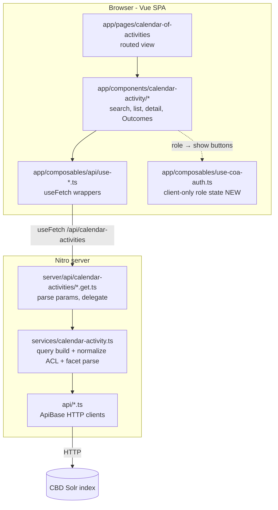
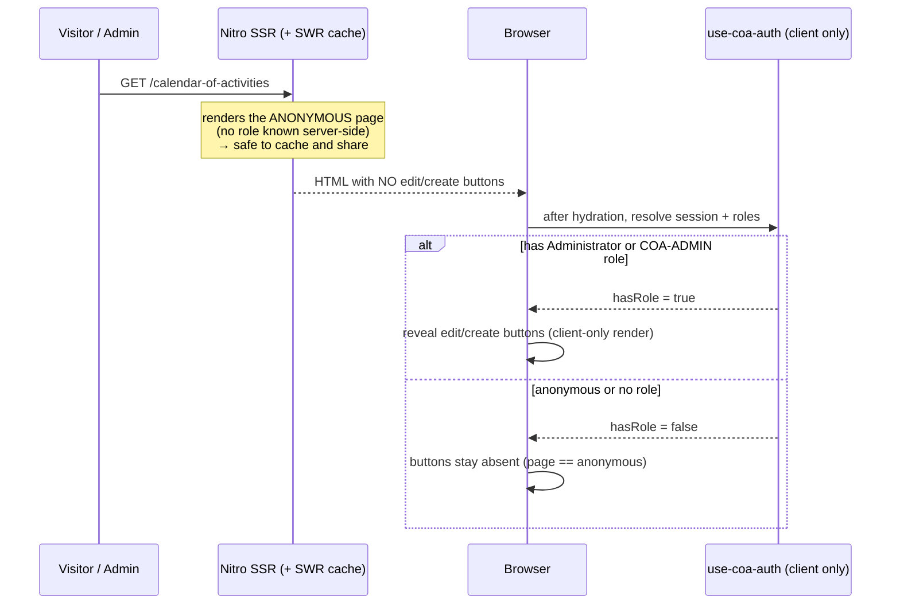
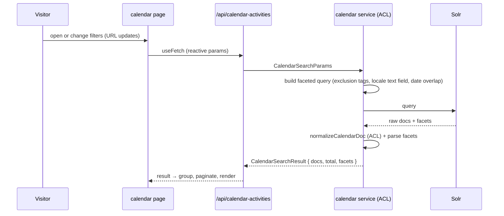

> Part of the [Calendar of Activities](architectural-plan.md) architectural plan. The cross-project
> hub (System Overview, Actors, Workflow Statuses, End-to-End Flows, Ownership, Verification) is the
> [hub](architectural-plan.md); glossary: [CONTEXT.md](CONTEXT.md); how this context relates to the
> others: [CONTEXT-MAP.md](CONTEXT-MAP.md). This doc owns the **www.cbd.int-headless (search front
> end)** work — the *COA Search & Presentation* context. Sibling spokes: [gaia](gaia-arch-plan.md),
> [strata](strata-arch-plan.md). Product intent: [www.cbd.int-headless-prd.md](www.cbd.int-headless-prd.md).
>
> **Plan vs. as-built.** This is the design-of-record for the front end's COA work. The
> `@scbd/www.cbd.int-headless` repo — including its `docs/architecture.md` and the existing partial
> calendar implementation — is the as-built truth; where they disagree, the code is the truth about
> what runs and this plan is the truth about intent. Facts that already ship are labeled
> **[as-built]**; new design is labeled **[new]**. This spoke lives in this repo's own `docs/` tree,
> so its links to the hub and siblings are relative today.

# Calendar of Activities: www.cbd.int-headless (search front end) plan

The front end is the **read-only consumer**. It is a Nuxt 4 app that renders the unified calendar
page for visitors and treats Solr as a read-only source behind its own Nitro server route. The
browser never talks to Solr, Drupal, or gaia directly — it calls the app's own `/api/**` routes,
which query upstream, normalize the result, and hand the page a clean shape. This version makes the
production page the real thing: the pilot's full approved feature set in this repo's conventions,
plus two additions — **Outcomes displayed** on activity details, and **role-gated edit/create
buttons** that link into strata. The page never writes. Domain terms are in [CONTEXT.md](CONTEXT.md).

## Owned interface (the seam)

The front end owns the **server API route** the browser depends on **[as-built shape, extended this
version]**:

```
GET /api/calendar-activities       → CalendarSearchResult { docs, total, facets }
GET /api/calendar-activities/:id   → one CalendarDoc with its expanded field set (404 when absent)
```

Behind that route sits the deep module: a query builder, a facet parser, and `normalizeCalendarDoc`
— the **anti-corruption layer** that renames Solr's published `*COA` fields into the app's own model,
so no index field name ever reaches a component.[^acl] On the upstream side the front end is the
**customer** in the Customer/Supplier relationship with gaia: it conforms to gaia's published field
contract ([gaia § Published language](gaia-arch-plan.md#published-language-the-solr-field-contract))
and adapts it here, rather than changing it. On the *strata* side, the front end is the customer of
strata's published URL contract — it builds links to strata's routes but owns none of them.

The frozen interface contracts the types, service, composables, and components follow are carried
forward from the front end's prior design work and still hold **[as-built, SC-01…SC-10]** — the
`CalendarSearchResult` shape (`docs`, `total`, `facets`), the `/api/calendar-activities` path
constant, the composable signature returning `calendarActivities`, the `CalendarSearchParams` schema,
the reuse of the shared pagination component, the `home` page layout, the `GroupedItem` shape, and
the `i18n/dist` build path. This version adds Outcome fields to the normalizer and two role-gated
affordances; it does not disturb those contracts.

## Containers and layering

The app ships three Docker images: `www-nuxt` (this app), `www-router` (an nginx reverse proxy), and
`www-drupal` **[as-built]**. The router is the front door, deciding by URL whether a request goes to
Nuxt, Drupal, the legacy site, the CBD API, or S3. Inside `www-nuxt`, a request flows through four
server layers, each with one job:



- **Server routes** (`server/api/calendar-activities/`) parse query params and delegate; no business
  logic. **[as-built]**
- **Service** (`services/calendar-activity.ts`) owns the real work: build the faceted Solr query,
  call the client, parse facets, and **normalize** (the ACL). Index field names never leak past here.
  **[as-built, extended for Outcomes]**
- **API clients** (`api/*.ts`, extending `ApiBase`) are thin HTTP wrappers — `SolrIndexApi`,
  `ThesaurusApi`, `CountryApi`. **[as-built]**
- **`use-coa-auth.ts`** — a new **client-only** composable holding the user's role state; the *only*
  new server-untouched piece (see Auth integration). **[new]**

The wider front-end architecture (the router, stale-while-revalidate caching, Drupal content paths,
the deployment pipeline) is this repo's own `docs/architecture.md`; only the calendar slice is here.

## UI Surfaces and the parity register

The feature owns one page (`/calendar-of-activities`) and the `components/calendar-activity/` tree
**[as-built partial]**. The production target is the **prototype's full approved feature set** — one
merged chronological view of meetings, notifications, and activities; month grouping with sticky
headers; list, grid, and tab views; infinite scroll with a load-more fallback; per-locale free-text
search with prefix, phrase, and boolean support plus a suggestion dropdown and highlighting; the full
filter set with live facet counts and per-filter exclusion; removable filter pills and clear-all; a
gear-menu filter-visibility preference; URL as the single source of state including `autoExpand` deep
links; per-type detail views; related records; six-locale UI and content with English fallback; the
loading/error/empty/retry states; keyboard and screen-reader operability; and responsive layout.

The prototype's stories 1–55 are the approved baseline, incorporated by reference from the prototype
PRD. The existing partial implementation has **17 verified gaps** against that baseline; rather than
list all 17, they group into five clusters this version closes:

| Cluster | Gaps it covers | Resolution direction |
|---|---|---|
| **URL state** | No shareable URL state; `autoExpand` deep links honored only in the list view | Every filter, sort, view, and page lives in the URL and is parsed back on load; deep links work in all three views (story 63) |
| **Locale-aware search** | Free-text search hardcodes the English field | Query the *visitor's locale* text field in all six locales (fixes the multilingual gap gaia already delivers at the index) |
| **Search expressiveness** | Missing boolean operators, autoExpand, quarter dates, protocol badges | Boolean operators and wildcards pass through; quarter-date parsing, protocol (CPB/NP) marking rendered identically in every view (story 69) |
| **Enrichment** | Missing article enrichment | Restore article-content enrichment on detail views |
| **Defect resolutions (stories 62–72)** | Placebo sort headers, Completed-alias filter bug, swapped filter-toggle labels, "Completed on" wording, dual decision-URL builders, duplicate v1/v2 view/filter variants, hardcoded hosts, misleading auto-date comment, pilot banner | One-line calls: only the date column sorts; the Completed filter drops the Confirmed alias; one decision-URL builder; one list + one filter component; all upstream base URLs from runtime config; the "today" start date clears on edit; the pilot banner is not ported |

The parity register (every prototype story mapped to a resolution or an explicit divergence) is the
acceptance artifact the downstream implementation plan carries; this spoke fixes the *direction* of
each cluster so no gap is left to guess.

### The four contract-gap resolutions (front-end side) **[new]**

Four fields the front end reads today are never emitted by gaia under those names, so they are
silently empty. The resolution (from [hub PRD](prd.md#implementation-decisions-cross-spoke)) is that
**the front end reads gaia's existing granular/structured fields**; gaia adds no combined fields
(except the four *new* per-link Outcome members). The change is entirely inside `normalizeCalendarDoc`
and the service's field list:

| Front end read (old) | Now reads | Where |
|---|---|---|
| `responsibleUnitsAndOfficers_ss` | `responsibleUnits_ss` + `responsibleOfficers_is` (paired in the normalizer) | detail |
| `agendaItems_ss` | `agendaItemMeetingCodes_ss`, `agendaItemNumbers_ds`, `agendaItemCodes_ss`, `agendaItemTitles_*_txt` | detail |
| `outcome_s` | `outcomeDetails_*_txt`, `outcomeUrls_ss`, `outcomeDates_dts`, plus the index-aligned `outcomeLinkKinds_ss` / `outcomeLinkSchemas_ss` / `outcomeLinkIdentifiers_ss` / `outcomeLinkTitles_ss` | detail (Outcomes) |
| `url_ss` | `outcomeUrls_ss` (the activity-level `url` concept is dropped) | list |

### Outcomes display **[new]**

An activity detail view gains an **Outcomes** section. It consumes gaia's structured outcome fields
with no second lookup at search time: `outcomeDetails_*_txt`, `outcomeUrls_ss`, and `outcomeDates_dts`
give the note, URL, and date for each Outcome, and the four **index-aligned** link arrays
(gaia § [the Outcome-link Solr shape](gaia-arch-plan.md#the-outcome-link-solr-shape-new)) —
`outcomeLinkKinds_ss`, `outcomeLinkSchemas_ss`, `outcomeLinkIdentifiers_ss`, `outcomeLinkTitles_ss`
— give each link's kind, schema, identifier, and display title by matching position: link *i* is
built from `schema[i]` + `identifier[i]`, its label is `title[i]` falling back to `identifier[i]`
when the title lookup missed. A link opens the linked record — inside the calendar when it is a
calendar record, otherwise its official page — chosen by `schema[i]`. The boundary rule ("a result
record, never an obligation") is gaia's; the front end only displays it.

## Auth integration **[new]** — the recommended mechanism

The repo has **no auth code today** and a `jwt-decode` dependency in `package.json` that is
currently unused **[as-built]**. Reading `scbd-auth-layer`'s own source (see Option B below) shows
that dependency does not answer this question: the layer never decodes a JWT client-side, so this
plan no longer plans to "put it to work" — `jwt-decode` stays unused; dropping it is an optional
cleanup, not part of this design. Auth here is a thin, read-only integration whose whole job is to
answer one question in the browser: *does this user hold one of gaia's write roles (`Administrator`
or `COA-ADMIN`)?* It gates rendering only. The hard constraints shape the whole design:

- **Anonymous traffic must be untouched**, and the page is SSR with **stale-while-revalidate**
  caching (`routeRules` swr 600 on `/` and `/api/**`).[^swr] One cached HTML page is served to
  everyone.
- **A cached page must never leak role-gated markup.** If SSR ever rendered an edit button, that HTML
  could be cached and served to an anonymous visitor.
- **Roles must equal gaia's** — the same `Administrator` / `COA-ADMIN` names (ADR 0004), the same
  login (the standard CBD login strata already uses through the `scbd-auth-layer` SSO).

**Two options were weighed:**

| Option | What it is | Trade-off |
|---|---|---|
| **B — Minimal client-only session composable, verified against `scbd-auth-layer`'s own handshake (Recommended default)** | A small client-only plugin repeats the exact three-step handshake `scbd-auth-layer` itself runs (`utils/scbd-auth-scheme.ts`, `composables/use-scbd-auth-sso.ts` — read directly for this plan): open a hidden iframe at `${authApiUrl}/app/authorize.html`, exchange one `postMessage` for a Bearer token, then call `GET ${authApiUrl}/api/v2013/authentication/user` with that token and read `roles: string[]` straight off the returned JSON body. No cookie is read, no JWT is decoded, and `jwt-decode` plays no part — see [Option B's verified mechanism](#option-bs-verified-mechanism-new) below. | Lightest, zero SSR involvement by construction — no framework-level SSR-inertness question to answer. Cost: re-implements the same three-step handshake as the layer and must track the SSO endpoint shapes it owns, risking drift from strata's login. |
| **A — Reuse `scbd-auth-layer`, consumed client-side only (upgrade path, gated)** | Adopt the same Nuxt auth layer strata uses for the CBD SSO login and token, integrated through one **client-only** composable so no auth code runs during SSR. | One CBD login shared with strata; roles are identical to gaia's by construction; proven layer *in strata*. Cost: Nuxt's `extends` mechanism merges in everything the layer ships — `server/` routes, global `middleware/`, app-level `plugins/` — at the framework level, not opt-in per file. Wrapping the *consumption* of the layer's composable in a client-only call does nothing to stop the layer's own globally-registered middleware/plugins from running during SSR if they were not already written to be SSR-inert. The layer has so far only run inside strata, which is `ssr:false` (a pure SPA) — its authors had no reason to guarantee SSR-inertness, and this plan cites no source confirming they did. |

**Recommendation: Option B is the default.** Reusing `scbd-auth-layer` (Option A) has a real,
unverified risk: if any of the layer's `middleware/`/`plugins/` files are not `.client.ts`-suffixed
or `import.meta.client`-guarded, they run on the server during SSR navigation resolution regardless
of how the front end's own composable is written — and any server-side branch that reads a cookie
or checks a token introduces per-request variance into exactly the SSR output the SWR cache is
trusted to serve identically to every visitor. That is the same anonymous-cache guarantee this
whole design exists to protect, so the default may not depend on an unverified assumption about it.

Option A remains the **upgrade path**, gated on a concrete verification step (added to the
build-time checklist below): before adopting Option A, read `scbd-auth-layer`'s own
`middleware/`/`plugins/` registration and confirm every file is either `.client.ts`-suffixed or
`import.meta.client`-guarded. If that check passes, Option A wins on consistency with strata's login
and on roles being identical to gaia's without a second implementation to keep in step, and the
front end should switch to it. Until it passes, Option B ships — it has no such ambiguity by
construction, since it never registers server-side middleware or plugins at all.

**Build-time checklist item (new):** [ ] `scbd-auth-layer`'s `middleware/` and `plugins/` files are
confirmed `.client.ts`-suffixed or `import.meta.client`-guarded before Option A is adopted; until
then, ship Option B.

### Option B's verified mechanism **[new — resolves round-2 High #1]**

This plan first wrote Option B as "reads the CBD SSO token/cookie", leaving open whether the token
is a readable cookie and whether roles come from a decoded JWT. Reading `scbd-auth-layer`'s own
source settles both questions, since Option B's whole point is to repeat what the layer already does
without pulling in the full Nuxt layer:

- **Token acquisition is not a cookie read.** The layer opens a hidden `<iframe>` pointed at
  `${authApiUrl}/app/authorize.html` — the CBD SSO domain, a different origin from
  `www.cbd.int-headless` — and exchanges a `postMessage` handshake against that iframe's own origin
  to ask for `getAuthenticationToken`. The response is `{ authenticationToken, expiration }`, a
  Bearer-prefixed token string (`utils/scbd-auth-scheme.ts` — `initAuhtIFrame`, `sendMessage`,
  `getToken`; `types/scbd-auth-token.ts`). `use-coa-auth.ts` repeats this same iframe-plus-postMessage
  exchange. There is no `document.cookie` read anywhere in this path.
- **The token is held only in memory**, re-acquired by the handshake above on each load — not stored
  in a cookie or `localStorage` the composable itself sets (`utils/scbd-auth-sso-plugin.ts`, which
  assigns the resolved token to a Nuxt `useState`). This is the resolution of round 1's "token/cookie"
  either/or: there is no cookie to name, because the mechanism never uses one.
- **Roles are read from a whoami JSON response, not decoded from the token.** After the handshake
  resolves a token, the layer calls `GET ${authApiUrl}/api/v2013/authentication/user` with header
  `Authorization: <Bearer token>` (`composables/use-scbd-auth-config.ts`'s `currenUserUrl`;
  `utils/scbd-auth-scheme.ts`'s `getUser`) and gets back an `AuthUser` object whose `roles: string[]`
  field is read directly (`types/scbd-auth-user.ts`). There is no claim path to name (e.g. no
  `payload.roles` vs. `payload.realm_access.roles` question) because there is no JWT decode step —
  `jwt-decode` has no role in this mechanism, confirmed by `scbd-auth-layer`'s own `package.json`
  carrying no `jwt-decode` dependency at all.
- **Composable surface** mirrors the layer's own `useScbdAuthSso()` shape
  (`composables/use-scbd-auth-sso.ts`) exactly, so `use-coa-auth.ts` is a small, familiar copy of a
  proven shape rather than an invented one: `token`, `user`, `isAuthenticated`, `hasRole(roleOrRoles)`,
  `login()`, `logout()`.
- **`use-coa-auth.ts` itself is `.client.ts`-suffixed (or `import.meta.client`-guarded) at
  registration**, the same explicit guard already required of Option A's consumption. This is not
  optional dressing: the mechanism touches `document` and creates an `<iframe>`, DOM APIs that do not
  exist during SSR, so the composable cannot run server-side by construction — the guard makes that
  fact visible in the registration, matching the rigor already applied to Option A.

### Client-side-only gating (the load-bearing rule) **[new]**

Whichever option is chosen, the gating rule is the same and is explicit:



- **SSR always renders the anonymous page.** The server never knows the role, so the HTML it produces
  — and the SWR cache stores — carries no edit/create markup. One cache entry is correct for everyone.
- **Role state resolves only in the browser**, after hydration, in `use-coa-auth.ts`.
- **Every edit/create control renders client-side only** (a `<ClientOnly>` boundary, or a `v-if` on a
  ref that is `false` during SSR and set true after mount when the role is present). Admins see a
  brief post-hydration reveal of the buttons; anonymous users never get them, so there is no layout
  shift for the public.
- **The read path adds no server-side session state.** No `Vary` on auth, no per-user SSR, no cache
  fragmentation.

### Building the strata links **[new]**

The edit and create controls are plain links built from a small util and runtime config:

- Add `strataBaseUrl` to `runtimeConfig.public` **[new]** (alongside the existing `drupalBaseUrl`,
  `apiBaseUrl`, `ortUrl`).
- **Create:** `${strataBaseUrl}/calendar-activity/new?returnUrl=<current calendar URL, encoded>`.
- **Edit:** `${strataBaseUrl}/calendar-activity/${record.humanLegibleId}?returnUrl=<current calendar
  URL, encoded>` — using the record's `CAL-ACT-YYYY-NNN` identifier.
- The routes and `returnUrl` follow strata's published contract
  ([strata → entry-point URL contract](strata-arch-plan.md#the-entry-point-url-contract-published-new)).
  Changing them is a coordinated two-repo change.

### Mega-menu entry (from the fast-www plan, DEV-842) **[new]**

The calendar has no path in from the site's top navigation today. The "Processes and Meetings"
mega-menu is built from Drupal, and Drupal's menu has no calendar item. This closes that gap the
same way the Meetings and Notifications entries already work, in four pieces:

1. **Preview composable** — `app/composables/api/use-calendar-activities-preview.ts` **[new]**.
   Fetches the next four upcoming calendar activities (`GET /api/calendar-activities?types=
   calendarActivity&startDate={today}&limit=4&sort=startDate_dt ASC`) for the hover preview,
   following the same shape as the Meetings and Notifications preview composables.
2. **Dynamic content switch case** —
   `app/components/navigation/mega-menu/navigation-mega-menu-dynamic-content.vue` **[modified]**.
   Adds `case 'calendar-activities'`, matching the existing `'meetings'` and `'notifications'`
   cases.
3. **Temporary static menu injection** — `services/drupal.ts`, inside `getMenu()` **[modified]**.
   Only when `code === 'cbd-header-processes-and-meeting'`, and only when the item is not already
   present, the function appends a menu item: title "Calendar of Activities", URL
   `/calendar-of-activities-and-actions`, weight `-47` (right after Decisions and Recommendations
   at `-48`), component `calendar-activities`. The presence check makes this duplicate-safe — if
   Drupal adds the real item first, the injected one never appears. The block carries a removal
   TODO comment.
4. **Drupal CMS handoff.** Written instructions tell the Drupal admin to add the permanent menu
   item under the same menu (`cbd-header-processes-and-meeting`) with the same title, URL, weight,
   and `component` custom attribute, verified by reading the menu's JSON:API endpoint. Once that
   item shows up in the API response, the temp injection block in `services/drupal.ts` is deleted.
   That deletion — confirmed against the live API — is the completion criterion for this whole
   piece, not just "the code was written."

The fast-www plan's third piece, a fullscreen iframe wrapper page at
`/calendar-of-activities-and-actions` pointed at the pilot site, is superseded: this repo already
ships a native page at that route, so no wrapper page is built.

The link target stays `/calendar-of-activities-and-actions`, exactly as the fast-www plan
specifies. Whether that destination later moves to point at the unified calendar page is a content
decision for whoever owns the Drupal menu, not part of this design.

## Key Flows

### Search to render (read path) **[as-built]**



The service builds the query with **exclusion tags** so a multi-select filter still shows counts for
its own unselected options, and — fixed this version — queries the **visitor's locale text field**
rather than a hardcoded English one, so search works in all six locales. Data-fetching goes through
`useFetch` in the composable layer only, refetching when the reactive params change.

### Role-gated render and deep link

- **Role-gated render** — covered by the client-only sequence above: SSR anonymous, buttons revealed
  in the browser for admins only.
- **Deep link (`autoExpand`)** — a URL carrying `autoExpand=<id>` opens that record's detail and
  scrolls it into view, in *any* of the three views (the list-only limitation is fixed). URL state is
  the single source of truth, so the whole view is shareable and restorable.

## The *COA parity check (front-end side) **[new — resolves forward finding 6, resolves hub D5]**

The front end holds the read half of the parity check against gaia's committed
[`*COA` field manifest](gaia-arch-plan.md#a-committed-coa-field-manifest-new--resolves-hub-d5-was-deferred-d5)
(was hub D5, pulled into scope). A CI check enumerates every `*COA` / `outcome*` field the calendar
**service reads** and asserts each is present in the manifest **under the same `solrType`, not just
the same name**. CI fails if the front end reads a field the manifest does not declare, or declares
under a different Solr type — catching the silent-rename failure of hub Flow 4 and a same-name type
change alike **[resolves round-2 Medium #3]**.

**How the front end consumes gaia's manifest (design decision) — two tiers, not one:** a single
pinned snapshot cannot catch the drift it exists to catch. Diffing a fixed pin against a committed
copy that started identical to it can never go red on its own — the pin only moves when a human
bumps it, and nothing was described to prompt that bump. Under that design, if gaia renamed or
removed a field the front end reads, both repos' CI would stay green (gaia's CI checks its own
emitter against its own manifest; the front end's CI checks its reads against its own stale pin)
and the break would only surface as an empty Solr field in production — the exact four-gap incident
this whole mechanism exists to stop recurring. So the front end runs **two** checks, not one:

1. **The hermetic build check (kept).** A checked-in snapshot of `coa-field-manifest.json`, pinned
   at a gaia release tag, lives in this repo. Every normal CI run — every push, every PR — diffs the
   front end's `*COA`/`outcome*` field reads against this committed snapshot with no live network
   call. This is what keeps the build reproducible and reviewable: a manifest bump is a visible,
   committed diff, not a live fetch that could vary run to run.
2. **The drift-detection job (new — closes the gap).** A separate, lower-frequency **scheduled CI
   job** (e.g. `scripts/check-coa-manifest.mjs`, run nightly or weekly) fetches gaia's **current**
   manifest from `master` on the gaia repo — not a pin — and diffs it against the committed
   snapshot. On a difference it opens or refreshes a pull request that bumps the snapshot to match.
   **That bump PR's own CI run is what actually executes the read-parity check (tier 1) against
   gaia's current contract** — this is the step that was missing before: nothing previously fetched
   gaia's live manifest and compared it to what the front end currently reads.
   - **The failure-first rule this restores:** gaia adding a new field is benign — the bump PR opens
     and its CI passes quietly, ready to merge whenever the front end wants to start reading the new
     field. gaia **renaming or removing** a field the front end already reads turns the bump PR's CI
     **red** — that red PR is the alarm a human investigates, instead of a silent empty field
     discovered later in production.
   - **Owner:** the front-end team owns this scheduled job and the bump PRs it opens, the same team
     that owns the checked-in snapshot itself.

This two-tier design keeps the hermetic-build property tier 1 was chosen for, while giving tier 2
the live comparison the single-pin design could never actually perform.

## Quality Attributes (NFRs)

| Attribute | Target | How the design meets it |
|---|---|---|
| Performance / scalability | Responsive during COP-scale spikes | SSR with stale-while-revalidate on `/` and `/api/**`; in-memory LRU cache; 10s upstream timeout so a slow back end fails fast |
| Anonymous-path integrity | Auth adds no cost to public traffic | Client-only role state; SSR + cache always render the anonymous page; no `Vary` on auth |
| Availability / resilience | No blank/broken page on upstream failure | Service-layer error handling, an `error.vue` boundary, an `async-block` per-page loading/error component |
| Internationalization | Six UN languages, Arabic RTL | `@nuxtjs/i18n` `prefix_and_default`; per-component JSON merged at build; Arabic `dir: rtl`; locale-aware search field |
| Accessibility | Keyboard operable, no critical WCAG violations | `axe-core` in e2e; ARIA roles for tabs/expanders; expandable rows announce state |
| Security | Read-only public surface; no leaked affordances | Browser never reaches upstream directly; client-only gating; role check is never the security boundary (gaia is) |
| Maintainability | New work follows a known shape | Strict route → service → client layering; normalization isolated in the service ACL; frozen contracts; strict TypeScript with `ts-standard` |

## Deployment and CI

The front end runs on **CircleCI today** **[as-built: `.circleci/config.yml`]** — lint on every push,
build-only on feature branches, and dev/master/CalVer builds pushing `scbd/www-nuxt`, `scbd/www-router`,
`scbd/www-drupal` with a Portainer webhook (tag builds do not deploy, a known gap). The SCBD
deployment standard mandates **GitHub Actions**, so the front end **diverges** from the standard.

This is recorded as migration item **D8** (hub Deferred): the CircleCI → GitHub Actions migration is
deployment work, not COA design, and **this plan designs nothing new on CircleCI**. The COA feature
ships on the existing pipeline as-is; the migration is tracked separately so the divergence is honest
and not silently inherited. The runtime is unchanged: the existing `node:24-alpine` three-stage
Dockerfile, non-root `nuxtjs` user, healthcheck `/api/healthcheck`.

## Risks and Open Questions

- **Client-only gating leaves a brief post-hydration reveal for admins.** An admin sees the page
  render, then the buttons appear a beat later. Accepted — it protects the anonymous cache and there
  is no shift for the public (who never get buttons). If a smoother reveal is wanted later, that is a
  UX refinement, not a security change.
- **Auth-layer quarantine (upgrade path only).** Option B (the minimal iframe-plus-whoami composable)
  ships by default and has no quarantine question, since it registers no server-side middleware or
  plugins. Upgrading to Option A depends on being able to consume the `scbd-auth-layer` strictly
  client-side without its own registered middleware/plugins varying SSR output — confirmed by the
  build-time checklist item above, not assumed.
- **Calendar nav link — resolved this version.** The mega-menu is data-driven from Drupal
  (`useMenuApi('cbd-header')`); the temporary static injection in `services/drupal.ts` (see
  *Mega-menu entry* above) removes the launch dependency on Drupal timing. The residual risk is
  narrow: the temp code must actually be removed once the Drupal CMS admin adds the permanent
  item, or the site could later show two Calendar of Activities entries if the duplicate guard is
  ever bypassed.
- **CI divergence (D8)** — carried openly above; the feature does not depend on the migration.

## Architecture Decisions (candidate ADRs)

- Auth is a **client-only, read-only** integration; SSR renders anonymous and the SWR cache is never
  varied by user (the load-bearing decision).
- Ship the minimal client-only session composable (Option B) as the **default**, built by repeating
  `scbd-auth-layer`'s own iframe-plus-`postMessage` token handshake and whoami role read — see
  [Option B's verified mechanism](#option-bs-verified-mechanism-new); adopt the `scbd-auth-layer`
  (Option A) only after its `middleware/`/`plugins/` files are confirmed SSR-inert, per the
  build-time checklist item — Option A is an upgrade, not the starting design.
- Drop the `jwt-decode` dependency, or leave it unused: Option B's verified mechanism reads roles
  from the SSO whoami endpoint's JSON body, not from decoding a token, so `jwt-decode` has no job in
  this design.
- Resolve the four contract gaps by reading gaia's granular/structured fields, not by asking gaia to
  emit combined ones.

## Verification Checklist (www-owned; * marks cross-seam)

- [ ] A filtered view restored from its URL alone reproduces the identical result set; deep links work
  in list, grid, and tabs.
- [ ] Free-text search queries the visitor's locale field in all six locales.
- [ ] * SSR / the cached anonymous page contains no edit/create markup; buttons appear only
  client-side for sessions holding either write role, 0% for anonymous.
- [ ] * An edit link opens strata loaded with the right record; a create link opens strata's blank
  form; both carry a valid `returnUrl`.
- [ ] * An activity with Outcomes renders them (kind, date, note, links), each link resolving to its
  record or official page.
- [ ] * Every `*COA` field the service reads is present in gaia's committed field manifest (parity
  test).
- [ ] Upstream errors show the retry alert or a per-section error state — never a blank page.
- [ ] No critical axe violations; expandable rows announce their expanded state.
- [ ] The "Processes and Meetings" mega-menu shows a "Calendar of Activities" item with its
  four-item preview; after the Drupal CMS item goes live, the temp injection is removed and the
  menu still shows exactly one calendar item.

[^acl]: An **anti-corruption layer** is a translation layer that keeps one system's field names and
    shapes from leaking into another. See
    <https://learn.microsoft.com/en-us/azure/architecture/patterns/anti-corruption-layer>.
[^swr]: **Stale-while-revalidate (SWR)** serves a cached page immediately while fetching a fresh copy
    in the background, so pages stay fast under load. See
    <https://developer.mozilla.org/en-US/docs/Web/HTTP/Headers/Cache-Control#stale-while-revalidate>.
