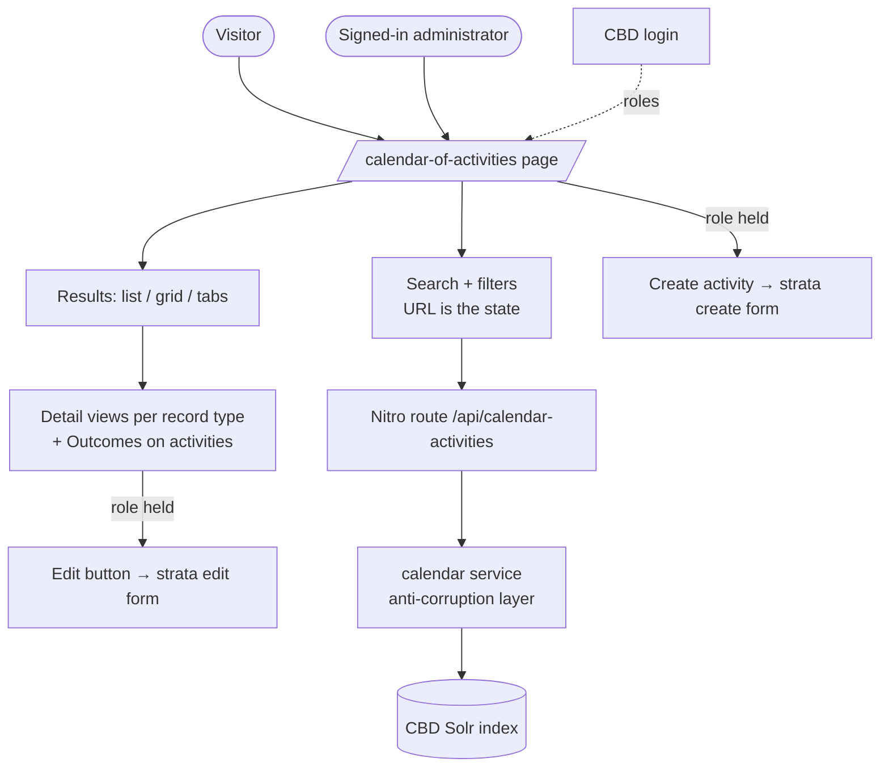

# Product Requirements: www.cbd.int-headless (COA search front end)

> Spoke PRD for the **www.cbd.int-headless** project in the COA production design run. The
> shared domain, workflow, cross-spoke flows, and Deferred register are in the
> [hub PRD](prd.md); context restated here is labeled "from hub PRD §x". Vocabulary:
> [CONTEXT.md](CONTEXT.md).

## Problem Statement

The prototype calendar proved what visitors need, but it lives outside the production site,
carries known defects, and cannot help the people who maintain the data: an administrator
looking at a wrong record on the public page has no path to fix it. Meanwhile the production
front end already carries a partial calendar implementation with verified gaps against the
prototype (no URL state, English-only text search, missing deep links, and more).

## Solution

Make the production calendar page the real thing: the **prototype's full approved feature
set**, re-implemented in this repo's own conventions (from hub PRD §Implementation Decisions),
plus two additions — **Outcomes displayed** on activity details, and **role-gated edit and
create buttons** linking into the strata form. The page stays a pure read-through of the Solr
index; it never writes (from hub PRD §Solution).

## What this spoke owns (responsibilities)

- The `/calendar-of-activities` search experience: free-text search, all filters and facets,
  the three result views, detail views, related records, URL state, i18n (six UN languages,
  Arabic right to left), and accessibility.
- The read path: Nitro route → calendar service (query builder + normalizer, the
  anti-corruption layer) → Solr client. Index field names never leak past the service.
- The **CBD login integration and role exposure** for this site — net-new here: the repo has
  no auth code today. It reads the same roles gaia enforces and gates only UI affordances
  with them (from hub PRD §Roles).
- The edit/create entry points into strata, shown only to holders of the gaia role.
- Displaying Outcomes on activity details, with links to linked in-system records.

Not owned: the records (gaia's), the form (strata's), the role model (gaia's), the Solr
document shape (gaia's published contract).

## User Stories

### Parity with the prototype (approved baseline)

The prototype PRD's user stories 1–55 (browsing and views; search; filtering; reading a
record; related records; language; resilience, feedback, and accessibility) are the approved
functional baseline and carry into production unchanged, except where a resolution below
supersedes a flagged defect. They are incorporated by reference from the prototype's
`docs/prd.md` rather than restated — the parity register in the arch plan tracks each cluster
against the existing partial implementation.

The headline capabilities, restated for standalone readability (from prototype PRD): one
merged chronological view of meetings, notifications, and activities; month grouping with
sticky headers; list, grid, and optional tab views; infinite scroll with load-more fallback;
free-text search per locale with prefix, phrase, and boolean support plus suggestion dropdown
and highlighting; the full filter set (record type, subject, bodies, activity type, GBF
target/section, country, decision, status, date range, action-required) with live facet
counts and per-filter exclusion; removable filter pills and clear-all; gear-menu filter
visibility persisted in a cookie; URL as the single source of state including `autoExpand`
deep links; per-type detail views with decision links, GBF icons, agenda-item resolution,
notification deadline badges, attachments, and excerpts; related-record sections; six-locale
UI and content with English fallback; loading, error, empty, and retry states; keyboard and
screen-reader operability; responsive layout.

### New in production

56. As a signed-in administrator, I want an edit button on each calendar-activity result I am
    allowed to edit, linking to the strata edit form for that record, so that fixing a record
    takes one click (from hub PRD §Flow 2).
57. As a signed-in administrator, I want a "create activity" entry point on the calendar
    page, linking to the strata create form, so that creation is reachable (strata has no
    menu).
58. As an anonymous visitor or a user without the role, I want no edit or create controls
    rendered at all, so that the public page is unchanged for the public. (Buttons gate on
    holding `Administrator` or `COA-ADMIN` — the latter new this version; gaia's
    server-side owner-may-update allowance is deliberately not surfaced — from hub PRD
    §Roles, UI decision.)
59. As a visitor, I want an activity's detail view to show its **Outcomes** — what the
    activity produced — each with its kind, date, note, and links to the records it names,
    so that I can follow results (from hub PRD §Outcomes).
60. As a visitor, I want an Outcome's link to open the linked record (in the calendar when it
    is a calendar record, otherwise its official page), so that following a result is one
    click.
61. As a user, I want to sign in with the standard CBD login from the site, so that my role
    can be established without a separate tool.

### Navigation (folded from the fast-www plan, DEV-842, 2026-07-09)

The need, as the fast-www plan states it: the calendar is invisible from the site's top
navigation. The mega-menu is data-driven from Drupal, the Drupal menu has no calendar item,
and a feature nobody can find might as well not exist. These stories close that gap the
same way Meetings and Notifications already solved it.

73. As a visitor, I want a "Calendar of Activities" item in the "Processes and Meetings"
    mega-menu, so that I can find the calendar from the top navigation without knowing a
    URL.
74. As a visitor hovering that menu item, I want a preview of the next four upcoming
    calendar activities (matching how the Meetings and Notifications menu items preview
    their content), so that the menu shows me what is coming before I click.
75. As the site team, I want the menu item injected in code as an explicitly temporary,
    guarded step until the Drupal CMS admin adds the permanent item (with written CMS
    instructions and a removal step for the temp code), so that visitors get the item now
    and Drupal stays the long-term owner of navigation.

### Defect resolutions (decision 9 — one-line calls on the prototype's flagged items)

62. Grid header sorting: only the date column sorts; the Type, Title, and Status headers lose
    their placebo sort affordance.
63. `autoExpand` deep links are honored in every view (list, grid, tabs), not just the list.
64. The basic/advanced filter-toggle labels are corrected (the prototype's i18n files swapped
    them).
65. The Completed status filter matches only completed, no-status, and no-date records — the
    leftover alias that also matched Confirmed records is dropped.
66. A past notification deadline is labeled "Deadline passed {date}", never "Completed on
    {date}" — completion is not knowable from the data. Both views use the dated label.
67. One decision-URL builder: protocol MOP links keep the decision number, COP paragraph
    links are zero-padded, and list and detail views produce identical URLs for the same
    decision.
68. One list view and one filter component ship; the prototype's duplicate v1/v2 variants
    are not ported.
69. Protocol (CPB/NP) marking renders identically in every view, using the list view's full
    rule.
70. All three upstream services (Solr, thesaurus, articles) resolve from one runtime-config
    base URL; no hardcoded hosts.
71. The auto-filled "today" start date clears when the user edits or clears the date, and
    this behavior is documented in the UI docs page — the prototype's misleading code-comment
    claim is dropped with the rebuild.
72. The prototype's pilot-release banner (prototype story 12) is not ported — the production
    page is the real site surface, not a pilot. The banner and its wording go away.

## Implementation Decisions

- **This repo's conventions govern** (from hub PRD; Fixed decision 6): Nuxt 4 `app/` layout,
  strict TypeScript with `ts-standard`, layered route → service → `ApiBase` client with
  normalization only in the service, one `useFetch` wrapper per domain in
  `composables/api/`, per-component i18n JSON compiled by the `sync-i18n` plugin, Bootstrap
  5.3 + repo SCSS, `vue-multiselect` for selects, Luxon + the framework time component for
  dates.
- **Build on the existing partial implementation.** The repo's calendar pages, components,
  service, and utils are the starting point; the draft-2 parity register's 17 verified gaps
  (URL state, locale-aware text search, boolean operators, article enrichment, quarter dates,
  deep links, and the rest) are closed to reach the prototype baseline.
- **Auth is a thin, read-only integration.** The CBD login establishes a session; the app
  exposes the user's roles through one composable; role checks gate rendering only. No
  server-side session state is added to the read path, and anonymous traffic is untouched.
  The concrete mechanism (which login flow, token handling, where roles are read) is designed
  in the [arch plan](www.cbd.int-headless-arch-plan.md).
- **Strata links are a published contract.** The edit/create URLs are the stable routes fixed
  in the [strata arch plan](strata-arch-plan.md); the front end builds them from the record's
  identifier and the strata base URL in runtime config.
- **The four gaia contract gaps close this version.** Resolution direction is fixed in the
  hub PRD's contract-gap table: the front end reads gaia's granular/structured fields.
- **The read contract is manifest-checked** (from hub PRD §Pulled into scope): this repo's
  CI verifies every Solr field the calendar service reads exists in gaia's committed `*COA`
  manifest, so a silent upstream rename fails the build here instead of emptying a field in
  production.
- **Outcome display consumes gaia's structured outcome fields** — details, kinds, links,
  dates — with no second lookup at search time.
- **The mega-menu item follows the fast-www plan (DEV-842) mechanics exactly**, mirroring
  the Meetings/Notifications pattern: a preview composable fetching the next four upcoming
  calendar activities; a `calendar-activities` case in the mega-menu dynamic-content
  component; a temporary, guarded static injection into the Drupal menu service for
  `cbd-header-processes-and-meeting` only (title "Calendar of Activities", weight -47,
  duplicate-safe, marked with a removal TODO); and written Drupal CMS instructions for the
  permanent item plus the temp-code removal step. The plan's link target
  (`/calendar-of-activities-and-actions`) is kept as specified; whether the destination
  later moves to the unified calendar page is the Drupal menu owner's content call, one
  line recorded here so nobody treats the URL as accidental. The fast-www plan's iframe
  wrapper page (its phase 3) is superseded — this repo already ships a native page at that
  route.

## Testing Decisions

Prior art: the repo's existing `test/unit` and `test/e2e` suites and the prototype's
three-seam test model, which carries forward onto this repo's seams:

1. **Pure utilities** (unit): date and quarter formatting, decision URL building (one
   builder, both protocols, paragraph padding), status normalization and the Completed rule
   (story 65), text processing and highlighting, month grouping.
2. **Service** (unit): query construction (facets, exclusion tags, locale-aware text fields,
   date overlap, status vocabularies), `normalizeCalendarDoc` including Outcome fields.
3. **Components** (Nuxt env, mocked service): filter emission, result rendering per view,
   detail views per record type including Outcomes, edit/create buttons per role state.
4. **Full flows** (Playwright): URL round-trip, deep links in every view, locale switching,
   role-gated buttons (with a stubbed session), error and empty states, axe accessibility
   checks.

## Success Metrics

- 100% of the prototype PRD's feature list is implemented or covered by a recorded
  resolution (stories 62–71); the parity register shows zero unexplained rows.
- Any filtered view restored from its URL alone reproduces the identical result set (e2e).
- Free-text search queries the visitor's locale field in all six locales (per-locale e2e).
- Edit/create buttons: rendered for 100% of role-holding sessions, 0% of anonymous sessions;
  every edit link opens strata loaded with the right record (e2e with stubbed auth).
- 100% of activities with Outcomes render them, with working links (e2e fixture).
- 0 blank-page failures on upstream errors; every failure path shows the retry alert or a
  per-section error state (fault-injection e2e).
- No critical axe violations; expandable rows announce their expanded state.

## Out of Scope

- Writing any record — the page links to strata, it never posts to gaia.
- The `/calendar-of-activities-and-actions` tabbed page — a separate surface, unchanged by
  this design.
- Calendar export/subscription, month-grid view, saved searches (hub Deferred D7).
- Per-user personalization beyond role-gated buttons; no user preferences server-side.
- The CircleCI → GitHub Actions migration (hub Deferred D8) — deployment work, not COA.

## Further Notes

- The repo currently has no CLAUDE.md/AGENTS.md; `docs/architecture.md` and the layering
  conventions above are the binding references.
- An unused `jwt-decode` dependency exists in `package.json` — evidence login integration
  was anticipated; the arch plan decides whether it participates in the auth design.
- Prototype design debt explicitly not ported: the duplicate view/filter variants, the
  placebo sort, the Completed-alias, the "Completed on" wording, the dual URL builders, the
  typo'd fallback host (`api.cbdd.int`), and the npm/Yarn lockfile split in the Docker build.
