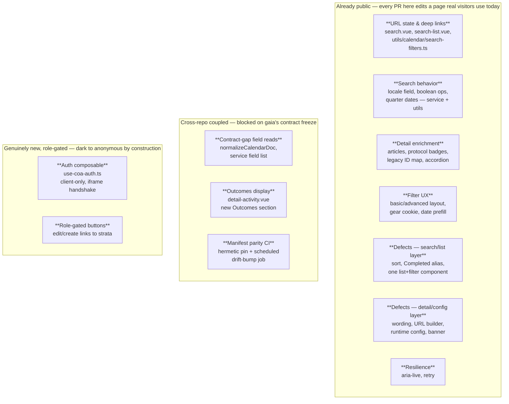
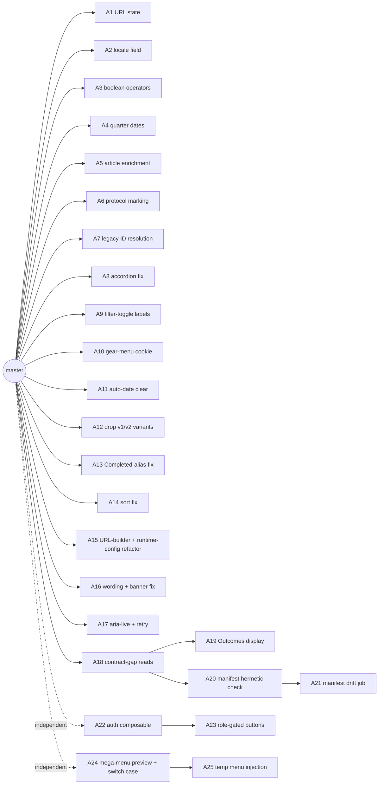
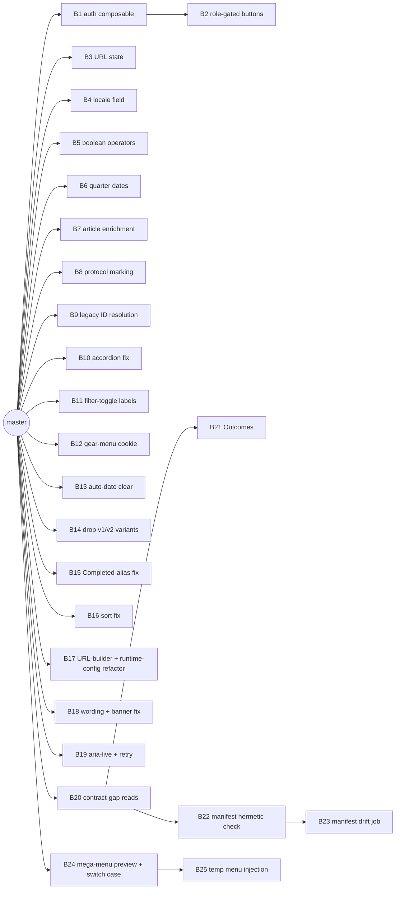
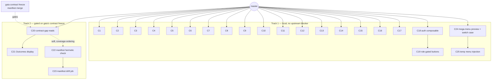

# PR Seam Options — www.cbd.int-headless (COA production build)

> **Doc:** "PR Seam Options" lays out rival ways to cut one body of design work into pull
> requests, for a human to pick between. It is not a pull request and not a code review — it is
> the plan for *how to make* the PRs.
>
> **Source of the work.** The work pieces below come straight from
> [www.cbd.int-headless-arch-plan.md](www.cbd.int-headless-arch-plan.md) (the design) and
> [www.cbd.int-headless-prd.md](www.cbd.int-headless-prd.md) (the stories and the parity
> register), with the four cross-spoke contract-gap fixes from
> [prd.md § Implementation Decisions](prd.md). Nothing here invents new scope; it only decides
> the order and grouping of what those two documents already call for.
>
> **Unlike a from-scratch rewrite, this repo already ships a partial calendar page.** The pages,
> the 15 components under `app/components/calendar-activity/`, the service
> (`services/calendar-activity.ts`), the server routes (`server/api/calendar-activities/`), and
> the thirteen util files under `app/utils/calendar/` are real, live, and already answering public
> traffic. Every option below treats them as the modification sites — this doc references those
> real paths, but it does not invent line counts for work that has not been written yet.

---

## The work, in one picture

---

## What a good split means here — and how this repo is different

A pull request is cut at the right place when a reviewer could approve **only that PR**, merge
it, deploy it, and the site would still be correct for every visitor who loads it next. That is
not a matter of taste — it restates a rule that continuous integration and trunk-based
development have both settled for decades: the shared branch must stay in a state you could ship
from at any moment.

Where this test comes from (sources)

> - **Continuous integration.** Martin Fowler writes that *"Continuous Integration can only work
>   if the mainline is kept in a healthy state,"* with the goal that *"the product should always
>   be in a state where we can release the latest build"*
>   ([martinfowler.com](https://martinfowler.com/articles/continuousIntegration.html)).
> - **Trunk-based development.** Working on one shared branch and never breaking it *"ensures the
>   codebase is always releasable on demand and helps to make Continuous Delivery a reality"*
>   ([trunkbaseddevelopment.com](https://trunkbaseddevelopment.com/)).
> - **Google's code-review guidance** defines the right-sized change as *"a minimal change that
>   addresses just one thing"* — *"one self-contained change"* such that *"the system will
>   continue to work well... after the CL is checked in"*
>   ([google.github.io/eng-practices](https://google.github.io/eng-practices/review/developer/small-cls.html)).
>
> Small is a side effect of a good cut, not its definition. The definition is: leaves the
> mainline shippable.

**Where this repo breaks from the usual pattern.** Most PR-seaming guidance (including the
worked example this doc borrows its shape from) assumes a lot of the work can land "wired but
dark" — new files nobody calls yet, sitting inert until one flip PR turns them on. That pattern
does not exist for most of this work, because **the calendar page is already live.** There is no
feature-flag system in this repo and no staging surface separate from production. So:

- A PR that fixes locale-aware search, or wires `autoExpand` into the grid view, is not adding an
  unused module — it is editing the query the live page already runs for every visitor, today.
  The moment it merges and deploys, real anonymous traffic sees the new behavior. There is no
  "dark" phase to hide a mistake in.
- Only the **auth work** gets the "dark until triggered" property for free, and it gets it
  honestly: SSR always renders the anonymous page, and the role-gated buttons only appear after
  client-side hydration resolves a role. An anonymous visitor — which is nearly all traffic —
  never sees a single byte of the new auth code's output. That is a real, structural difference
  from the rest of the work, not a labeling choice.

So this doc uses three **kinds**, not the "adds/switches/moves" vocabulary that fits a new-build
project, because that vocabulary assumes dark shipping is available by default here. It is not:

| Kind | Meaning | Examples below |
|---|---|---|
| **completes-existing** | Finishes or fixes a gap on the page visitors already use. Live to everyone the instant it deploys. No dark phase. | URL state, search behavior, enrichment, filter UX, the defect batches, resilience |
| **gated-new** | New code, but invisible until a real-world condition is true (a role, an upstream field). The closest thing this repo has to "dark until flip." | Auth composable + buttons, contract-gap reads, Outcomes display |
| **infra-only** | Touches build/CI only; no visitor-facing behavior changes. | Manifest parity CI |

**Four hard constraints, the same in every option below:**

1. **No dark-shipping for `completes-existing` work (see above).** Each such PR must be correct
   and complete entirely on its own — there is no later "flip" PR to catch a partial fix, and no
   flag to roll it back except a revert. This raises the bar on what "independently mergeable"
   requires here: it is not just "the build still compiles," it is "the live page is still
   correct for every visitor after this one PR."
2. **The contract-gap reads and Outcomes display are blocked on gaia, not on each other's
   sequencing.** Both read fields gaia's indexer must already be emitting
   (`outcomeDetails_*_txt`, the index-aligned `outcomeLink*_ss` arrays, the granular
   `responsibleUnits_ss`/`responsibleOfficers_is` pair, and the rest — see
   [prd.md's contract-gap table](prd.md#implementation-decisions-cross-spoke)). The front end's
   code can be written and even merged ahead of gaia's release, because a missing field reads as
   empty rather than throwing — but the field only carries real data after gaia's **contract
   freeze**, defined as gaia's manifest merge (arch plan § *the two-tier manifest job*). Treat
   that merge as the gate for shipping these PRs to production, even if code review happens
   earlier.
3. **Auth is the one review that changes the anonymous cache, not just the page.** A mistake here
   does not just show a wrong button — it can leak role-gated markup into the stale-while-
   revalidate cache and serve it to every anonymous visitor until the cache expires. This changes
   the *kind* of review needed (a security-and-caching read, not a feature read), which is why
   Option B below treats it specially. It does not, on its own, dictate sequencing — Options A
   and C sequence it differently and both are defensible.
4. **This repo runs CircleCI today; GitHub Actions is deferred (hub D8), and this design does not
   assume it exists.** The arch plan places the manifest drift job "in CI" without naming which
   CI. Since GitHub Actions is not present in this repo and migrating to it is explicitly out of
   scope, both manifest-parity tiers stay on CircleCI: the hermetic pinned-snapshot check rides
   in the existing lint/build job, and the scheduled drift-bump job uses CircleCI's own scheduled
   pipelines feature rather than a GitHub Actions cron — that pattern needs no CircleCI-to-Actions
   migration to work. A PR for either tier that assumes `.github/workflows/` exists here is
   mis-scoped.

**The mega-menu work (folded in from the fast-www plan, DEV-842) has no dependency on gaia or on
any other PR in this plan.** It targets the existing, already-live
`/calendar-of-activities-and-actions` page and the Drupal-driven mega-menu — nothing here waits
on gaia's contract freeze or on any other calendar work, so it slots into the local/independent
set in every option below. The fast-www plan's own iframe-wrapper phase is superseded: this repo
already ships a native page at that route, so that piece is dropped from scope.

**A fifth fact, found only after drafting the options below and applied to all three: the
`completes-existing` clusters were originally bundled too coarsely.** Six of the PRs each needed
an "and" to state their purpose, and two of them mixed a move-only refactor with a results-changing
behavior fix in the same PR — both are anti-patterns under constraint 1 above, which raises the bar
on independence here past "the build still compiles" to "the live page is still correct, and a
revert of just this PR is possible." Two fixes, applied identically in every option so none of them
converge:

- **Every move-only refactor gets its own PR, separate from any behavior change riding alongside
  it.** Dropping the duplicate v1/v2 list-and-filter variants is a refactor; consolidating the
  decision-URL builder and routing every upstream host through runtime config are refactors. None
  of the three changes what a visitor sees.
- **The two fixes that change what a visitor gets back stand alone.** Dropping the `Confirmed`
  alias from the Completed status filter, and switching search to query the visitor's locale field
  instead of the hardcoded English one, both change the result set a real visitor sees the instant
  they deploy — each deserves a PR a reviewer can ask "did we mean to change what shows up here?"
  about, in isolation, and revert on its own if the answer turns out to be no.

This raises the `completes-existing` count from seven PRs to seventeen in every option below — the
correct outcome, not scope creep: these are genuine distinct logical changes that were previously
sharing a diff, not new work and not build-step chunking. Each option's total PR count rises
accordingly (to roughly the low twenties); the fix is prose-identical across A, B, and C, so it
sharpens each option without collapsing any of them into another.

---

## Option A — Parity-first, auth last *(risk-ascending)*

**The idea:** Land the visible, low-risk completions of the existing page first — the ones
visitors have been missing for a while — while the review muscle is fresh and the changes are
easy to reason about one at a time. Save the one PR that touches SSR-cache safety for the end,
once the team has a rhythm and gaia's contract freeze has had time to land.

| # | What it does (no "and") | Kind | Builds on |
|---|---|---|---|
| A1 | Make the URL the single source of state and honor `autoExpand` deep links in the list, grid, and tab views alike | completes-existing | master |
| A2 | Query the visitor's locale text field instead of the hardcoded English one | completes-existing | master |
| A3 | Accept boolean operators in free-text search | completes-existing | master |
| A4 | Accept quarter-format dates in free-text search | completes-existing | master |
| A5 | Restore article-content enrichment on the detail view | completes-existing | master |
| A6 | Render protocol (CPB/NP) marking identically everywhere | completes-existing | master |
| A7 | Resolve legacy record IDs | completes-existing | master |
| A8 | Fix the detail accordion's expand/collapse behavior | completes-existing | master |
| A9 | Correct the basic/advanced filter-toggle labels | completes-existing | master |
| A10 | Persist the gear-menu filter-visibility preference in a cookie | completes-existing | master |
| A11 | Clear the auto-filled start date on edit | completes-existing | master |
| A12 | Drop the prototype's duplicate v1/v2 list-view and filter-component variants — move-only, no behavior change | completes-existing | master |
| A13 | Fix the Completed filter to drop the Confirmed alias — changes the result set a visitor sees | completes-existing | master |
| A14 | Fix the search/list defect so only the date column sorts | completes-existing | master |
| A15 | Consolidate to one decision-URL builder for both protocols, and route every upstream base URL through runtime config — move-only, no behavior change | completes-existing | master |
| A16 | Fix the "Deadline passed" wording and drop the pilot banner | completes-existing | master |
| A17 | Add ARIA-live announcements and a retry affordance to the loading/error/empty states | completes-existing | master |
| A18 | Read gaia's granular and structured fields (`responsibleUnits_ss`/`responsibleOfficers_is`, the agenda-item fields, the outcome fields) in place of the four fields gaia's indexer no longer emits under the old names | gated-new | master |
| A19 | Add an Outcomes section to the activity detail view, reading the index-aligned `outcomeLink*_ss` arrays gaia's manifest declares | gated-new | A18 |
| A20 | Add the hermetic manifest-parity check: CI diffs every `*COA`/`outcome*` field the service reads against a committed snapshot of gaia's manifest | infra-only | A18 |
| A21 | Add the scheduled drift-detection job that fetches gaia's live manifest and opens a bump PR on a difference; a no-op, not an error, if gaia's manifest does not exist yet | infra-only | A20 |
| A22 | Add the auth composable (`use-coa-auth.ts`): the client-only iframe-plus-`postMessage` handshake and the whoami role read, wired to nothing yet | gated-new | master |
| A23 | Show edit and create buttons, built from `strataBaseUrl` and the record's identifier, only when the resolved role is `Administrator` or `COA-ADMIN` | gated-new | A22 |
| A24 | Add the mega-menu preview composable (`app/composables/api/use-calendar-activities-preview.ts`, new) and the `'calendar-activities'` case in `navigation-mega-menu-dynamic-content.vue` (modified) — dark until a menu item with that component value exists | gated-new | master |
| A25 | Inject the temporary "Calendar of Activities" item into `services/drupal.ts`'s `getMenu()` (modified), guarded so it never duplicates a real Drupal item — the visitor-visible flip that makes A24's composable and switch case reachable; the Drupal CMS handoff and temp-code removal are follow-up, non-code steps outside this PR graph | completes-existing | A24 |

**Good:**
- All seventeen `completes-existing` PRs and the contract-gap reads (A18) branch straight off
  `master` — nothing in the graph pretends A18 needs A1 through A17 to exist, because it does not.
  "Risk-ascending" is now a **recommended review order** stated in prose, not a dependency: start
  with the well-understood, visible fixes while the review muscle is fresh, and save the
  SSR-cache-safety read (A22/A23) for once the team has a rhythm — but any of the seventeen can
  merge whenever its own review clears, in any order, without blocking each other.
- Splitting the refactors (A12, A15) from the results-changing fixes (A2, A13, A14, A16) means a
  reviewer asking "did we mean to change what Completed shows, or what non-English visitors see?"
  can review — and revert — that change alone, with no unrelated file move riding along.
- By the time A18/A19 come up, gaia's contract freeze has had the most possible time to land.

**Watch out:**
- Twenty-five PRs is a lot of surface to track at once — group review order by reviewer bandwidth
  (prose guidance), not by an artificial dependency chain that would just create rebase pain for no
  reason.
- Auth (A22–A23) has no code dependency on anything else and could start on day one; scheduling it
  last is a deliberate choice (fresh SSR-cache-safety attention once other reviews build
  confidence), not a code requirement — say so explicitly in the run plan so nobody reads it as
  blocked. The mega-menu pair (A24–A25) is the same story: independent of everything else, no
  reason to schedule it last except reviewer bandwidth.
- The drift job (A21) needs a defined behavior for the case where gaia's manifest does not exist
  yet on gaia `master`: it must no-op silently — no error on every scheduled run, no spurious bump
  PR — until gaia's own manifest PR has actually merged.

---

## Option B — Auth-isolated-first *(focused security review)*

**The idea:** The one PR that can leak role-gated markup into an anonymous cache deserves the
smallest possible diff to review it against — not a diff sitting behind a dozen already-merged
parity changes. Land the composable and the buttons first, while the rest of the calendar page
is still exactly what is in production today, so the SSR/cache read has nothing else to account
for.

| # | What it does (no "and") | Kind | Builds on |
|---|---|---|---|
| B1 | Add the auth composable (`use-coa-auth.ts`): the client-only iframe-plus-`postMessage` handshake and the whoami role read, wired to nothing yet | gated-new | master |
| B2 | Show edit and create buttons, built from `strataBaseUrl` and the record's identifier, only when the resolved role is `Administrator` or `COA-ADMIN`; add `strataBaseUrl` to runtime config | gated-new | B1 |
| B3 | Make the URL the single source of state and honor `autoExpand` deep links in the list, grid, and tab views alike | completes-existing | master |
| B4 | Query the visitor's locale text field instead of the hardcoded English one | completes-existing | master |
| B5 | Accept boolean operators in free-text search | completes-existing | master |
| B6 | Accept quarter-format dates in free-text search | completes-existing | master |
| B7 | Restore article-content enrichment on the detail view | completes-existing | master |
| B8 | Render protocol (CPB/NP) marking identically everywhere | completes-existing | master |
| B9 | Resolve legacy record IDs | completes-existing | master |
| B10 | Fix the detail accordion's expand/collapse behavior | completes-existing | master |
| B11 | Correct the basic/advanced filter-toggle labels | completes-existing | master |
| B12 | Persist the gear-menu filter-visibility preference in a cookie | completes-existing | master |
| B13 | Clear the auto-filled start date on edit | completes-existing | master |
| B14 | Drop the prototype's duplicate v1/v2 list-view and filter-component variants — move-only, no behavior change | completes-existing | master |
| B15 | Fix the Completed filter to drop the Confirmed alias — changes the result set a visitor sees | completes-existing | master |
| B16 | Fix the search/list defect so only the date column sorts | completes-existing | master |
| B17 | Consolidate to one decision-URL builder for both protocols, and route every upstream base URL through runtime config — move-only, no behavior change | completes-existing | master |
| B18 | Fix the "Deadline passed" wording and drop the pilot banner | completes-existing | master |
| B19 | Add ARIA-live announcements and a retry affordance to the loading/error/empty states | completes-existing | master |
| B20 | Read gaia's granular and structured fields in place of the four fields gaia's indexer no longer emits under the old names | gated-new | master |
| B21 | Add an Outcomes section to the activity detail view | gated-new | B20 |
| B22 | Add the hermetic manifest-parity check: CI diffs every field the service reads against a committed snapshot of gaia's manifest | infra-only | B20 |
| B23 | Add the scheduled drift-detection job that fetches gaia's live manifest and opens a bump PR on a difference; a no-op, not an error, if gaia's manifest does not exist yet | infra-only | B22 |
| B24 | Add the mega-menu preview composable (`app/composables/api/use-calendar-activities-preview.ts`, new) and the `'calendar-activities'` case in `navigation-mega-menu-dynamic-content.vue` (modified) — dark until a menu item with that component value exists | gated-new | master |
| B25 | Inject the temporary "Calendar of Activities" item into `services/drupal.ts`'s `getMenu()` (modified), guarded so it never duplicates a real Drupal item — the visitor-visible flip that makes B24's composable and switch case reachable; the Drupal CMS handoff and temp-code removal are follow-up, non-code steps outside this PR graph | completes-existing | B24 |

**Good:**
- The security-and-caching read for auth happens against a diff of two new files and one small
  edit — nothing else in the page has moved yet. That is the smallest this review will ever be.
- Getting the riskiest piece de-risked early means every later PR merges into a codebase where
  the hardest question is already answered, instead of everyone waiting to find out at the end.
- All seventeen `completes-existing` PRs and B20 branch off `master`, same as Option A — no fake
  chain through the parity work here either.
- Splitting the refactors (B14, B17) from the results-changing fixes (B4, B15, B16, B18) gives the
  same isolated-review, isolated-revert property Option A gets from the same split.

**Watch out:**
- B2's buttons are genuinely dark to nearly all traffic (no anonymous visitor sees them), but the
  reviewer still has to reason about the SSR/hydration boundary correctly on the very first PR of
  the whole body of work — there is no easier warm-up PR before it, by design.
- The manifest-parity work is now the same two-tier split as Option A (B22 hermetic check, B23
  scheduled drift job) rather than one folded PR — a single PR covering both a build-time check and
  a scheduled job was responsible for two genuinely different things (different triggers, different
  failure modes), so the split removes that defect at the cost of one extra PR; B's distinctness
  from A still holds on auth placement, not on the manifest cut.
- B23 needs the same no-manifest-yet no-op behavior as Option A's A21, for the same reason: a late
  gaia should produce silence, not a scheduled-run error or a spurious bump PR.

---

## Option C — Local-first vs. the gaia-coupled chain *(grouped by who blocks you)*

**The idea:** Stop grouping by risk or by feature area, and group by **what each PR is waiting
on**. Everything the front end can finish without anyone else is Track 1 — start it immediately,
merge in any order, no coordination needed. Everything blocked on gaia's contract freeze is
Track 2 — track it as one dependent chain so nobody merges a piece of it early and ships an empty
field by accident. Auth counts as Track 1: it depends only on the existing, already-live
`scbd-auth-layer` SSO endpoints, not on anything gaia has yet to ship.

| # | What it does (no "and") | Kind | Track | Builds on |
|---|---|---|---|---|
| C1 | Make the URL the single source of state and honor `autoExpand` deep links in every view | completes-existing | 1 (local) | master |
| C2 | Query the visitor's locale text field instead of the hardcoded English one | completes-existing | 1 (local) | master |
| C3 | Accept boolean operators in free-text search | completes-existing | 1 (local) | master |
| C4 | Accept quarter-format dates in free-text search | completes-existing | 1 (local) | master |
| C5 | Restore article-content enrichment on the detail view | completes-existing | 1 (local) | master |
| C6 | Render protocol (CPB/NP) marking identically everywhere | completes-existing | 1 (local) | master |
| C7 | Resolve legacy record IDs | completes-existing | 1 (local) | master |
| C8 | Fix the detail accordion's expand/collapse behavior | completes-existing | 1 (local) | master |
| C9 | Correct the basic/advanced filter-toggle labels | completes-existing | 1 (local) | master |
| C10 | Persist the gear-menu filter-visibility preference in a cookie | completes-existing | 1 (local) | master |
| C11 | Clear the auto-filled start date on edit | completes-existing | 1 (local) | master |
| C12 | Drop the prototype's duplicate v1/v2 list-view and filter-component variants — move-only, no behavior change | completes-existing | 1 (local) | master |
| C13 | Fix the Completed filter to drop the Confirmed alias — changes the result set a visitor sees | completes-existing | 1 (local) | master |
| C14 | Fix the search/list defect so only the date column sorts | completes-existing | 1 (local) | master |
| C15 | Consolidate to one decision-URL builder for both protocols, and route every upstream base URL through runtime config — move-only, no behavior change | completes-existing | 1 (local) | master |
| C16 | Fix the "Deadline passed" wording and drop the pilot banner | completes-existing | 1 (local) | master |
| C17 | Add ARIA-live announcements and retry affordance | completes-existing | 1 (local) | master |
| C18 | Add the auth composable (`use-coa-auth.ts`) | gated-new | 1 (local) | master |
| C19 | Add role-gated edit/create buttons linking to strata | gated-new | 1 (local) | C18 |
| C20 | Read gaia's granular and structured fields in place of the four retired field names | gated-new | 2 (gaia-coupled) | master* |
| C21 | Add the Outcomes section to the activity detail view | gated-new | 2 (gaia-coupled) | C20 |
| C22 | Add the hermetic manifest-parity CI check | infra-only | 2 (gaia-coupled) | C20 |
| C23 | Add the scheduled manifest drift-bump job; a no-op, not an error, if gaia's manifest does not exist yet | infra-only | 2 (gaia-coupled) | C22 |
| C24 | Add the mega-menu preview composable (`app/composables/api/use-calendar-activities-preview.ts`, new) and the `'calendar-activities'` case in `navigation-mega-menu-dynamic-content.vue` (modified) — dark until a menu item with that component value exists | gated-new | 1 (local) | master |
| C25 | Inject the temporary "Calendar of Activities" item into `services/drupal.ts`'s `getMenu()` (modified), guarded so it never duplicates a real Drupal item — the visitor-visible flip that makes C24's composable and switch case reachable; the Drupal CMS handoff and temp-code removal are follow-up, non-code steps outside this PR graph | completes-existing | 1 (local) | C24 |

\* C20 branches from `master`, not from Track 1's chain — its real blocker is gaia's contract
freeze, drawn separately below. **C20 → C22 is a soft edge, not a hard one:** the hermetic check
would still compile and run without C20 landed first (it would just diff the current field list),
so it is drawn here for coverage-ordering — declare it that way rather than a code dependency, or
let C22 branch from `master` directly if that reads more honestly.

**Good:**
- Makes the real dependency structure visible instead of hiding it inside a review-order
  decision: twenty-one of twenty-five PRs need nothing from anyone and can start today; four are
  honestly blocked on a different repo's release, and that is drawn as a gate, not guessed at.
- Nobody can accidentally merge C21 (Outcomes) or C20 (contract-gap reads) to production before
  gaia's fields exist, because the chain makes the gaia dependency an explicit node instead of an
  implicit assumption buried in a PR description.
- Splitting the refactors (C12, C15) from the results-changing fixes (C2, C13, C14, C16) gives
  Track 1 the same isolated-review, isolated-revert property as the other two options, without
  giving up Track 1's clean, chain-free shape.

**Watch out:**
- Track 1's seventeen local PRs still need *some* merge-order discipline even though they are code-
  independent: C1 and C9 both touch `search.vue`, and C5, C20, and C21 all touch
  `detail-activity.vue` — none of that breaks the independence test (each PR is still correct and
  shippable on its own), but landing them out of author-order invites avoidable rebase conflicts.
  This is a scheduling note, not a dependency.
- If gaia's contract freeze slips, Track 2 stalls as a block of four PRs rather than degrading
  gracefully one at a time — the same four-PR chain exists in every option, but grouping them
  together here makes the stall more visible, which is the point, not a new risk.
- C23 needs the same no-manifest-yet no-op behavior as the other two options' drift jobs: silence,
  not a scheduled-run error or a spurious bump PR, until gaia's manifest actually exists.

---

## Side by side

|                              | Option A — parity-first, auth last | Option B — auth-isolated-first | Option C — local-first vs. gaia-coupled |
|---|---|---|---|
| Number of PRs | 25 | 25 | 25 |
| Longest chain | 3 (A18→A20→A21) | 3 (B20→B22→B23) | 3 (C20→C22→C23, and that top edge is soft); Track 1 has no chain at all except C18→C19 and C24→C25 |
| Heaviest single review | A22/A23 auth composable + buttons — the SSR-cache-safety read, reviewed last | B1/B2 auth composable + buttons, reviewed first | C18/C19 auth, reviewed whenever Track 1's reviewer gets to it |
| Security/cache review timing | Last — after the team has practice on this codebase | First — smallest possible diff, no warm-up | Unscheduled — grouped as "local," timing is a scheduling choice, not a doc decision |
| Cross-repo (gaia) blocker made explicit | **Explicit now** — A18 branches off `master`, not off A1…A17; the fake parity-chain dependency is gone | **Explicit now** — same fix applied to B20 | **Explicit** — drawn as its own gated node in the diagram, as it always was |
| Best when… | you want the hardest review to happen once the team has a rhythm | review bandwidth for security is scarce and should be spent while the diff is smallest | multiple people are shipping in parallel and need to know at a glance who is blocked on what |

---

## Recommendation

**Option C is the strongest starting point, with Option B's ordering borrowed for Track 1's auth
pair.** The real shape of this work is two independent tracks and one honest cross-repo gate —
Option C is the only one of the three that draws that shape instead of hiding it inside an
ordering choice. Twenty-one of the twenty-five PRs need nothing from anyone and should start the
day this plan is approved; the other four are genuinely waiting on gaia and should be visibly
blocked, not quietly scheduled last and hoped to be ready.

**The two mega-menu PRs folded in from the fast-www plan (DEV-842) slot into that same
independent/local set.** N1 (the preview composable and switch case) and N2 (the temporary menu
injection) have no dependency on gaia or on any other PR in this plan, and can land whenever
review clears.

The one thing to take from Option B rather than write Track 1 as an unordered pile: land the auth
composable and the role-gated buttons **early** within Track 1, not late. Nothing about Track 1
requires it to go last, and getting the SSR-cache-safety review done against the smallest
possible diff — before a pile of other parity PRs has stacked up behind it — is worth the small
scheduling discipline it costs. Everything else in Track 1 (the seventeen `completes-existing`
PRs) can merge in whatever order reviewer bandwidth allows; none of them depend on each other or
on auth.

**Carry the cluster fix into whichever option is chosen.** All three options above already apply
it — every move-only refactor (dropping the duplicate v1/v2 variants, consolidating the
decision-URL builder, routing hosts through runtime config) is its own PR, separate from the
results-changing fixes riding alongside it in the old bundles, and the two fixes that most change
what a visitor sees — the Completed-alias drop and the locale-field switch — each stand alone. This
is what raises the count from thirteen PRs to twenty-three: correct, not scope creep, since these
were always distinct logical changes sharing a diff. The mega-menu work folded in from the
fast-www plan (N1/N2 in each option above) adds two more on top of that, for twenty-five total.

Whichever option is chosen, one instruction carries into every one of them: no PR that reads a
gaia field (`normalizeCalendarDoc`, the service's field list, the Outcomes section, either
manifest-CI tier) should reach production before gaia's contract freeze — write and review that
code whenever convenient, but hold its deploy for the gate. And the scheduled drift job, in every
option, must no-op silently rather than error or open a spurious bump PR if gaia is late enough
that its manifest file does not exist yet.
